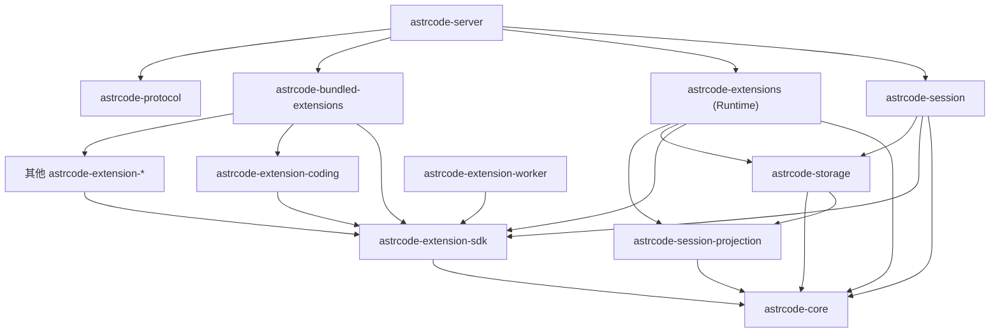
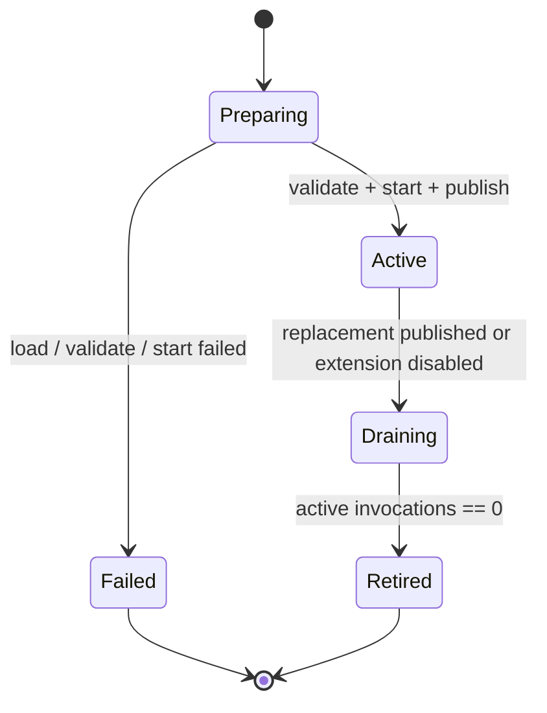
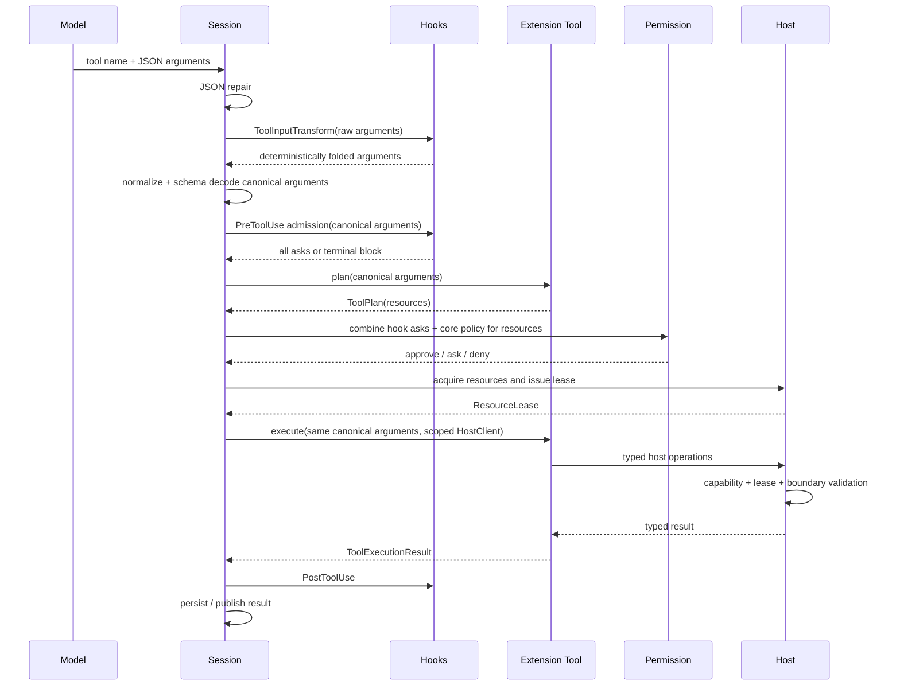
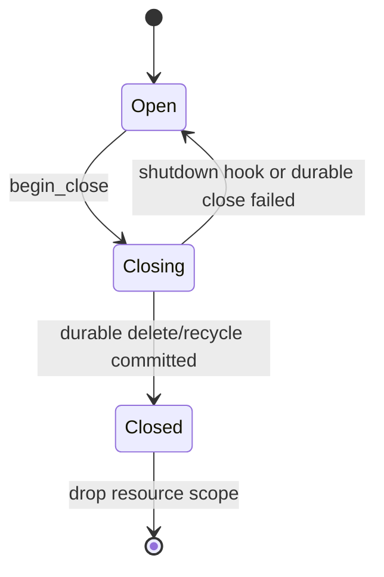

# 统一 Extension 工具运行时架构设计

> 状态：已实施；本文同时记录迁移前问题、最终边界与验收依据
> 适用范围：工具注册与执行、Extension Runtime、第一方编码工具、S5R、session 资源生命周期
> 不包含：Compact、Session Projection、HTTP/前端协议重整
> 核心决策：所有工具都属于 Extension；统一语义路径，保留进程内与 S5R 两种执行载体

## 1. 摘要

AstrCode 的工具系统应当只有一个产品概念：**Extension 提供的工具**。

第一方 `read`、`read_tool_result`、`write`、`edit`、`patch`、`glob`、`grep`、`shell` 和 `shell_poll`
不应继续通过独立的 `astrcode-tools`、`BuiltinToolCatalog` 和 server 专用清理器进入
session。它们应当成为一个正常的第一方 bundled Extension，与其他 Extension 一样完成：

1. 注册和发现；
2. turn 级快照冻结；
3. 参数校验和资源规划；
4. 权限审批；
5. 受约束的 Host 能力调用；
6. 生命周期和资源回收；
7. reload 与 generation 管理。

统一 Extension 并不意味着所有调用都必须经过 stdio、JSON 和 S5R framing。目标架构保留两种
载体：

- **Bundled Extension**：可信的进程内 Rust 实现，直接调用同一套语义接口；
- **Worker Extension**：通过 S5R 运行在进程外，由 adapter 映射同一套语义接口。

两者共享注册、规划、审批、执行、生命周期和错误语义，只在 transport 上不同。

目标架构同时删除独立的 `astrcode-extension-contract` crate，将其内容按逻辑边界收回
`astrcode-extension-sdk`：

- 作者语义 API 位于 `extension`；
- typed HostClient 和 host operation DTO 位于 `host`；
- S5R envelope、framing、Peer 和 conformance 位于独立的 `s5r` / `wire` 逻辑模块。

这是**删除物理 crate、保留逻辑边界**，不是把 wire DTO、作者 API 和宿主实现混成一层。

## 2. 迁移前问题

迁移前实现已经有统一 Extension Runtime，但第一方编码工具仍从旁路进入 session，因此系统存在
两套工具来源和两套资源所有权。

### 2.1 两套工具 catalog

server 单独构造 `astrcode-tools::BuiltinToolCatalog`，再注入 `SessionRuntimeServices`。session
每次冻结 turn runtime view 时，又把 Extension catalog 和 builtin catalog 组合为新的
`CompositeToolCatalogProvider`。

实际数据流是：

```text
Bundled / S5R Extension
    → ExtensionRunner
        → extension ToolCatalogProvider ─┐
                                        ├→ CompositeToolCatalogProvider
astrcode-tools                           │      → Session ToolRegistry
    → BuiltinToolCatalog ────────────────┘
```

这带来以下问题：

- 工具名称冲突需要额外定义隐藏优先级；
- catalog revision 需要再次组合；
- Extension generation 与 builtin 配置 revision 属于不同一致性来源；
- server、session 和 Extension Runtime 都知道“工具从哪里来”；
- 第一方工具不能自然复用 Extension 的启停、诊断、reload 和生命周期模型。

### 2.2 两套执行上下文

内置工具实现 `astrcode_core::tool::Tool`，可以直接访问 `ToolExecutionContext` 中的内部能力，
包括 file observation store、artifact reader、session operations 和 session store path。

普通 Extension 工具只接收受控的 `ToolContext`。这个 context 有意不暴露 raw
`ToolExecutionContext`、裸 `SessionOperations` 或 event sink。

因此，直接把现有内置 `Tool` 包装为 Extension 会留下一个隐藏的 native 特权入口；把它们机械
改写成普通 `ToolHandler`，又会丢失目前依赖的内部能力。正确迁移必须先把这些能力建模为正式的
Host capability。

### 2.3 Extension 工具缺少精确资源规划

当前内置文件工具可以根据最终参数声明具体读写路径。普通 Extension tool adapter 除
`SessionControl` 外保守声明 `ResourceAccess::all()`。

如果不补资源规划就迁移编码工具，会产生真实行为退化：

- 原本可并行的不同文件读取可能退化为全局串行；
- 权限链无法准确区分 workspace 内读、workspace 外写和敏感路径；
- approval 展示只能告诉用户“访问全部资源”；
- Extension 的声明与真正 Host 操作之间没有 call-scoped 约束。

### 2.4 server 知道具体工具资源

迁移前的 terminal 和 background shell 使用各自的全局 registry。server 在 session delete/recycle 后
直接调用 `astrcode-tools` 的清理函数。

这意味着 server 不只是 composition root，还知道具体工具实现的资源模型。新增一个具有
session 生命周期的工具时，开发者必须同时修改工具 crate、server bootstrap 和
`SessionManager` 清理列表。

### 2.5 相同基础能力重复实现

Extension HostRouter 已经提供 workspace read/write/edit/glob/grep 和 process spawn。编码工具又
直接实现了相近的文件与进程能力。

但两者当时并不等价：编码工具还有 patch、artifact 读取、read-before-edit observation、后台
shell、PTY terminal 和特殊结果展示。迁移没有假定两份实现天然等价，而是明确
分离：

- Host Runtime 拥有安全、资源和操作原语；
- Coding Extension 拥有面向模型的工具契约和结果表达。

## 3. 设计目标

### 3.1 必须达成

1. **一个工具来源**：session 只从一个不可变 Extension turn view 获取工具。
2. **一个作者模型**：第一方、第三方、进程内和 worker 工具使用相同 Tool API。
3. **一个权限管线**：所有工具都按“最终参数 → plan → approve → lease → execute”执行。
4. **一个资源所有者**：长寿命进程和临时资源由 Host session scope 统一拥有。
5. **一个 generation 边界**：同一 turn 的工具、prompt 和 hooks 来自同一 Extension view。
6. **无 server 工具特例**：server 不识别具体工具名、实现 crate 或清理函数。
7. **无 native 逃生口**：Extension SDK 不向作者暴露 raw `ToolExecutionContext`。
8. **两种 transport 等价**：进程内和 S5R 具有相同的可观察语义与失败规则。
9. **逻辑边界清晰**：合并 contract crate 后仍保持 wire、authoring 和 runtime 分层。
10. **可渐进迁移**：每一步都能验证行为，不用一次性重写整个 Extension 系统。

### 3.2 明确不做

- 不强制 bundled Extension 经过 S5R 或 JSON 序列化；
- 不把 Extension Runtime 变成 session/storage 的所有者；
- 不把 durable event、HTTP DTO 或 frontend 状态塞进 Extension SDK；
- 不引入通用 service locator；
- 不为未来假想能力增加可选字段、provider 类型或后台 coordinator；
- 不在本次设计中改变 Compact、Projection 或 EventLog 格式；
- 不承诺 S5R 本身提供操作系统级沙箱；
- 不允许以 `native_tool()`、`trusted_tool()` 等名字永久保留旧执行路径；
- 不把工具名冲突处理成不可见的优先级覆盖；
- 不为了减少 crate 数量而合并职责无关的 runtime、worker 或 server。

## 4. 规范性语言与术语

本文使用以下含义：

- **必须**：目标架构不可违反的不变式；
- **应当**：默认设计，只有存在明确、已记录的反例才可偏离；
- **可以**：实现选择，不形成公共契约。

术语：

| 术语                   | 含义                                                                                       |
| ---------------------- | ------------------------------------------------------------------------------------------ |
| Extension              | 通过 manifest 和 registrar 贡献工具、hook、命令等能力的产品单元。                          |
| Bundled Extension      | 与宿主二进制链接、进程内运行的第一方 Extension。                                           |
| Worker Extension       | 通过 S5R 在进程外运行的 Extension。                                                        |
| Extension Runtime      | 加载、校验、索引、发布 generation，并调度 Extension 调用的宿主运行时。                     |
| Extension Generation   | 某个 Extension 一次成功加载后不可变的 manifest、registrations、handler 和 admission 状态。 |
| Extension Turn View    | 一个 turn 冻结的、跨多个 Extension generation 的一致性视图。                               |
| Tool Plan              | 工具根据冻结的最终参数声明的资源意图。                                                     |
| Resource Lease         | approval 后由 Host 签发、执行时强制校验的 call-scoped 资源授权。                           |
| Host Capability        | Extension 通过 typed HostClient 请求的 workspace、process、model、session 等能力。         |
| Session Resource Scope | Host 为一个 session 持有的进程内资源容器。                                                 |
| S5R                    | Host 与 Worker Extension 之间的版本化进程协议。                                            |

## 5. 不可违反的架构不变式

### 5.1 工具归属

- 每个 provider-visible tool 必须归属于一个 Extension ID。
- session 不得额外注入 builtin、native、server 或 test-only production catalog。
- 测试可以构造 fake Extension Runtime port，但不得为生产代码增加第二套 catalog trait。
- 工具定义、planner、executor 和 prompt metadata 必须由同一 registration 提供。

### 5.2 turn 一致性

- turn 开始后只解析一次 `ExtensionTurnView`。
- provider schema、prompt contribution、tool plan、tool execute 和相关 hook 必须使用该 view
  固定的 generation。
- reload 只影响后续 turn；已经开始的 turn 不切换 handler。
- Extension Runtime 不得在调用途中以“获取最新”为由绕过 pinned generation。
- Session 在首个 turn hook 前固定 core `RuntimeGenerationView`，并从中派生本 turn 的
  `LlmProviderBindings`。该 binding 必须通过 hook/tool call context 和 `InvokeContext` 显式传到
  `HostRouter`；session-scoped `ModelClient` 不得重新读取 live provider。
- startup 或没有 turn attribution 的调用可以显式使用 live provider fallback；该 fallback 不得被
  隐式用于具有 turn attribution 的 hook 或 tool call。

`ExtensionTurnView` 与 core `RuntimeGenerationView` 当前仍在两个独立边界固定。上述约束解决的是
active turn 内 Host LLM 漂移，不表示 core config generation 与 Extension publication 已经原子化；
两者共享 revision/commit barrier 仍是独立的配置发布问题。

### 5.3 权限与资源

- tool execute 之前必须基于 hook 修改后的最终参数重新 plan。
- plan 是不可信声明，不能代替 Host 边界校验。
- approval 只授权 plan 中的资源；execute 不能扩大授权。
- 每个实际 Host 操作必须同时通过 capability、resource lease 和边界输入校验。
- 磁盘/RPC 输入在执行覆盖、删除、进程控制等操作前必须再次校验。

### 5.4 生命周期

- `SessionShutdown` hook 是业务通知，不是强制资源清理机制。
- durable session close 成功前不得销毁仍属于该 session 的资源。
- durable close 失败时必须恢复 admission，并保留 session 资源。
- session close 成功、Extension disable/uninstall 或进程退出时，Host 必须能够独立回收资源。

### 5.5 边界与映射

- SDK 作者类型不得直接作为 HTTP/frontend wire 类型。
- core 内部 enum 不得因为同处一个 crate 依赖图就直接成为 S5R wire enum。
- 跨 S5R 的类型必须是显式、版本化、严格反序列化的 DTO。
- 映射只发生在 in-process adapter、worker adapter、HostRouter 和外部 protocol 等边界。
- 错误上下文只在最接近可操作信息的层级添加一次。

## 6. 目标 crate 与依赖方向

本文箭头 `A → B` 表示 **A 依赖 B**。



### 6.1 目标 crate 职责

| crate                         | 唯一职责                                                                           |
| ----------------------------- | ---------------------------------------------------------------------------------- |
| `astrcode-core`               | Event、LLM、资源访问、session 标识等稳定领域原语；不知道具体 Extension。           |
| `astrcode-extension-sdk`      | Extension 作者 API、typed HostClient、runtime port 和逻辑隔离的 S5R/wire contract。 |
| `astrcode-extensions`         | Extension 加载、generation、索引、调用调度、HostRouter 和 session resource scope。 |
| `astrcode-extension-worker`   | 将 SDK Extension/handler 适配到 S5R worker transport。                             |
| `astrcode-extension-coding`   | 八个 provider-visible 编码工具的 schema、plan、调用和结果展示。                    |
| `astrcode-bundled-extensions` | 产品组合根：返回本产品链接的第一方 Extension 集合。                                |
| `astrcode-session`            | turn、权限、审批、provider context、工具管线和 Compact；只消费 Extension port。    |
| `astrcode-server`             | 进程 composition、operation gate、HTTP/SSE/ACP 边界和 runtime wiring。             |

### 6.2 明确删除的 crate

- `astrcode-tools`：其工具表现层迁入 `astrcode-extension-coding`，安全与资源原语迁入
  Extension Runtime 的 Host services。
- `astrcode-extension-contract`：其逻辑模块迁入 `astrcode-extension-sdk`，不丢失协议边界。

### 6.3 明确保留的 crate

- `astrcode-extension-worker` 必须保留。它是 worker 运行时实现，不是纯 contract。
- `astrcode-bundled-extensions` 应当保留。不同产品入口可能链接不同第一方 Extension；这个
  composition 决策不属于 server，也不属于 runtime。
- `astrcode-extensions` 应当与 SDK 分离。作者 API 不应依赖宿主加载、存储、进程和网络实现。

### 6.4 依赖边界

Session 消费 `ExtensionRuntimePort`，因此这个稳定端口及 `ExtensionTurnView` 由 SDK 拥有；Session
不依赖 Runtime 的具体实现。Runtime 不得依赖 `astrcode-session` 或 `astrcode-context`，避免执行引擎
反向获取 turn/Compact 策略。

Runtime 可以依赖 `astrcode-storage` 的现有 reader/store trait 与
`astrcode-session-projection` 的只读模型，因为 Host session/event API 本身就是这两个边界的 adapter。
映射必须留在 `HostRouter`，Runtime 不得拥有 durable event 格式、projection 归约或回收策略。

生产依赖图中只有 `astrcode-bundled-extensions` 可以直接依赖具体的第一方
`astrcode-extension-*` 实现；server、session 和 Extension Runtime 只依赖组合根或稳定端口。
少量 server `dev-dependencies` 可以直接引用具体 Extension 作为集成测试 fixture，但不得进入生产
依赖图或承担产品组装职责；`scripts/check-deps.py` 对具体 Extension 清单做完整性自检，并强制上述
生产边界。

这里不再为已有的 `SessionReader`/`SessionStore` 包一层同构 backend trait。那只会复制方法、错误和
测试 fake，却没有形成新的信任边界。Extension 作者仍只看到按 manifest capability、call scope 和
resource lease 裁剪后的 typed `HostClient`，不会接触 storage 或 projection 类型。

### 6.5 数据所有权矩阵

| 数据/资源                        | 唯一 owner                                | 生命周期                           | 是否 durable                 |
| -------------------------------- | ----------------------------------------- | ---------------------------------- | ---------------------------- |
| Extension manifest/registrations | Extension Runtime generation              | generation                         | 否，可从配置/代码重建        |
| 静态 tool/hook/command index     | RuntimeIndex                              | RuntimeIndex revision              | 否                           |
| 动态 discovery cache             | Extension Runtime                         | runtime revision + discovery scope | 否                           |
| ExtensionTurnView                | session turn                              | 单 turn/独立 operation             | 否                           |
| session tool selection           | Session EventLog/Projection               | session                            | 是                           |
| 最终 tool arguments              | session tool call                         | 单 tool call                       | 仅按现有事件策略记录结果事实 |
| ToolPlan                         | session tool call                         | plan 到 execute 结束               | 否                           |
| ResourceLease                    | Host resource scheduler                   | 单 tool call                       | 否                           |
| file observation                 | Extension session resource scope          | session                            | 否                           |
| process handle                   | Extension session resource scope          | call、session 或显式 kill          | 否                           |
| Extension 业务状态               | 对应 Extension 的 session state namespace | session                            | 按 capability 契约决定       |
| durable event/tool artifact      | storage                                   | session/recycle policy             | 是                           |

一个事实只能有一个可变 owner。其他层只持有不可变 view、opaque handle 或窄端口，不建立镜像状态。

## 7. Extension Runtime

### 7.1 唯一事实来源

Extension Runtime 是所有 Extension registration 的唯一 owner。session 不自行合并 catalog，
也不维护第二份 hook 或 prompt index。

```rust
pub struct ExtensionRuntime {
    active: ArcSwap<RuntimeIndex>,
    loader: ExtensionLoader,
    host: Arc<RuntimeHost>,
}

struct RuntimeIndex {
    revision: RuntimeRevision,
    extensions: BTreeMap<ExtensionId, Arc<ExtensionGeneration>>,
    static_tools: ToolNameIndex,
    hooks: HookIndex,
    commands: CommandIndex,
}
```

`RuntimeIndex` 发布后不可变。新 generation 在发布锁之外完成加载、manifest 校验、registration
校验和 start；最终只用一次短原子替换发布。

### 7.2 每 Extension generation，而不是全局 generation

generation 必须属于单个 Extension ID：

```rust
pub struct ExtensionGeneration {
    pub extension_id: ExtensionId,
    pub revision: ExtensionRevision,
    pub manifest: ExtensionManifest,
    registrations: ExtensionRegistrations,
    admission: InvocationAdmission,
}
```

全局 `RuntimeIndex` 是多个 Extension generation 的不可变组合。这样 reload 一个 Extension 时：

- 只有该 Extension 的新调用切换 generation；
- 其他 Extension 的 handler 和长寿命资源不受影响；
- 已持有旧 generation 的 turn 可以完成；
- runtime revision 仍能用于 turn snapshot cache key。

### 7.3 reload 状态机



约束：

- `Preparing` 不能被 session 看到；
- 发布新 index 时不得等待 hook、worker 或 I/O；
- `Draining` 拒绝新调用，已有调用持有 permit；
- stop 失败只产生有界诊断，不回滚已经发布的新 generation；
- reload/disable/uninstall 在旧 view 与调用 drain、旧实例 stop 尝试结束后，按不可见的
  `ExtensionInstanceId` 清理该实例的 session-scoped resources；
- 同 ID 的新旧 generation 使用不同 Host resource owner，不能互相 list/read/input/kill。新代若需要
  跨代状态，必须通过 Extension 自己的持久化契约重建，不能继承旧代的活资源句柄。

### 7.4 Extension turn view

session 在 turn 开始时只请求一次：

```rust
#[async_trait]
pub trait ExtensionRuntimePort: Send + Sync {
    async fn turn_view(
        &self,
        scope: ExtensionTurnScope,
    ) -> Result<ExtensionTurnView, ExtensionError>;

    async fn emit_lifecycle(
        &self,
        call: LifecycleCall,
    ) -> Result<(), ExtensionError>;
}
```

```rust
pub struct ExtensionTurnView {
    pub revision: RuntimeRevision,
    pub tools: ToolCatalogSnapshot,
    prompt: Arc<dyn PromptContributor>,
    hooks: Arc<dyn TurnHooks>,
}
```

`ExtensionTurnView` 是 SDK 拥有的只读 facade，不引用 Runtime 的私有类型。Runtime 从同一个
私有 `Arc<PublishedView>` 构造 tool handles、prompt dispatcher 和 hook dispatcher；这些 trait
object 在内部持有相同的 generation lease。因此，只要 session 持有 view，相关 generation 就
不会退休。

session 可以通过 view 的窄方法触发 prompt/hook，但不能拆开保存“最新工具”和“旧 hooks”，也
不能访问或构造 generation。这样同时满足：

- session 只依赖 SDK，不依赖 Runtime；
- SDK 不依赖 Runtime 的具体实现；
- Runtime 仍然独占 generation、admission 和 retirement；
- 一个 turn 的 tools、prompt 与 hooks 来自同一份已发布视图。

### 7.5 工具名冲突

内部 identity 是 `(extension_id, local_tool_name)`，provider-visible name 仍是扁平字符串。

规则：

- 静态 registration 的 provider-visible name 冲突时，新 RuntimeIndex 校验失败，不发布；
- 动态 discovery 在同一 scope 产生冲突时，冲突项全部不进入本轮 catalog，并返回结构化
  diagnostic；
- 不按加载顺序、bundled 身份或隐藏 priority 静默覆盖；
- 本设计不增加 alias/override 配置。将来确有产品需求时，应设计显式用户配置，而不是恢复隐式
  precedence。

### 7.6 动态发现、缓存与 session 工具选择

Extension Runtime 负责静态 registration 与动态 discovery 的组装和缓存；session 不再维护另一份
跨 turn catalog cache。

Runtime discovery cache key 至少包含：

- 已发布 RuntimeIndex revision；
- workspace/discovery scope；
- 参与 discovery 的 Extension generation；
- discovery 明确读取的 Extension 配置 revision。

规则：

- 同一 key 的并发未命中使用 single-flight；
- 静态工具不能因某个动态 discovery 失败而消失；
- 部分发现返回 `Partial` + 结构化 diagnostics，不能伪装成完整 catalog；
- partial 结果只做短 TTL 缓存，随后允许重试；
- RuntimeIndex 正在发布时不返回混合 generation 的 view；
- discovery handler 与最终 tool handle 必须属于相同 pinned generation。

session 仍然拥有 durable tool selection。Runtime 返回 scope 内可用的完整 catalog 后，session 按
EventLog 投影出的选择策略和父 session 边界做过滤，并构造本 turn 的不可变 `ToolRegistry`：

```text
Extension Runtime catalog
  → session durable tool selection
    → parent/ancestor intersection
      → immutable turn ToolRegistry
        → prompt schema + tool execution
```

配置工具选择只影响后续 turn，不修改 RuntimeIndex，也不卸载 Extension。provider schema 与实际执行
必须引用同一份过滤后的 registry。

## 8. Tool API：plan 与 execute 两阶段

### 8.1 为什么必须两阶段

工具执行需要同时满足两个事实：

1. Extension 最了解参数代表哪些逻辑资源；
2. Host 才能审批、加锁并强制执行资源边界。

如果只有 `execute()`：Host 在执行前不知道工具要访问什么。如果完全相信 Extension 的静态声明：
不同参数无法精确区分路径。如果让 Extension 自己做权限检查：第三方代码可以绕过。

因此，工具必须先纯规划，再由 Host 授权并执行。

### 8.2 作者接口

```rust
#[async_trait]
pub trait ToolHandler: Send + Sync {
    async fn plan(
        &self,
        ctx: ToolPlanContext,
    ) -> Result<ToolPlan, ExtensionError>;

    async fn execute(
        &self,
        ctx: ToolContext,
    ) -> Result<ToolExecutionResult, ExtensionError>;
}
```

`plan()` 保持 async，是因为 Worker Extension 需要一次异步 S5R invoke；对进程内 Extension 而言
实现通常立即返回。

### 8.3 ToolPlanContext

```rust
pub struct ToolPlanContext {
    call: ToolCallAttribution,
    working_dir: PathBuf,
    arguments: Value,
}
```

它只提供：

- Extension、session、turn、tool-call 身份；
- workspace root / working directory；
- 已完成 JSON repair、hook 修改和 schema 校验的参数；
- SDK 的纯路径归一化与参数解析函数。

它明确不提供：

- HostClient；
- 文件、进程、网络、LLM、session control；
- event emitter；
- background tasks；
- session data directory 的写句柄。

`plan()` 必须是无副作用、可重试、可取消和有时间上限的。它不得通过全局状态间接执行 I/O。

### 8.4 ToolPlan

```rust
pub struct ToolPlan {
    resources: Vec<ResourceAccess>,
}
```

planner 不得返回或改写参数。参数先经过 JSON repair 和全部 `ToolInputTransform`，再由 Session
统一 normalize 并做 schema 校验；全部 `PreToolUse` admission handler 只观察这份 canonical
arguments。进入 plan 后参数已经冻结，plan 与 execute 必须接收完全相同的值。这样不会再产生
“审批基于一份规范化参数，执行却基于另一份参数”的一致性边界。

相对路径解释、缺省 action、timeout 上限和 patch 路径提取应由同一 Extension generation 内的纯
参数解析代码完成：plan 使用解析结果声明资源，execute 使用相同解析规则发起 Host 请求。若两者
仍然产生偏差，Host operation 的 lease 校验必须拒绝超出 plan 的实际访问。

`ToolPlan` 直接按声明顺序保存 core 的领域资源类型，在 S5R 边界映射为显式
DTO。它不再包装一层没有独立不变式的集合类型；`ToolPlan::new` 是唯一通用的 iterator
构造入口，`resources()` 只读暴露切片。资源顺序和重复声明保持不变。`ResourceAccess` 至少表达：

```rust
pub enum ResourceAccess {
    File {
        operation: FileOperation,
        path: String,
        recursive: bool,
    },
    Host(HostResource),
    Opaque,
}
```

`File` 精确到规范化后的路径、操作类型与递归范围；`Host` 只授权一个非文件能力族；
`Opaque` 只表示不经过 Host、因而无法细分的外部副作用。不存在 `All`：任何资源租约都不能绕过
具体领域，也不能把 `Opaque` 扩展成任意 Host 权限。这里只定义当前权限链实际消费的资源种类，
不能为了“以后也许需要”添加空 `Option` 或无触发器分支。

### 8.5 ToolContext

execute 收到的 context 必须是不可变、Host 构造的调用上下文：

```rust
pub struct ToolContext {
    call: ToolCallAttribution,
    working_dir: PathBuf,
    arguments: Value,
    host: ScopedExtensionHost,
    cancellation: CancellationToken,
}
```

`ScopedExtensionHost` 已绑定：

- Extension ID；
- session / turn / tool-call ID；
- manifest capabilities；
- 本次 approval 生成的 ResourceLease；
- cancellation；
- session resource scope。

作者无法替换 attribution，也不能构造一个权限更宽的 HostClient。

### 8.6 完整工具调用顺序



固定顺序：

1. 解析模型输出并做现有 JSON repair；
2. 全部匹配的 `ToolInputTransformHandler` 按确定的 priority/order 折叠输入，后一个 transform 观察
   前一个的输出；
3. Session 对折叠结果执行一次 normalize 与 schema/typed decode，得到 canonical arguments；
4. 全部匹配的 `PreToolUseHandler` 观察同一份 canonical arguments：任一 `Block` 立即拒绝，否则聚合
   全部 `Ask` requirements；
5. 调用 pinned Extension generation 的 `plan()`；
6. 权限链基于 `ToolPlan.resources` 组合 hook asks 与 core policy；
7. 获取资源调度许可并签发 lease；
8. 使用同一份 canonical arguments 调用同 generation 的 `execute()`；
9. 每个 Host operation 强制验证 lease；
10. 执行 `PostToolUse`；
11. 按现有工具结果策略持久化或发布。

不能缓存跨 tool call 的 `ToolPlan`，不能在 transform 后复用旧 plan，也不能让 admission handler
改写参数。参数变换和准入判断是两个独立阶段，不再通过一个“首个 Ask/Block/Replace 胜出”的结果
类型混合控制流。

### 8.7 三层授权

一个 Host 操作必须依次通过：

1. **Extension capability**：manifest 是否允许使用该能力族；
2. **Session permission**：本次 tool call 的 `ToolPlan.resources` 是否经过策略/用户审批；
3. **Resource lease**：实际请求是否属于本次批准的具体范围。

例如，工具声明只读 `src/lib.rs`，实际 execute 请求写 `src/main.rs`，即使该 Extension manifest
拥有 workspace write capability，Host 也必须因 lease 不匹配而拒绝。

### 8.8 planner 失败和不确定资源

- 参数无效：返回 typed invalid-input error，不进入 approval；
- 无法解析 patch 路径：plan 失败，不得猜测为空；
- 不经过 Host、无法给出可强制资源范围的外部调用：显式返回 `ResourceAccess::Opaque` 并要求审批；
- planner 超时/取消：本次工具失败，不执行；
- S5R worker 返回畸形 plan：protocol error，记入 extension health，不执行；
- 不允许 plan 失败后自动按空资源或先执行再补审批。

## 9. Host Capability 设计

### 9.1 所有副作用都通过 typed HostClient

Coding Extension 只定义工具语义，不直接使用：

- `std::fs` / `tokio::fs` 修改 workspace；
- `tokio::process::Command` 启动 shell；
- PTY library；平台不暴露无法证明跨平台进程树所有权的 PTY capability；
- session repository；
- raw event sink；
- global process registry。

它调用 `ctx.host()` 暴露的 typed client。每个 client 由 capability 和 ResourceLease 裁剪。

### 9.2 WorkspaceClient

目标操作：

- `read`
- `write`
- `edit`
- `apply_patch`
- `list`
- `glob`
- `grep`

Host workspace service 负责：

- 相对路径解析和 workspace 边界；
- symlink、敏感路径和 workspace 外路径策略；
- 文件大小、搜索条数、输出字节数等边界；
- 实际 I/O 前的二次权限与 lease 校验；
- write/edit/patch 的原子替换；
- read-before-edit observation。

当前 wire 边界进一步编码以下不变量：

- 普通文件最大 10 MiB；文本单次只返回不超过 1 MiB 的完整行窗口，并携带
  `totalLines/lineOffset/returnedLines/hasMoreLines`，避免 JSON 转义后撑破 S5R frame；
- 图片最大 3 MiB，以 typed image payload 返回；其余非 UTF-8 文件返回 binary 元数据，不把原始
  字节误塞进文本；
- glob/grep 都按 typed entry 分页；glob 真正应用 `.gitignore`、`.ignore` 和父目录规则，只有完整
  扫描才返回精确 `totalMatches`；grep 的 content/file/count 模式共享同一 offset 单位，并报告
  scan truncation 与 skipped files；
- write/edit 在成功的原子 mutation 边界生成 `TextChange`，包含 old/new bytes、精确增删行数和最多
  64 KiB 的 unified diff；Host 保证有界，Coding Extension 只映射到展示 metadata。

Coding Extension 负责：

- LLM 参数 schema；
- read 的 offset/limit 用户语义；
- edit/patch 的工具说明；
- 结果文本、metadata 和错误展示；
- 图片/二进制结果如何映射到 ToolResult。

### 9.3 read-before-edit observation

observation 是 Host session runtime 的安全状态，不应由 Extension 自己持有或伪造。

```text
WorkspaceClient.read(path)
    → Host 读取并记录 (session, canonical path, fingerprint)

WorkspaceClient.edit(path, ...)
    → Host 在真正写入前重读 fingerprint
    → 与最近 observation 比较
    → 不一致则拒绝 stale edit
```

Extension 不需要把隐藏 token 暴露给模型，也不需要跨 tool call 保留内部对象。session resource scope
清理时 observation 一起销毁。

### 9.4 ToolResultClient

tool result artifact 不属于普通 workspace 文件。不得只因一个任意路径看起来位于 artifact 目录就
直接读取。

Session 持久化大结果后只公开 session-scoped opaque `artifactId`，不把宿主绝对路径或存储布局
作为契约。扩展声明 `tool_result_read` capability，并用独立 `ToolResultClient.read` 分页读取；
Host 以当前 session 解析 ID、拒绝路径组件和跨 session 访问，再按
`HostResource::ToolResultArtifact` lease 二次校验。

Coding Extension 对模型提供显式 `read_tool_result` 工具。普通 `read` 永远表示 workspace 文件，
不再检查路径里是否碰巧出现 `tool-results`，也不在两类资源之间隐式分流。

### 9.5 ProcessClient

foreground shell 和 background shell 共享一个 session-scoped process service。平台只暴露由
Host 在 spawn 前建立进程树监管的 pipes process；不提供 PTY 或 resize 旁路：

```rust
pub struct HostProcessStartRequest {
    pub command: String,
    pub args: Vec<String>,
    pub cwd: Option<String>,
    pub lifetime: ProcessLifetime,
    pub timeout_ms: Option<u64>,
}
```

Host 提供：

- `spawn`：运行一个 call-owned pipes process 并收集有界输出；
- `start`：启动 call-owned 或 session-owned pipes process 并返回 opaque handle；
- `read`：增量读取 stdout/stderr；
- `input(write)`：向 stdin 写入；
- `input(close)`：关闭 stdin，让等待 EOF 的进程可以结束；
- `status`：读取运行状态和 exit code；
- `promote`：把仍运行的 call-owned handle 原子提升为 session-owned；
- `kill`：终止并回收；
- `list`：只列出当前 session、当前 Extension 可见的 handle。

所有 spawn 统一经过 Runtime 的 `process_supervision.rs`：Unix 在 spawn 前创建独立 process group，
terminate 与 Drop 都面向整个 group；Windows 生产路径在 spawn 时绑定带 `KillOnDrop` 的 Job Object。
Unix descendant-tree 已由真实子孙进程回归覆盖；Windows Job Object 仍需要真实 Windows runner 用
descendant PID 完成验收，cross-compile 或 Unix 测试不能替代该证据。

`read` 与 `status` 在进程结束后还返回 typed termination：`exited`、`timed_out`、`killed` 或
`cancelled`。Host 负责观察真实生命周期并确定终态；Extension 不从 exit code、空输出或错误文本
反推超时和取消。

Coding Extension 把这些原语组合成：

- `shell` foreground：`start(Pipes)`，写入可选输入并关闭 stdin，随后循环 `read`；
- `shell` background：`start(Pipes)`，后续由 `shell_poll` 调用 `read`；
- 自动转后台：foreground handle 转为 session-owned handle，不复制进程；

PTY/terminal 没有保留降级实现。`portable-pty` 把 spawn 隐藏在 opaque API 后，Host 无法在 Windows
创建进程前绑定 Job Object，也无法在所有平台证明 session close 会覆盖完整 descendant tree；因此
删除该产品能力比只 kill 直接 child 更符合 fail-closed 的资源所有权契约。

Coding Extension 自己拥有 Shell 产品语义：timeout 配置、命令与 cwd 展示、sudo 认证诊断以及严格
pipeline 状态。对支持 `pipefail` 的 POSIX/WSL shell 显式启用；所选 shell 无法保证 pipeline 任一
阶段失败可见时，含 pipeline 的命令直接拒绝，不静默退化为只观察最后一段。

### 9.6 输出预算：不用 `maxOutputTokens`

`maxOutputTokens` 不应保留为 shell 或某个 Coding Tool 的兼容参数。它把三个不同问题混在了
一起：进程输出是否会耗尽内存、单次 tool result 是否过大，以及 provider 实际会消耗多少
token。扩展并不知道当前 provider 的 tokenizer，也不应各自实现一套截断策略。

平台采用两层通用约束：

1. Host process 对每个 handle 的未读 stdout、stderr 和 combined 分别保留最多 1 MiB，读取后
   消费缓冲；溢出时保留最新尾部并返回 `droppedBytes`。Coding Extension 的前台聚合也只保留
   1 MiB combined 尾部，避免高吞吐进程在 30 秒自动转后台之前重新引入无界内存。
2. Session 在 PostToolUse 之后、durable commit 之前，对所有扩展一视同仁地执行 tool-result
   预算：单结果超过 30,000 bytes 自动写入 session-owned artifact；模型只收到短预览、opaque
   `artifactId` 和 `read_tool_result` 的分页指引。`artifactId` 是由调用归属确定性导出的哈希 ID，
   不包含工具名、call ID 或文件路径；Storage 在读取边界重新校验格式和 session 目录归属，
   并通过 UTF-8 byte cursor 在文件上 seek 后只读取当前页，不把整个 artifact 重新载入内存。
   大量小结果的累计上下文由现有 token accounting 和 Compact 负责，不再维护一套无法重写
   已提交事件的伪“总字符预算”。

这两层分别保护运行时内存和模型上下文。工具需要产品级分页时返回 opaque handle/cursor；不得
用 token 数控制字节流，也不得在 schema 中重新加入 `maxOutputTokens` 一类执行结果预算旋钮。
`read.maxChars` 和 `read_tool_result.maxBytes` 是读取已存在内容的显式分页大小，不属于执行输出
预算；后者的 `byteOffset` 必须使用上一页返回的 `nextByteOffset`，从而始终位于 UTF-8 边界。

### 9.7 process handle 所有权

handle 必须是不可猜测的 opaque ID，并绑定：

```text
(session_id, extension_instance_id, process_id)
```

规则：

- 同 Extension ID 的新旧 generation 也不能互相访问 handle；
- 其他 Extension instance 即使猜到 process ID 也不能访问；
- session close 后所有 handle 失效；
- Extension reload/disable/uninstall 在旧 instance drain 与 stop 后关闭该 instance 的所有 handle；
- foreground 调用取消时默认终止进程；
- 显式 background handle 不随单次 tool call cancellation 自动终止，但随 session scope 终止；
- Host 负责 process group / Job Object，不能只杀父进程留下子进程。

### 9.8 Extension 状态与任务

Extension 自己的轻量配置缓存可以属于 generation。跨调用、具有外部资源的状态必须进入 Host
session resource scope 或 Extension state capability，不能藏在进程级 static。

后台任务必须：

- 由 Extension Runtime 的 owned task set 管理；
- 绑定 Extension ID 和明确生命周期；
- 有 cancellation、错误记录和 tracing；
- 不允许 detached `tokio::spawn`；
- 不在持有同步锁时 `.await`。

## 10. Session Resource Scope

### 10.1 结构

```rust
pub struct ExtensionSessionScope {
    session_id: SessionId,
    admission: SessionAdmission,
    observations: FileObservationStore,
    processes: SessionProcessStore,
    extension_state: ExtensionStateStore,
    custom_events: CustomEventSession,
}
```

该 scope 是进程内瞬态状态，不写入 EventLog。durable session 事实仍由 storage/session 拥有。

### 10.2 session close 状态机



顺序固定为：

1. 获取 session close operation gate；
2. `begin_close()`，拒绝新 Extension 调用；
3. quiesce/cancel 必须结束的活跃调用；
4. 发出 `SessionShutdown` hook；
5. 执行并确认 durable delete/recycle；
6. 从 runtime/session index 移除 session；
7. commit close；
8. 统一 drop resource scope：kill process，清理 observation、state 和 custom-event lane；
9. 发出有界 tracing/metrics。

如果第 4 或第 5 步失败：

- abort close；
- 恢复 admission；
- 保留 process 和其他资源；
- 不调用工具特定 cleanup；
- 返回原始有类型错误。

### 10.3 hook 与强制清理分离

`SessionShutdown` hook 可以用于 flush Extension 自己的业务状态，但不能成为清理安全边界，因为：

- hook 可能超时、返回错误或 panic；
- worker 可能已经退出；
- Extension 可能被禁用；
- session 删除补偿路径仍必须清理 Host-owned 资源。

Host resource scope 的 Drop/close commit 必须在没有任何 Extension handler 配合时仍能完成。

## 11. 第一方 Coding Extension

### 11.1 crate 结构

```text
crates/astrcode-extension-coding/src/
├── lib.rs
├── files/
│   ├── mod.rs
│   ├── read.rs
│   ├── write.rs
│   ├── edit.rs
│   ├── patch.rs
│   ├── search.rs
│   └── tool_result.rs
├── process/
│   ├── mod.rs
│   └── shell.rs
```

文件唯一职责：

| 文件                  | 职责                                                          |
| --------------------- | ------------------------------------------------------------- |
| `lib.rs`              | manifest、registration 和公开 `extension()`；不放工具实现。   |
| `files/mod.rs`        | 注册文件工具和极少量共享类型。                                |
| `files/read.rs`       | read schema、plan、Workspace/Artifact client 调用和结果映射。 |
| `files/write.rs`      | write schema、单路径写计划和结果映射。                        |
| `files/edit.rs`       | edit 参数语义、原子多编辑计划和结果映射。                     |
| `files/patch.rs`      | patch 解析、受影响路径 plan 和 Host apply_patch 调用。        |
| `files/search.rs`     | glob/grep schema、只读 tree plan 和结果映射。                 |
| `files/tool_result.rs`| opaque artifact 分页 schema、plan 和 ToolResultClient 映射。 |
| `process/shell.rs`    | shell 参数、命令策略、foreground/background 展示语义。        |

只有逻辑确实复用或提取能澄清重要流程时才增加共享函数。不得重新创建模糊的 `utils.rs`、
`helpers.rs` 或 `manager.rs`。

### 11.2 依赖边界

`astrcode-extension-coding` 只依赖：

- `astrcode-extension-sdk`；
- serde 等基础 authoring 依赖；
- 纯参数解析所必需的小型库。

它不得依赖：

- `astrcode-session`；
- `astrcode-storage`；
- `astrcode-server`；
- `astrcode-extensions`（Runtime 实现）；
- `astrcode-context`；
- `astrcode-protocol`。

workspace I/O、process 和 artifact 实现不能因为“这是第一方 Extension”而加入依赖。

### 11.3 Shell 超时

shell 调用可通过 `timeout` 显式指定 1 到 600 秒；省略时读取 Coding Extension 自己的
`shellTimeoutSecs` 配置，默认 120 秒。平台删除旧的 `runtime.shellTimeoutSecs`，server 和 session
都不再了解 shell 配置。Coding Extension 在候选实例的 `validate_config` / `start` 边界读取并固定
默认值；配置变化会构造新实例，校验或启动失败不会修改已发布实例。已经构造完成的单次 Host
process request 固定当次 timeout，新代发布只影响后续 turn。

### 11.4 工具资源计划示例

| 工具       | 典型 plan                                                                          |
| ---------- | ---------------------------------------------------------------------------------- |
| `read`     | 单路径只读；目录读取为 subtree read。                                               |
| `read_tool_result` | 当前 session 的 opaque artifact read；不接受宿主路径。                    |
| `write`    | 单路径读写，包含可能创建的父目录语义。                                             |
| `edit`     | 每个目标文件读写；多编辑先收集全部路径再返回一个原子 plan。                        |
| `patch`    | 解析 patch 后列出全部 create/update/delete/rename 路径；解析不完整即失败。         |
| `glob`     | 指定 path subtree read。                                                           |
| `grep`     | 指定 root subtree read。                                                           |
| `shell`    | process + broad workspace access；除非命令语言已被可靠限制，否则不伪装成精确路径。 |
| `shell_poll` | 已批准 process 的增量输出读取。                                                  |

### 11.5 Provider-visible 契约

工具名和参数必须只表达当前产品语义。旧的 builtin-only 参数、默认值或错误 metadata 没有兼容
义务；无法由统一 Extension Runtime 自然解释的字段直接删除，不增加 alias、fallback 或双路径。

仍被保留的行为必须由当前契约完整定义并测试，而不是依赖旧实现的偶然细节。任何产品契约变更都
同时更新 schema、工具说明、前端通用展示和相应测试。

## 12. S5R 与 SDK 合并设计

### 12.1 目标目录

```text
crates/astrcode-extension-sdk/src/
├── extension/          # 作者语义 API
├── host/               # typed HostClient
├── runtime_ports/      # session/runtime 之间的稳定窄端口
├── builder/            # manifest、tool、command 等 builder
├── s5r/                # 作者/运行时使用的 S5R 语义适配
│   └── tool_plan.rs
├── wire/               # 严格 wire DTO、operation identity 与 transport
│   ├── host/
│   ├── operation.rs
│   ├── protocol.rs
│   ├── frame.rs
│   ├── peer.rs
│   └── peer_runtime.rs
└── bin/
    └── s5r-conformance.rs
```

模块职责：

| 模块               | 内容                                                                       |
| ------------------ | -------------------------------------------------------------------------- |
| `extension`        | `Extension`、`Registrar`、handler contexts/results、capability 声明。      |
| `host`             | 作者可见的 typed clients；复用 `wire::host` 的严格请求/响应类型。          |
| `runtime_ports`    | `ExtensionRuntimePort`、turn view 等 host 内部稳定语义；不进作者 prelude。 |
| `s5r`              | S5R adapter 所需语义类型，例如严格 `ToolPlanDto`。                         |
| `wire::host`       | Host/Worker 两边共同的严格 operation DTO。                                 |
| `wire::operation`  | 稳定 operation identity、request/response 绑定和 capability requirements。 |
| `wire::frame`      | 长度前缀 framing、帧大小与 header 上限。                                   |
| `wire::peer*`      | 握手状态机、双向 invoke、stream ordering、取消和 retirement。              |
| `bin`              | 独立 conformance 入口，不进入普通运行时代码。                              |

### 12.2 公共边界

- bundled Extension 通过 `extension`、`host`、`tool` 与 `prelude` 作者 API 工作；
- `astrcode-extension-worker` 与 `astrcode-extensions` adapter 显式使用 `wire`/`s5r`；
- prelude 不 re-export frame、Peer、WireMessage 等 transport 类型；
- 当前不增加未被编译成本证明必要的 feature 矩阵；物理同 crate 不等于作者 API 与 wire API
  可以混用。

### 12.3 合并后仍保留的协议纪律

物理 crate 合并后，S5R 仍必须：

- 有独立协议版本，不把 Cargo crate version 当 wire version；
- 对 request/response 使用 `serde(deny_unknown_fields)`；
- 保留 frame size/header size 上限；
- stdout 只传协议，日志只写 stderr；
- 保留 initialization、feature negotiation 和 handler catalog 校验；
- 保留未知 wire error code 的无损透传；
- 保留 cancellation、stream ordering 和 generation retirement 语义；
- 保留独立 conformance binary/fixture；
- 对 plan 与 execute 使用严格的 `ToolInvocationRequest` 与必填 `ToolInvocationPhase`，且两种 phase 返回不同 effect；
- 不把 core 内部 `ToolExecutionContext` 序列化给 worker。

### 12.4 host operation DTO 的位置

workspace/process/session/model 等 typed request/response 既服务进程内 `ExtensionHost`，也服务远程
Worker HostClient。它们属于 SDK 的 host boundary，不应复制两份。

进程内路径可以直接传 typed value；S5R adapter 把同一 typed value 放进版本化 envelope。业务
handler 不看到 envelope，HostRouter 不接收任意无类型 JSON 后再自行猜测 operation。

### 12.5 何时重新拆出 contract crate

只有出现以下真实需求时才重新评估：

- contract 需要独立发布和独立 semver；
- 出现不依赖 Rust SDK 的独立 host 实现；
- 多个非 Rust worker 需要生成独立协议包；
- SDK 默认编译成本被测量为明确问题，feature 不能解决。

在这些触发器出现前，独立 contract crate 只增加导航和 re-export 成本。

## 13. Bundled 与 Worker transport 等价性

### 13.1 进程内路径

```text
Session
  → ExtensionTurnView
    → generation admission
      → ToolHandler::plan / execute
        → in-process ScopedExtensionHost
          → HostRouter
```

不经过 JSON、frame 或 stdio，但仍经过 capability、lease 和 HostRouter。

### 13.2 Worker 路径

```text
Session
  → ExtensionTurnView
    → generation admission
      → S5R Tool Adapter
        → plan / execute invoke
          → Worker ToolHandler
            → remote HostClient invoke
              → HostRouter
```

### 13.3 必须相同的行为

- registration 校验；
- tool name 冲突规则；
- 最终参数与 plan 顺序；
- ToolPlan 中 ResourceAccess 的顺序与含义；
- permission 与 ResourceLease；
- cancellation 结果；
- timeout 分类；
- HostError / ExtensionError 映射；
- ToolExecutionResult；
- hook 顺序；
- generation pinning 和 draining；
- session resource owner attribution。

### 13.4 可以不同的实现细节

- transport 延迟；
- serialization；
- worker crash/exit；
- stderr capture；
- S5R frame metrics；
- in-process panic containment 和 worker protocol error 的具体来源。

这些差异必须在 adapter 边界折叠为共同语义，不能泄露出第二套 session 控制流。

## 14. 错误与失败语义

| 阶段                  | 失败                                  | 结果                                                   |
| --------------------- | ------------------------------------- | ------------------------------------------------------ |
| Extension load        | manifest/registration 无效            | 不发布 generation，保留旧 generation。                 |
| Extension start       | 返回错误/超时                         | 不发布，记录结构化诊断。                               |
| Tool lookup           | 本轮 view 无该工具                    | typed not-found；不查询“最新” runtime。                |
| PreToolUse            | block                                 | 不 plan、不审批、不执行。                              |
| 参数校验              | schema/typed decode 失败              | invalid-input tool result。                            |
| plan                  | invalid/timeout/cancel/protocol error | 不审批、不执行。                                       |
| permission            | deny                                  | 不签发 lease、不执行。                                 |
| approval              | 用户取消/turn 取消                    | 取消本次调用。                                         |
| lease acquire         | 冲突/取消                             | 等待或取消，不能先执行。                               |
| execute               | Host/Extension error                  | typed tool failure，进入既有 PostToolUse 规则。        |
| Host operation        | 超出 lease                            | permission-denied，并记录 extension/tool attribution。 |
| worker crash          | 调用中退出                            | generation health failure；本次调用失败。              |
| reload                | 新 generation 失败                    | 旧 generation 继续 active。                            |
| session durable close | 失败                                  | abort close，保留资源并恢复 admission。                |
| resource cleanup      | 单项失败                              | 继续清理其余资源，汇总有界 warning；session 已关闭。   |

错误码由 SDK 定义稳定类别，Host、Worker、Runtime 和 Session 各只在自己的责任边界映射一次。
不得把同一原因在每层包装成新的等价字符串。

## 15. 并发、锁与取消

### 15.1 锁规则

- RuntimeIndex 使用 immutable `Arc` + 原子替换；
- generation 构建和 Extension start 不持有发布锁；
- process map 只在查找/插入/删除时短暂持锁；
- child wait、process read/write、hook、worker invoke 和 cleanup 等 `.await` 均在锁外；
- tool resource scheduler 以 lease guard 表达所有权，不依赖调用方手工 unlock；
- 不启动无 owner、无 cancellation、无 tracing 的后台任务。

### 15.2 取消传播

```text
turn cancellation
  → tool call cancellation
    → planner/execute cancellation
      → in-process handler cancellation
      → S5R CancelMsg
      → foreground Host process cancellation
```

background process 已经显式转为 session-owned 后，不因创建它的 tool call 结束而消失；但仍受 session
close、Extension disable 和显式 kill 控制。

### 15.3 并行执行

现有 execution mode 仍决定候选工具能否并行。`ToolPlan.resources`/lease 再提供实际冲突约束：

- 两个互不相交的 read 可以并行；
- 同一路径 read/read 可以并行；
- read/write、write/write 必须冲突；
- `ResourceAccess::Opaque` 不参与 Host lease 覆盖；此类调用由权限策略显式审批；
- process handle 操作按 handle 粒度串行化必要状态变更；
- provider-visible `ExecutionMode::Parallel` 不能绕过资源锁。

## 16. 安全边界

### 16.1 Host API 能保证什么

HostRouter 可以强制保证：

- Host operation 调用者 attribution；
- manifest capability；
- session/tool ResourceLease；
- request DTO 边界；
- workspace path 和敏感路径规则；
- process handle owner；
- session scope 生命周期；
- 审计与有界日志。

### 16.2 Host API 不能单独保证什么

进程内 bundled Extension 是可信 Rust 代码，技术上可以直接调用 `std::fs`。crate 依赖规则、代码
review 和 lint 可以防止意外绕过，但不能把同进程代码变成安全沙箱。

S5R worker 是进程隔离和协议隔离，不天然是 OS sandbox。除非 launcher 使用操作系统沙箱，worker
仍可能直接访问其进程权限允许的文件和网络。

因此本文的安全承诺是：

- 第一方 bundled Extension 通过依赖边界和 review 纪律只使用 Host API；
- 所有 Host API 调用都被强制授权；
- 如果需要对不可信第三方代码提供强隔离，必须另行设计 OS sandbox，不能把 S5R 等同于 sandbox。

## 17. 可观测性

稳定 span 建议：

- `extension.load`
- `extension.publish`
- `extension.plan`
- `extension.execute`
- `extension.reload`
- `tool.permission`
- `tool.resource_lease`
- `host.invoke`
- `session.resource_cleanup`
- `s5r.frame`

必要字段：

- extension ID / generation revision；
- session / turn / tool-call ID；
- tool name；
- operation；
- transport kind；
- result category；
- duration；
- resource count，不记录敏感完整路径时使用安全摘要；
- frame direction/bytes，不记录 payload；
- cleanup count 和 failure count。

禁止记录：

- 完整 tool arguments；
- 文件内容；
- shell stdin/stdout；
- secret/config value；
- S5R 原始 payload。

## 18. 测试策略

遵循“一个多样测试优于多个单样测试”，只覆盖能够阻止真实回归的边界。

### 18.1 SDK

一个参数化 ToolPlan contract 测试覆盖：

- plan 与 execute 收到相同的冻结参数；
- 单路径、多路径、tree、all；
- plan invalid-input；
- plan DTO round-trip；
- unknown field 拒绝。

### 18.2 Runtime

一个多 Extension generation 场景验证：

- static registrations 原子发布；
- turn view 固定旧 generation；
- reload 只影响新 turn；
- duplicate tool name 阻止发布；
- old generation drain 后退休；
- 同 Extension ID reload 时新旧 process handle 按 instance 隔离；
- old view drain 与 stop 后只清理旧 instance 的 handles，disable 清理被禁用 instance 的 handles。

同一多样场景还应覆盖工具 hook 的两阶段语义：两个 transform 按固定顺序折叠，后一个看到前一个
结果；两个 Ask 都进入最终 requirements；更晚的 Block 仍会被执行并终止调用；planner 与 execute
收到同一份 canonical arguments。

另用一个跨 Session/Runtime 的 reload 场景验证 turn-scoped Host LLM binding：旧 turn 的 hook 与
tool 在 live provider reload 后仍调用旧 main/small provider，新 turn 调用新 provider；没有 turn
attribution 的 startup/unscoped 调用才使用 live fallback。该测试只证明 turn binding，不证明 core
generation 与 Extension publication 原子化。

### 18.3 permission 与 lease

一个对抗性测试覆盖：

- planner 声明只读 A；
- approval 只批准 A；
- execute 尝试写 B；
- HostRouter 拒绝；
- B 未改变；
- error attribution 指向正确 Extension/tool call。

再用一个多资源场景验证 read/read 并行、read/write 冲突和 `All` 保守冲突。

### 18.4 Coding Extension

复用现有 fixtures，建立一个表驱动行为测试覆盖八个工具的代表性路径：

- read 后 edit 成功；外部修改后 stale edit 失败；
- write/create；
- multi-edit 原子失败不写半份结果；
- patch create/update/delete；
- glob/grep 有界输出、真实 ignore 语义和可推进的分页；
- foreground shell；
- background shell status/read/kill；
- artifact read。

测试应通过 fake HostClient 验证 Extension 生成的 plan 和 host request，不在 Extension crate 里重新
测试 Host 文件系统实现。

### 18.5 Host process service

一个 session lifecycle 集成测试覆盖：

1. 启动 call-owned 和 session-owned pipes process；
2. durable close 失败，session-owned resource 仍可见；
3. 重试 close 成功；
4. 所有 process group 被终止；
5. cleanup 幂等；
6. 其他 session 的 process 不受影响。

Unix 测试必须启动真实 descendant 并验证 terminate 与 Drop 都清理整个 process group。Windows
必须在真实 runner 上通过 `cmd.exe` 启动 descendant，验证 Job Object 在 kill、session close 和
Host drop 后都不留下子孙；该 Windows 验收当前仍待执行。

### 18.6 transport parity

同一个 fixture Extension 分别以 in-process 和 S5R 运行，比较：

- registration；
- plan；
- permission denial；
- execute result；
- Host error；
- cancellation；
- reload/draining。

这不是要求 Coding Extension 实际通过 S5R 发布，而是验证两种 adapter 对同一作者语义等价。

### 18.7 conformance

S5R conformance 必须继续覆盖：

- framing limits；
- initialization/feature negotiation；
- handler catalog；
- nested Host invoke；
- plan/execute；
- stream ordering；
- cancellation；
- worker exit；
- unknown wire error passthrough。

## 19. 迁移实施记录（历史）

> **迁移前历史**：本章保留从 builtin/contract 双路径收敛到当前 Extension-only 架构时使用的文件
> 映射和分阶段顺序，用于解释代码来源，不表示这些路径或 PTY blocker 仍存在。

这次重整没有保留运行时双轨、旧参数 alias、迁移 adapter 或 feature flag。每个生产入口切换后只
保留最终 Extension Runtime 路径；下列阶段是已完成迁移的历史记录。当前契约、剩余验收和风险分别
以第 5—18 节及第 21 节为准。

### 当前文件到目标职责的映射

| 当前位置                                                                | 目标位置/动作                             | 迁移后的职责                                                                                     |
| ----------------------------------------------------------------------- | ----------------------------------------- | ------------------------------------------------------------------------------------------------ |
| `astrcode-core/src/tool/access.rs`                                      | 原地演进                                  | 最小领域 `ResourceAccess`/`ToolPlan`；不含审批或 Host 实现。                                      |
| `astrcode-extension-sdk/src/extension/hooks/handlers.rs`                | 原地演进                                  | 作者侧 `ToolHandler::plan/execute`。                                                             |
| `astrcode-extension-sdk/src/extension/registrar.rs`                     | 原地演进                                  | definition、prompt metadata 与同一 handler 的原子注册。                                          |
| `astrcode-extension-sdk/src/runtime_ports.rs`                           | 收敛                                      | SDK-owned `ExtensionRuntimePort`、opaque `ExtensionTurnView`；删除 composite catalog。           |
| `astrcode-extensions/src/runner/tool_adapter.rs`                        | Runtime adapter                           | 将 in-process/S5R handler 适配为 session 可调用的 plan/execute handle，并持有 generation lease。 |
| `astrcode-extensions/src/runner/*`                                      | 原地收敛为 Runtime                        | generation、immutable index、discovery cache、admission、draining。                              |
| `astrcode-extensions/src/host_router/workspace.rs`                      | Runtime Host workspace                    | 安全路径、I/O、patch、artifact、observation 和 lease enforcement。                               |
| `astrcode-extensions/src/host_router/process.rs`                        | Runtime Host process                      | supervised pipes、handle registry、process group/Job Object、session resource ownership。        |
| `astrcode-tools/src/files/*.rs`                                         | 拆分到 Coding Extension 与 Host workspace | schema/展示进 Coding Extension；安全 I/O 原语进 Host。                                           |
| `astrcode-tools/src/shell_tool/*`                                       | 拆分到 Coding Extension 与 Host process   | 命令/结果语义进 Coding Extension；spawn/stream/kill 进 Host。                                    |
| `astrcode-tools/src/terminal_tool.rs`                                   | 删除                                      | PTY 无法满足可证明的跨平台进程树所有权，不保留降级路径。                                         |
| `astrcode-tools/src/background_shell/*`                                 | 合入 Host process                         | 不再有独立 background registry。                                                                 |
| `astrcode-tools/src/registry.rs`                                        | 删除                                      | 不再存在 builtin catalog。                                                                       |
| `astrcode-session/src/tool_pipeline/*`                                  | 原地演进                                  | final args → plan → permission → lease → execute。                                               |
| `astrcode-session/src/session_runtime_services.rs`                      | 收敛                                      | 只持有 Extension Runtime port，不组合 builtin catalog。                                          |
| `astrcode-session/src/session_tools.rs`                                 | 删除                                      | discovery/cache 归 Runtime；session 只应用 durable tool selection。                              |
| `astrcode-session/src/session_runtime.rs`                               | 收敛                                      | 不再拥有 Extension catalog cache；审批等 session 自有状态保留。                                  |
| `astrcode-server/src/config_manager.rs`                                 | 删除 builtin wiring                       | 只注入 Runtime 与其他 session 服务。                                                             |
| `astrcode-server/src/bootstrap/mod.rs`                                  | 删除工具特例                              | 不再创建工具专用 process cleanup。                                                               |
| `astrcode-server/src/session_resource_cleanup.rs`                       | 保留通用 cleanup port                     | durable close 成功后通知 Runtime 清理 session resource scope；不出现工具特例。                   |
| `astrcode-bundled-extensions/src/lib.rs`                                | 增加 Coding Extension                     | 仍只负责产品组合。                                                                               |
| `astrcode-extension-contract/src/host/*`                                | 移入 SDK `host/`                          | Host operation DTO 与 operation identity。                                                       |
| `astrcode-extension-contract/src/{frame,peer,peer_runtime,protocol}.rs` | 移入 SDK `s5r/`                           | wire、framing、Peer 和 transport state。                                                         |
| `astrcode-extension-worker/src/*`                                       | 更新依赖和 adapter                        | 只依赖 SDK，保持 worker 组装职责。                                                               |

这个表描述责任移动，不要求按行逐一提交。提交边界以可运行、可验证的行为阶段为准，禁止用批量文件
搬迁掩盖语义变化。

### 阶段 0：固定基线

- 从包含当前 S5R、step lifecycle 和 session runtime 改动的完整基线工作；
- 若主 checkout 有并发脏改动，创建隔离 worktree；
- 记录八个迁移来源工具以及目标新增 `read_tool_result` 的 definition/schema/prompt/result fixtures；
- 记录迁移前 session close 与 terminal/background shell 的真实行为，并明确 PTY 不进入最终契约；
- 记录当前 S5R conformance 结果。

退出条件：存在可比较的行为基线，且没有把其他未提交工作混入迁移。

### 阶段 1：补 ToolPlan 和 ResourceLease

- 在 core/SDK 定义最小 ResourceAccess 和 ToolPlan；
- Extension registration 支持 `plan/execute`；
- Session ToolPipeline 固定为 final-args → plan → permission → lease → execute；
- HostRouter 强制 lease；
- S5R 增加 plan operation 和严格 DTO；
- 现有 Extension 工具先给出保守 plan；
- 将动态 discovery/cache 的唯一 owner 收敛到 Extension Runtime；
- 同一提交删除 session 接受第二套 builtin catalog 的能力。

不得为了让旧入口继续工作而使用 `ResourceAccess::all()`，也不得保留绕过 plan/lease 的 Tool
adapter。

退出条件：所有 Extension tool 都经过正式 plan/lease，in-process/S5R parity 通过。

### 阶段 2：统一 Workspace 与 Process Host capability

- Host workspace 补齐 patch、artifact 和 observation；
- 建立统一 session process service；
- foreground/background 使用同一 supervised handle model；
- session close 使用 resource scope commit/abort；
- server 不新增新的工具特定 cleanup。

退出条件：Host capability 能覆盖八个迁移来源工具与新增 `read_tool_result` 的全部必需行为。

### 阶段 3：引入 Coding Extension

- 创建 `astrcode-extension-coding`；
- 使用正常 manifest/registrar 注册八个工具；
- 所有副作用通过 typed HostClient；
- 加入 `astrcode-bundled-extensions`；
- 使用基线 fixture 验证仍被保留的产品行为；
- 把 `runtime.shellTimeoutSecs` 收归 `astrcode-coding` Extension config，并保留每次调用显式
  timeout。

Coding Extension 与旧 builtin 不得同时注册；生产组合切换时同步删除旧注册入口。

退出条件：Coding Extension 在生产组合中完整替代 builtin，且行为验收通过。

### 阶段 4：删除内置工具路径

- 删除 `BuiltinToolCatalog`；
- 删除 `CompositeToolCatalogProvider`；
- 删除 `SessionRuntimeServices.tool_catalog`；
- 删除 session 中 `extensions + builtins` 合并；
- 删除 session 的跨 turn Extension catalog cache，只保留 turn 内 tool selection 过滤；
- 删除 server 对 `astrcode-tools` 的依赖；
- 删除 `TerminalCleanup`、`BackgroundShellCleanup` 和 tool-specific cleanup 列表；
- 删除 SDK 对 raw `ToolExecutionContext`、`ToolCapabilities` 等作者侧导出；
- 删除 `astrcode-tools` crate；
- 更新依赖检查和 crate 文档。

退出条件：生产依赖图中不存在 `astrcode-tools`，session 只消费一个 Extension turn view。

### 阶段 5：合并 Extension Contract

- 将 author semantic types 归入 SDK `extension/host`；
- 将 wire/framing/Peer 迁入 SDK `s5r`；
- runtime 和 worker 只依赖 SDK；
- 保持 wire version、fixture 和 conformance；
- 删除中间 re-export；
- 删除 `astrcode-extension-contract` crate；
- 更新文档与依赖检查。

退出条件：workspace 不存在 contract crate，但 S5R 仍有独立逻辑模块、协议版本和 conformance。

### 阶段 6：最终清理

- 保留 `astrcode-extensions` 这一既有物理 crate 名，文档统一称其职责为 Extension Runtime，避免
  引入不改变所有权的全仓重命名；
- 删除旧入口、旧字段和只验证旧契约的测试；
- 删除已无消费者的 catalog/provider 类型；
- 复查 SDK prelude，只暴露作者真正需要的类型；
- 复查 server，确保不出现具体工具名、实现 crate 或 cleanup。

## 20. 删除清单

最终架构必须能通过以下反向检查：

### 20.1 类型与接口

- [x] `BuiltinToolCatalog` 不存在；
- [x] `builtin_tools()` 不存在；
- [x] `CompositeToolCatalogProvider` 不存在；
- [x] production `SessionRuntimeServices` 不接受额外 tool catalog；
- [x] Extension SDK 作者 API 不导出 raw `ToolExecutionContext`；
- [x] 没有 `native_tool` / `trusted_tool` 生产入口；
- [x] ToolHandler 同时具有正式 plan/execute 语义；
- [x] Host operation 强制 ResourceLease。

### 20.2 crate 与依赖

- [x] workspace 不包含 `astrcode-tools`；
- [x] workspace 不包含 `astrcode-extension-contract`；
- [x] Coding Extension 只依赖 SDK 和基础 authoring 库；
- [x] Extension Runtime 不依赖 session/context；storage/projection 只用于 Host 边界映射；
- [x] server 不直接依赖 Coding Extension，只依赖 bundled composition；
- [x] worker 只通过 SDK 获取作者和 S5R contract。

### 20.3 server/session

- [x] server 生产分支不按具体工具名解释行为；
- [x] server 不调用工具 crate 清理函数；
- [x] session 每个 turn 只冻结一个 ExtensionTurnView；
- [x] prompt/schema/execute 使用同一 view；
- [x] durable close 成功后才 drop session resource scope；
- [x] close 失败会恢复资源与 admission。

### 20.4 文档与协议

- [x] `docs/crates.md` 不再描述 builtin tool layer 和独立 contract crate；
- [x] Extension author guide 只展示 plan/execute + HostClient；
- [x] S5R 文档明确 plan/execute operation；
- [x] conformance 命令从 SDK s5r 模块运行；
- [x] protocol/frontend 文档不解释 Extension 内部资源状态。

## 21. 验收标准

### 21.1 架构验收

- 所有 provider-visible tools 都能追溯到 Extension registration；
- 没有生产代码在 Extension Runtime 外组合工具 catalog；
- 没有第一方工具通过 raw core execution context 获取特权；
- session close 不依赖 Extension handler 配合即可清理 Host resources；
- S5R 和 in-process adapter 使用同一 ToolPlan/ToolResult 语义。
- Host process operation 只提供 supervised stdin/stdout/stderr pipes；Coding registration、operation
  catalog 与生产依赖中都不存在 `terminal`、resize 或 `portable-pty` 旁路。
- session-scoped hook/tool 的 Host LLM 调用显式继承 turn-pinned `LlmProviderBindings`；只有
  startup/unscoped 调用允许 live fallback。该项不替代 core/Extension 原子发布验收。

### 21.2 行为验收

- 八个 Coding tools 的产品能力被 Extension/Host 契约覆盖，不依赖已删除的内置路径；
- 精确文件 ResourceAccess 不退化为 All；
- 未批准路径的实际 Host 操作被拒绝；
- 不同文件 read 保持并行；
- stale edit、patch 原子性和 artifact read 保持；
- foreground/background process 的取消、进程树终止和 close 行为明确且通过测试；
- `ToolInputTransform` 按稳定顺序完成全部变换，normalize 后的 canonical arguments 由所有
  `PreToolUse` admission handler、planner、permission 与 executor 共同使用；Ask 聚合，Block 终止；
- reload 不改变 active turn 的工具；
- reload 后旧 turn 的 Host main/small model 仍绑定旧 provider，新 turn 绑定新 provider；
- reload 同 Extension ID 不允许新旧 generation 互相操作 process，并在旧代 drain 后只回收旧代资源；
- disable/uninstall 与 session close 可以清理 process group。

Unix process-group descendant 回归已经覆盖当前实现；Windows Job Object 的真实 descendant-tree CI
仍是发布验收项，在该 runner 通过前不能把跨平台进程树清理写成已完成验收。

### 21.3 验证命令

实施时按阶段从最小到完整运行：

```bash
cargo fmt --all -- --check
cargo test -p astrcode-extension-sdk
cargo test -p astrcode-extensions
cargo test -p astrcode-extension-coding
cargo test -p astrcode-session
cargo test -p astrcode-server
cargo clippy -p astrcode-extension-sdk --all-targets --all-features -- -D warnings
cargo clippy -p astrcode-extensions --all-targets --all-features -- -D warnings
cargo clippy -p astrcode-extension-coding --all-targets --all-features -- -D warnings
python3 scripts/check-deps.py
cargo clippy --all-targets --all-features -- -D warnings
cargo test --all-features
```

Runtime 的物理 package name 固定为 `astrcode-extensions`。

## 22. 被拒绝的替代方案

### 22.1 保留 builtin + Extension 双 catalog

拒绝原因：它保留两套事实来源、revision、优先级和生命周期；当前问题不会消失。

### 22.2 给 Registrar 增加 `native_tool(Arc<dyn Tool>)`

拒绝原因：它只把旧路径藏进 Extension 外壳。native tool 仍可访问 raw context，普通 worker tool
无法等价实现，权限与资源模型继续分裂。

### 22.3 bundled tools 也强制经过 S5R

拒绝原因：序列化、stdio、错误映射、进程管理和额外 plan round-trip 没有带来新的语义正确性。
transport 不是统一模型的目的。

### 22.4 让 Coding Extension 直接执行文件和进程 I/O

拒绝原因：权限、资源 lease、session cleanup 和 worker parity 无法由 Host 强制；全局 registry 会再次
出现。

### 22.5 让 `SessionShutdown` hook 清理 shell process

拒绝原因：hook 可以失败、超时、panic 或根本不存在，不能承担强制资源回收不变式。

### 22.6 把 S5R contract 放进 worker

拒绝原因：Host Runtime 也需要相同 wire，最终会反向依赖 worker 实现。

### 22.7 把 S5R contract 放进 Extension Runtime

拒绝原因：Worker 需要依赖宿主 runtime，带入加载、HostRouter 和系统实现，依赖方向错误。

### 22.8 把 Extension Runtime 合进 SDK

拒绝原因：作者依赖会拉入宿主进程、网络、加载、storage adapter 和 supervisor 逻辑；公共 API 与
内部实现无法独立演进。

### 22.9 静默工具名覆盖

拒绝原因：实际执行者依赖加载顺序，prompt 与权限审计难以解释；reload 后可能无意切换实现。

## 23. 设计检查问题

每次实现或 review 都应回答：

1. 这个新工具是否来自 Extension registration？
2. 它是否需要新 Host capability，还是已有 capability 已满足准确语义？
3. plan 是否基于 hook 后的最终参数？
4. plan 无法准确声明时是否显式保守，而不是返回空？
5. actual Host operation 是否重新验证 capability、lease 和边界输入？
6. 资源由 call、session 还是 Extension ID 拥有？生命周期是否编码在类型/guard 中？
7. session durable close 失败时资源会怎样？
8. reload 发生在调用中时，哪个 generation 完成调用？
9. in-process 与 S5R 是否产生相同的外部结果和错误类别？
10. 新类型是否真的跨边界；若不跨边界，为什么需要 DTO？
11. server 是否开始知道具体 Extension 或工具实现？
12. 是否新增了一个最终不能删除的迁移分支？

## 24. 最终目标图

```text
                         ┌──────────────────────────────┐
                         │ astrcode-bundled-extensions │
                         │ 只决定发行包包含哪些扩展     │
                         └──────────────┬───────────────┘
                                        │ Extension objects
                                        ▼
┌──────────────────┐          ┌─────────────────────────────┐
│ S5R Worker       │◄────────►│ astrcode-extensions        │
│ 同一作者语义     │ transport│ generation/index/host      │
└────────┬─────────┘          └──────────────┬──────────────┘
         │                                    │ ExtensionRuntimePort
         │                                    ▼
         │                          ┌────────────────────────┐
         │                          │ astrcode-session       │
         │                          │ turn/permission/lease  │
         │                          └────────────┬───────────┘
         │                                       │
         └──────── astrcode-extension-sdk ───────┘
                   author API + HostClient
                   + logically isolated S5R

astrcode-extension-coding
  → 只依赖 SDK
  → 注册 read/read_tool_result/write/edit/patch/glob/grep/shell/shell_poll
  → plan 声明资源
  → execute 只调用 scoped HostClient

server
  → 只做 composition 和外部协议
  → 不构造 builtin catalog
  → 不认识具体 process tool cleanup
```

最终系统只有一条可解释路径：

```text
Extension registration
  → immutable turn view
    → final arguments
      → ToolPlan
        → permission
          → ResourceLease
            → Tool execute
              → scoped HostClient
                → Host boundary validation
                  → session-owned resource / durable result
```

这条路径是目标架构的判断标准。任何新增设计如果绕过其中一个边界，即使文件数量更少或局部代码
更短，也不属于本设计所说的“统一 Extension”。
