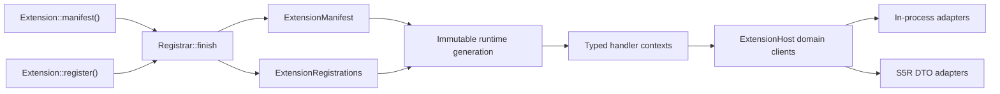
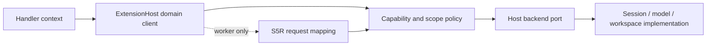

# 内置 Rust 扩展作者接口实现规范

> 状态：已实现；本文同时保留设计依据与迁移记录
>
> 范围：`astrcode-extension-sdk`、`astrcode-extensions` 与仓库内置 `astrcode-extension-*` crate
>
> 读者：SDK、扩展运行时和内置扩展维护者

## 1. 结论

AstrCode 的扩展运行时具备比单纯“好写”更难获得的性质：能力授权、S5R
子进程边界、不可变 runtime generation、旧 generation 延迟退休、统一注册校验和来源失败保护。
本次实现没有重写这些机制，而是收敛了它们在内置 Rust 扩展作者眼中的形状。

当前作者模型分为五层：

1. `Extension::manifest()` 声明身份、版本、说明和权限；
2. `Registrar` 将定义与 handler 一次注册，并产出不可变 `ExtensionRegistrations`；
3. 每类 handler 只接收一个职责明确、私有字段的上下文对象；
4. 上下文通过类型化领域客户端暴露宿主能力，不要求作者解包 `Option`、拼 capability
   字符串或手写 `serde_json::Value`；
5. `ExtensionTasks` 明确区分可取消后台任务和必须跨调用方取消完成的持久化事务。

Vvbot 的 `manifest()` builder、`prelude`、注册 API、上下文对象和类型化 host convenience
method 是作者体验参考，但不会照搬它当前的平行 registration vectors、过宽
`SessionControlBackend` 或仅面向机器人产品的能力。

## 2. 实现前的问题（历史）

本节记录迁移前的接口问题，用于解释后续取舍；这里出现的旧符号不是当前可用 API。

### 2.1 一个扩展被三套 API 描述

迁移前，内置扩展分别通过 `Extension::id()`、`Extension::capabilities()` 和
`Extension::register()` 描述自己。显示名、版本和说明主要属于 S5R 握手
`ExtensionManifest`，内置扩展没有同等的身份描述入口。

这带来三个问题：

- 查看一个扩展时，身份、权限和行为不在同一处；
- 内置扩展状态页无法稳定展示版本、说明等作者元数据；
- `ExtensionManifest` 同时被理解为 `extension.json` 元数据和运行时注册清单，名称与真实职责不一致。

### 2.2 注册调用存在不必要的分裂

迁移前，`Registrar::tool(definition, handler)` 已经把工具定义和 handler 绑定在一起，但
`tool_metadata()` 又要求作者按名称单独注册 prompt metadata。Provider hook 同时存在
`on_provider(event, ...)` 和更清楚的 `on_before_provider_request` /
`on_after_provider_response`；生命周期 hook 使用 `on_event`，容易与扩展自定义事件混淆。

运行时已经把完整 `Registrar` 保存为一代 resolved registration aggregate，这是正确的；作者
API 应沿着这个方向继续收敛，而不是把注册结果重新拆成平行字段。

### 2.3 handler context 形状不一致

迁移前，`ToolHandler::execute` 同时接收 `tool_name`、`arguments`、`working_dir` 和
`&ExtensionToolContext`；`CommandHandler` 采用另一组位置参数；HTTP handler 只有 request；
动态发现 handler 只有 `working_dir`；hook context 则公开大量字段。

后果是：

- 新增一个通用上下文字段可能需要修改多个 trait 签名；
- 作者很难判断应从参数、context 还是 host service 读取同一事实；
- 测试只能手工构造宿主内部形状，公开字段逐渐成为事实 ABI；
- 路径、取消、事件和宿主能力在不同 handler 中的可用方式不一致。

### 2.4 bundled 与 worker 使用两套宿主 API

迁移前，内置扩展从 `ExtensionCtx::host_services()` 取得一组可选服务；磁盘扩展通过
`HostClient` 使用类型化 DTO。前者要求作者反复处理“未声明 capability”和“宿主没有配置
backend”两个语义完全不同的 `None`，后者则有结构化 `ErrorPayload`。

同一项能力不应因为运行在进程内还是 S5R 子进程中而使用不同的业务词汇。传输可以不同，作者
看到的请求、响应和错误语义应尽量相同。

### 2.5 `prelude` 边界不够清楚

迁移前，bundled `prelude` 同时 re-export `Worker`、`HostClient` 和大量 worker DTO；
`worker_prelude` 又导出相近内容。作者指南要求两者不要混用，但类型入口没有强化这条边界。

### 2.6 需要收敛的重复入口

实现没有在旧 API 外再包一层 facade。每项新入口都替代了旧入口，并在工作区迁移完成后删除旧实现。
历史收敛关系如下：

| 实现前入口或重复形状 | 当前唯一入口 | 已删除或隐藏 |
|---|---|---|
| `Extension::id()` + `capabilities()` | `Extension::manifest()` | 两个旧 trait method |
| 磁盘 `ExtensionManifest` 与运行时 manifest 同名 | `ExtensionPackageManifest` / `ExtensionManifest` | 含义含混的旧类型名 |
| `Registrar::tool()` + 按名字 `tool_metadata()` | `ToolDefinitionBuilder::prompt()` + `Registrar::tool()` | `tool_metadata` map 和二次名称关联 |
| `on_provider(event, ...)` + before/after 专用入口 | before/after 专用入口 | `ProviderEvent` 驱动的注册别名 |
| `on_event(...)` 表示 lifecycle hook | `on_lifecycle(...)` | 容易与 custom event 混淆的别名 |
| handler 位置参数 + `ExtensionToolContext` + hook 公开字段 | 每个 handler 一个私有字段 context | 旧位置参数签名和生产 context struct literal |
| `ExtensionCtx::event_sink()` 与各 handler 单独事件路径 | `ExtensionCallContext::events()` | 作者可见的裸 event sink |
| `ExtensionHostServices` 可选 backend 字段 | `ExtensionHost` 领域客户端 | `trusted` re-export 和作者可见 backend trait |
| bundled `prelude` 中的 `Worker` / `HostClient` | `worker_prelude` | bundled prelude 的 worker-only re-export |
| 作者传 base path + extension id 的 state helper | `ExtensionPaths` | 可绕开 attribution 的路径拼接入口 |

实现没有留下“新 API 调旧 API、旧 API 又调新 API”的循环 compatibility 层；运行时只有一份注册
aggregate、一套 context 构造和一条 host 授权路径。

## 3. 目标与非目标

### 3.1 目标

- 一个新内置扩展只需要依赖 `astrcode-extension-sdk`。
- 阅读 `manifest()` 和 `register()` 即可知道扩展是谁、要什么权限、提供什么行为。
- 注册定义与 handler 不会因名字或索引不同步。
- 常见 handler 可以只实现一个带类型化 context 的方法。
- 内置扩展不直接接触 `SessionOperations`、`LlmProvider` 或裸 `HostRouter::invoke`。
- capability 未声明、backend 不可用、输入无效、取消、超时和内部失败可以区分。
- 新增 capability、hook 或 context 字段时有唯一扩展路径，不需要修改所有既有作者代码。
- bundled 与 worker 对相同宿主能力复用 DTO、错误码和行为语义。

### 3.2 非目标

- S5R 3.0 保留十进制长度前缀分帧，在同一次 major 升级中加入 feature negotiation、
  nested invoke、增量 stream 与 cancel；不兼容 1.0/2.0 worker。
- 不取消进程内扩展与子进程扩展的信任差异。
- 不把 Vvbot 的 Robot、Sensor、Audio、Telemetry 能力引入 AstrCode。
- 不在本设计中增加动态库 ABI、WASM runtime 或插件市场。
- 不改变现有 hook 的业务顺序、阻断规则、优先级或 runtime generation 语义。
- 不为了 API 对称添加没有当前调用方的能力。

## 4. 不可破坏的不变式

1. 内置扩展只能依赖扩展 SDK，不能依赖 `astrcode-session`、`astrcode-server`、
   `astrcode-storage` 或 `astrcode-extensions`。
2. manifest capability 是显式授权，不根据注册行为自动增加。
3. `register()` 是同步、确定性且无副作用的；I/O 和后台任务只能从 `start()` 或 handler 发起。
4. `start()` 中登记的普通后台任务在完整 reload batch 发布前保持挂起。
5. 一次 turn 固定一个不可变 extension generation；reload 不把两代 handler 混入同一 turn。
6. extension 被移出当前分发表后，旧 generation 的最后一个 view 释放前不得执行 `stop()`。
7. 所有线缆 DTO 只在 Host/S5R/HTTP/持久化边界映射，核心注册逻辑不处理 wire 命名。
8. capability、scope、路径、schema 和注册冲突在安装边界验证一次；执行期只验证跨边界输入和
   破坏性操作前仍然成立的条件。

## 5. 当前作者体验

以下示例使用当前 API；方法语义是本实现规范的契约。

```rust
use std::sync::Arc;

use astrcode_extension_sdk::prelude::*;
use astrcode_extension_sdk::extension::ToolHookTarget;
use serde::Deserialize;

pub fn extension() -> Arc<dyn Extension> {
    Arc::new(TodoExtension)
}

struct TodoExtension;

#[async_trait::async_trait]
impl Extension for TodoExtension {
    fn manifest(&self) -> ExtensionManifest {
        manifest("astrcode-todo-tool")
            .name("AstrCode Todo")
            .version(env!("CARGO_PKG_VERSION"))
            .description("Session-scoped progress tracking")
            .capability(ExtensionCapability::ProviderRequest)
            .capability(ExtensionCapability::ToolIntercept)
            .build()
    }

    fn register(&self, reg: &mut Registrar) {
        reg.tool(
            tool("todoWrite")
                .description("Replace the current session todo list")
                .parameters(todo_schema())
                .prompt(ToolPromptMetadata::new("Use for multi-step work"))
                .build(),
            Arc::new(TodoWriteHandler),
        );
        reg.on_before_provider_request(
            0,
            Arc::new(TodoReminderHandler),
        );
        reg.on_post_tool_use_for(
            ToolHookTarget::names(["todoWrite"]),
            0,
            Arc::new(TodoWriteObserver),
        );
    }
}

#[derive(Deserialize)]
#[serde(rename_all = "camelCase", deny_unknown_fields)]
struct TodoArgs {
    todos: Vec<TodoItem>,
}

struct TodoWriteHandler;

#[async_trait::async_trait]
impl ToolHandler for TodoWriteHandler {
    async fn plan(&self, ctx: ToolPlanContext) -> Result<ToolPlan, ExtensionError> {
        let _: TodoArgs = ctx.arguments()?;
        Ok(ToolPlan::host(HostResource::Session))
    }

    async fn execute(&self, ctx: ToolContext) -> Result<ToolExecutionResult, ExtensionError> {
        let input: TodoArgs = ctx.arguments()?;
        let state_dir = ctx.paths().session_data_dir()?;
        write_todos(state_dir, input.todos).await?;
        Ok(ToolResult::success("Todo list updated").into())
    }
}
```

这个例子有意避免：

- 重复传递 `tool_name`、`working_dir` 和 context；
- 根据 extension id 手工拼 `extension_data/<id>`；
- 在 `register()` 之外按工具名补充 metadata；
- 从 `ExtensionHostServices` 中逐项解包可选后端；
- 为常用结果填充与当前语义无关的默认 metadata。

## 6. 总体结构



`ExtensionManifest` 只描述作者身份与申请的权限；`ExtensionRegistrations` 只描述作者提供的
行为。运行时在安装边界校验二者的关系，并发布为一代不可变索引。

### 6.1 注册链路

注册链路只允许沿一个方向流动：

1. 作者用 builder 构造纯 declaration；
2. `Registrar` 原子绑定 declaration 与 handler；
3. `finish(manifest)` 做 extension 内校验，并返回
   `(ExtensionManifest, ExtensionRegistrations)`；
4. runner 将 manifest、registrations 与当前 generation 做全局校验；
5. handler index 只从该 aggregate 构建；
6. dispatcher 固定 generation view 后执行；
7. retirement supervisor 等待 view 释放，再回收 tasks 和 extension instance。

任何 registration family 都不能绕过 `Registrar` 直接写 runner 字段，也不能由 dispatcher 再按名字
从第二张表拼回 handler。这样定义、实现、权限和生命周期始终具有同一个 owner。

### 6.2 Host 调用链路



bundled 与 worker 的差异只存在于 `ExtensionHost` 之后：bundled adapter 直接进入 policy，worker
adapter 先做 wire DTO 映射。capability 判定、session ownership、超时、取消和错误 code 不得分别在
两个 adapter 中各实现一套。

## 7. 已实现 API 与逐项语义

### 7.1 `Extension` trait

```rust
#[async_trait::async_trait]
pub trait Extension: Send + Sync {
    fn manifest(&self) -> ExtensionManifest;
    fn register(&self, registrar: &mut Registrar) {}

    async fn start(&self, ctx: ExtensionStartContext) -> Result<(), ExtensionError> {
        Ok(())
    }
    async fn stop(&self, _ctx: ExtensionStopContext) -> Result<(), ExtensionError> {
        Ok(())
    }
    async fn health(&self) -> Result<(), ExtensionError> {
        Ok(())
    }
}
```

| API | 语义 | 可扩展性约束 |
|---|---|---|
| `manifest()` | 返回稳定身份、展示信息和显式 capability。宿主可以调用多次。 | 必须纯函数；不得读取配置、文件或网络。未来增加可选元数据通过 builder 和私有字段完成。 |
| `register()` | 同步声明工具、命令、HTTP、事件和 hook。每个实例安装时调用一次。 | 不返回运行时资源，不启动任务；新增注册族进入 `ExtensionRegistrations`，不能给 `HostedExtension` 增加平行 vector。 |
| `start()` | 在注册与配置校验成功后、候选代尚未对 turn 可见前初始化资源。 | 通过 `ctx.config()` 读取本实例完整配置；失败时宿主调用 `stop(StartupFailed)`。普通 task 在 batch 发布前挂起，Host I/O 与事件发送在候选阶段被 typed gate 拒绝，不得裸 `tokio::spawn`。 |
| `stop()` | 释放资源；reload、disable、shutdown 和 startup rollback 均可触发。 | 必须幂等并容忍部分初始化；旧 generation view 释放后才调用。配置变化通过 fresh instance replacement 完成，不对活动实例执行可变 reconfigure。 |
| `health()` | 只读检查当前扩展能否服务新请求。 | 有统一超时；不得修复状态或触发 reload；详细诊断由结构化 health DTO 后续独立扩展。 |

历史上的 `id()` 和 `capabilities()` 已由 `manifest()` 替代。`Extension` trait 只用于进程内 Rust
扩展，工作区迁移已一次完成，没有保留双轨 trait。

### 7.2 `ExtensionManifest` 与 builder

```rust
pub fn manifest(id: impl Into<String>) -> ExtensionManifestBuilder;

impl ExtensionManifestBuilder {
    pub fn name(self, name: impl Into<String>) -> Self;
    pub fn version(self, version: impl Into<String>) -> Self;
    pub fn description(self, description: impl Into<String>) -> Self;
    pub fn capability(self, capability: ExtensionCapability) -> Self;
    pub fn build(self) -> ExtensionManifest;
    pub fn build_checked(self) -> Result<ExtensionManifest, ExtensionManifestError>;
}
```

| API | 语义 |
|---|---|
| `manifest(id)` | `id` 是配置、状态目录、诊断和事件 attribution 的稳定键；必须以 ASCII 字母或数字开头，后续只允许 ASCII 字母、数字、`.`、`-`、`_`。`name` 默认等于 id。 |
| `name()` | 仅用于 UI 和诊断，不参与路由或所有权。 |
| `version()` | 作者显式提供；不使用 SDK 自己的 crate version，也不伪造默认版本。 |
| `description()` | 人类可读摘要，不作为 prompt 或权限依据。 |
| `capability()` | 去重保存显式申请；注册某项行为不会自动授予权限。 |
| `build()` | 构造值；宿主安装时仍必须验证，不能信任作者已经调用 `build_checked()`。 |
| `build_checked()` | 供扩展单元测试和打包检查提前获得同一校验错误。 |

authoring manifest builder 不提供 `.tool()`、`.command()` 等行为声明方法。行为必须在
`register()` 中与 handler 原子绑定；否则会重新产生“manifest 有定义但 registrar 没 handler”的
平行清单和名称关联问题。

描述 `extension.json` 的 serde 类型已命名为 `ExtensionPackageManifest`。它是磁盘发现边界
DTO，不与内置扩展的 authoring manifest 共用名字。S5R initialize manifest 继续由 Worker
registrations 自动生成，不要求作者在 JSON 中重复 tools 或 hooks。包中的 `extension_id` 是
启动前可读取的权威身份，握手必须返回同一 ID。

### 7.3 `Registrar` 与 `ExtensionRegistrations`

```rust
pub struct Registrar { /* private mutable collection */ }
pub struct ExtensionRegistrations { /* private immutable aggregate */ }

impl Registrar {
    pub fn tool(&mut self, definition: impl Into<ExtensionToolDefinition>, handler: Arc<dyn ToolHandler>);
    pub fn tool_discovery(&mut self, handler: Arc<dyn ToolDiscoveryHandler>);
    pub fn command(&mut self, command: SlashCommand, handler: Arc<dyn CommandHandler>);
    pub fn command_discovery(&mut self, handler: Arc<dyn CommandDiscoveryHandler>);
    pub fn http_route(&mut self, route: ExtensionHttpRoute, handler: Arc<dyn ExtensionHttpHandler>);
    pub fn keybinding(&mut self, binding: Keybinding);
    pub fn status_item(&mut self, item: StatusItem);
    pub fn declare_custom_event(&mut self, event: CustomEventDeclaration);
    pub fn on_custom_event(&mut self, subscription: CustomEventSubscription, handler: Arc<dyn CustomEventHandler>);

    pub fn on_tool_input_transform(&mut self, priority: i32, handler: Arc<dyn ToolInputTransformHandler>);
    pub fn on_tool_input_transform_for(&mut self, target: ToolHookTarget, priority: i32, handler: Arc<dyn ToolInputTransformHandler>);
    pub fn on_pre_tool_use(&mut self, priority: i32, handler: Arc<dyn PreToolUseHandler>);
    pub fn on_pre_tool_use_for(&mut self, target: ToolHookTarget, priority: i32, handler: Arc<dyn PreToolUseHandler>);
    pub fn on_post_tool_use(&mut self, priority: i32, handler: Arc<dyn PostToolUseHandler>);
    pub fn on_post_tool_use_for(&mut self, target: ToolHookTarget, priority: i32, handler: Arc<dyn PostToolUseHandler>);
    pub fn on_before_provider_request(&mut self, priority: i32, handler: Arc<dyn ProviderHandler>);
    pub fn on_after_provider_response(&mut self, priority: i32, handler: Arc<dyn ProviderHandler>);
    pub fn on_prompt_build(&mut self, priority: i32, handler: Arc<dyn PromptBuildHandler>);
    pub fn on_compact(&mut self, event: CompactEvent, priority: i32, handler: Arc<dyn CompactHandler>);
    pub fn on_continue_after_stop(&mut self, priority: i32, options: ContinueAfterStopOptions, handler: Arc<dyn ContinueAfterStopHandler>);
    pub fn on_user_message_envelope(&mut self, priority: i32, handler: Arc<dyn UserMessageEnvelopeHandler>);
    pub fn on_lifecycle(&mut self, event: LifecycleEvent, priority: i32, handler: Arc<dyn LifecycleHandler>);

    #[doc(hidden)]
    pub fn finish(self, manifest: ExtensionManifest)
        -> Result<(ExtensionManifest, ExtensionRegistrations), RegistrationError>;
}
```

#### 声明类 API

| API | 语义与冲突规则 | 扩展规则 |
|---|---|---|
| `tool` | 定义与 handler 原子绑定；同一 extension 内或全局静态工具重名时安装失败。 | prompt metadata 进入 `ToolDefinition` builder，不保留按名字二次注册。 |
| `tool_discovery` | 按工作区动态返回定义、handler 和 metadata 的整体；失败形成诊断而不是伪装为空目录。 | 返回 `Result<ToolDiscovery, ExtensionError>`，未来字段加到 discovery result。 |
| `command` | 命令定义与执行/补全 handler 原子绑定；静态命令重名安装失败。 | 补全作为同一 handler 的可选方法，不再另设名字索引。 |
| `command_discovery` | 为当前工作区提供动态命令集合。 | 与动态工具使用同一缓存 generation 和错误模型。 |
| `http_route` | 路由定义与 handler 原子绑定；校验 scope capability、路径、body 上限和冲突。 | handler 取得 `HttpContext`；新增认证模式通过 access enum 和边界映射扩展。 |
| `keybinding` | 将按键映射到本 extension 已注册命令；目标不存在时安装失败。 | 只声明 UI 意图，不直接执行前端代码。 |
| `status_item` | 声明一个可由命令结果或 custom event 更新的状态项。 | id 在 extension 内唯一；未来样式字段保持可选且不改变语义。 |
| `declare_custom_event` | 声明 extension 可发射的事件名、schema version、类型化 delivery 和 payload 上限。 | 发射时必须匹配声明；schema 演进以 version 为边界，不静默接受未知大 payload。 |

`Registrar` 的读取 accessor 只供运行时内部使用；作者只看到写入 API。`finish(manifest)` 完成所有
局部校验，并把 manifest 与冻结后的 aggregate 成对返回。全局名称冲突等需要当前 runtime 上下文的
校验仍由安装层完成。

#### Hook API

| API | 触发点 | mode / 返回值语义 | 必需 capability |
|---|---|---|---|
| `on_tool_input_transform[_for]` | 工具参数规范化之前 | blocking-only；按 priority 折叠 `Unchanged` / `Replace`，不能作准入决策。 | `tool_intercept`。 |
| `on_pre_tool_use[_for]` | 参数变换和规范化之后、工具副作用之前 | blocking-only；可 Allow、Block 或 Ask。所有 handler 读取同一最终参数，Ask 聚合且 Block 覆盖。 | `tool_intercept`。 |
| `on_post_tool_use[_for]` | 工具结果生成之后、交给模型之前 | blocking 可修改可见结果或阻断后续；`Advisory` / `NonBlocking` 只观察，结果丢弃。 | 只有 blocking 需要 `tool_intercept`。 |
| `on_before_provider_request` | provider 请求最终 wire 编码之前 | blocking 可阻断、替换或追加 messages；按 priority 串行合成。 | `provider_request`。 |
| `on_after_provider_response` | provider 响应完成之后 | 永远是 observer；错误记录诊断，不改写已完成响应。 | `provider_request`。 |
| `on_prompt_build` | session prompt 构建时 | 返回结构化 contributions；按 priority 稳定合并。首次调用可能早于 `SessionStarted` 持久化。 | 无额外 capability，除非 handler 调用其它 host client。 |
| `on_compact` | compact 前或后 | pre 可阻断/贡献指令；post 只能观察或贡献后续状态，具体矩阵保持现状。 | `session_history`。 |
| `on_continue_after_stop` | 模型自然停止且无工具调用后 | 请求至多继续一个 step；宿主执行 per-handler 和全局预算。 | `turn_continuation_control`。 |
| `on_user_message_envelope` | 用户消息写入 transcript 之前 | 可 Allow、ReplaceText、AppendText、Block；不得改变已校验附件所有权。 | `provider_request`。 |
| `on_lifecycle` | Session/Turn/Step 生命周期点 | 只有 hook matrix 明确允许的事件可 blocking；其他事件支持 awaited advisory 或 lifecycle-managed non-blocking 通知。 | 按行为校验，不因“生命周期”统一申请高权限。 |

含义模糊的 provider/lifecycle 旧别名已经删除；当前只保留 before/after provider 专用入口和
`on_lifecycle`。

### 7.4 Handler trait 与 closure adapter

所有 handler trait 都只接收一个 context。context 自己持有请求输入和公共调用上下文，不再通过
位置参数重复传递同一事实。

```rust
#[async_trait::async_trait]
pub trait ToolHandler: Send + Sync {
    async fn execute(&self, ctx: ToolContext)
        -> Result<ToolExecutionResult, ExtensionError>;
}

#[async_trait::async_trait]
pub trait CommandHandler: Send + Sync {
    async fn execute(&self, ctx: CommandContext)
        -> Result<ExtensionCommandResult, ExtensionError>;

    async fn complete(&self, ctx: CommandCompletionContext)
        -> Result<CommandCompletions, ExtensionError> {
        Ok(CommandCompletions::default())
    }
}

#[async_trait::async_trait]
pub trait ExtensionHttpHandler: Send + Sync {
    async fn handle(&self, ctx: HttpContext)
        -> Result<ExtensionHttpResponse, ExtensionError>;
}
```

| Handler | 输入 | 输出语义 |
|---|---|---|
| `ToolHandler::plan` | `ToolPlanContext` | 只把最终参数解释成 `ToolPlan`；无 Host、event、task 或 persistence。 |
| `ToolHandler::execute` | `ToolContext` | 权限与 lease 已建立后执行；返回 `ToolExecutionResult::Completed` 或 `CompletedWithDiscoveredTools`。 |
| `CommandHandler::execute` | `CommandContext` | Display、Handled、StartTurn 等互斥 command decision。 |
| `CommandHandler::complete` | `CommandCompletionContext` | 光标位置对应的补全集合；只有 command 声明支持补全时调用。 |
| `ExtensionHttpHandler::handle` | `HttpContext` | 结构化 JSON response；status 和 body 在返回边界校验。 |
| `ToolDiscoveryHandler::discover` | `ToolDiscoveryContext` | 一组完整 `DiscoveredTool` 或结构化错误，不用空集合表示扫描失败。 |
| `CommandDiscoveryHandler::discover` | `CommandDiscoveryContext` | 一组 command+handler aggregate 或结构化错误。 |
| hook handler `handle` | 对应 hook context | 对应 hook result；runtime 在应用前验证 mode 允许该 decision。 |

SDK 为无状态 handler 提供 closure adapter：

```rust
reg.tool(
    tool("ping").description("Return pong").build(),
    tool_handler(
        |_ctx| async { Ok(ToolPlan::default()) },
        |_ctx| async { Ok(ToolResult::success("pong")) },
    ),
);

reg.tool(
    tool("greet").parameters(greet_schema()).build(),
    tool_handler_args(
        |_args: GreetArgs, _ctx| async move { Ok(ToolPlan::default()) },
        |args: GreetArgs, _ctx| async move {
            Ok(ToolResult::success(format!("hello, {}", args.name)))
        },
    ),
);
```

`tool_handler_args` 在 plan 与 execute 两个阶段分别解码同一最终参数，错误仍走同一
`InvalidInput` 模型；它不生成 schema，也不根据 Rust 类型推断 provider strict。其它 adapter 只在确实能消除重复
boilerplate 时提供，例如 `http_handler`、`command_handler`，不为每个 hook 机械复制一组函数。

### 7.5 Builder

#### `tool()`

```rust
pub fn tool(name: impl Into<String>) -> ToolDefinitionBuilder;

impl ToolDefinitionBuilder {
    pub fn description(self, text: impl Into<String>) -> Self;
    pub fn parameters(self, schema: serde_json::Value) -> Self;
    pub fn strict(self) -> Self;
    pub fn non_strict(self) -> Self;
    pub fn execution_mode(self, mode: ExecutionMode) -> Self;
    pub fn prompt(self, metadata: ToolPromptMetadata) -> Self;
    pub fn build(self) -> ExtensionToolDefinition;
}
```

- 默认 non-strict、`ExecutionMode::Sequential`、空 object schema。
- `strict()` 是作者对所有目标 provider strict 子集的显式承诺；宿主仍在 provider 边界编译和验证。
- `prompt()` 只影响模型如何理解/使用工具，不改变执行权限或 schema。
- `build()` 不接受 handler；handler 只在 `Registrar::tool` 绑定，避免 builder 持有运行态对象。

#### `command()`

```rust
pub fn command(name: impl Into<String>) -> SlashCommandBuilder;

impl SlashCommandBuilder {
    pub fn description(self, text: impl Into<String>) -> Self;
    pub fn arguments(self, schema: serde_json::Value) -> Self;
    pub fn requires_idle(self, value: bool) -> Self;
    pub fn argument_completions(self, value: bool) -> Self;
    pub fn priority(self, value: i32) -> Self;
    pub fn availability(self, value: CommandAvailability) -> Self;
    pub fn host_command(self, value: SessionCommandKind) -> Self;
    pub fn build(self) -> SlashCommand;
}
```

`availability` 是 list、execute、complete 共用的 transport admission；例如
`InteractiveOnly` 命令不会进入非交互列表，也不会在 HTTP 调用中先执行 handler 再报错。
`host_command` 只声明一个类型化宿主 intent，Extension 不持有宿主服务或 operation gate；使用它的
Extension 必须声明 `SessionCommand` capability，宿主会在注册、动态发现、返回结果三个边界校验
declaration、capability 与 intent 一致。server 仍在调用 handler 前重新检查 session/turn 状态。

声明 `argument_completions(true)` 但 handler 未实现补全时安装失败，而不是运行时返回空列表掩盖配置错误。

#### `http_route()`、`keybinding()`、`status_item()`、`custom_event()`

这些 builder 采用与 `tool()` 相同的规则：构造纯描述值、提供安全默认值、在 `finish()` 与宿主
安装边界再次校验。建议入口为：

```rust
http_route(method, path).public().max_body_bytes(...).description(...).build();
keybinding(key, command).arguments(...).description(...).build();
status_item(id, text).priority(...).build();
custom_event(name)
    .schema_version(...)
    .delivery(CustomEventDelivery::SessionDurable)
    .max_payload_bytes(...)
    .build();
```

HTTP 默认应保持 authenticated，而不是 Vvbot 当前 builder 的 admin 命名，也不能为了更省代码默认
公开。事件 delivery 默认是 `SessionDurable`；需要 live session 或进程级实时 fan-out 时显式选择
`SessionLive` 或 `GlobalLive`。类型中不存在无有效 owner 的 global durable 组合。

### 7.6 统一 context

所有运行期 context 字段私有，通过 accessor 读取，并标记为 host-constructed。SDK 在
`testing` 模块提供 builder；生产作者不直接构造 context。这样新增字段不破坏下游 struct literal。

#### 公共调用上下文

```rust
#[derive(Clone)]
pub struct ExtensionCallContext { /* private */ }

impl ExtensionCallContext {
    pub fn extension_id(&self) -> &str;
    pub fn paths(&self) -> &ExtensionPaths;
    pub fn host(&self) -> &ExtensionHost;
    pub fn events(&self) -> &CustomEventEmitter;
    pub fn tasks(&self) -> &ExtensionTasks;
    pub fn cancellation(&self) -> &CancellationToken;
}
```

| accessor | 语义 |
|---|---|
| `extension_id()` | 由 manifest attribution 注入，不能由请求覆盖。 |
| `paths()` | 只返回该 extension 已授权的数据目录，不让作者拼 extension id。 |
| `host()` | 类型化、已按 capability 和调用范围裁剪的宿主客户端。 |
| `events()` | 只能发射本 manifest 已声明事件；未声明时报结构化错误。 |
| `tasks()` | 当前 extension generation 的任务所有权；用于登记后台任务或 must-finish 临界区。 |
| `cancellation()` | turn、HTTP request、reload 或 shutdown 的组合取消信号；handler 应协作退出。 |

session 与 workspace 事实不暴露在公共调用上下文上。`SessionCallContext::session_id()` 和
`WorkspaceCallContext::working_dir()` 均为非可选值；`ToolContext`、hook context、command context
组合这些事实并直接提供同名 accessor。只有真正可缺省的 turn id、tool call id 和 startup working
directory 保持 `Option`。缺少必需事实的输入由运行时在构造专用 context 前拒绝，作者代码不做
`Option + require_*()` 检查。

#### 专用 context

| 类型 | 额外事实 | 约束 |
|---|---|---|
| `ExtensionStartContext` | config、tasks、global paths、startup working dir、startup host | 没有隐式 session；session-scoped client 调用返回 `ContextUnavailable`。 |
| `ToolContext` | tool name、call id、arguments、model、available tools | `arguments<T>()` 统一做 JSON 解码并返回带工具名的 `InvalidInput`。 |
| `CommandContext` | command name、argument、model | 只供 execute；不再重复传递位置参数。 |
| `CommandCompletionContext` | command name、argument、cursor、model | 只供 complete；与 execute 共享同一个公共调用上下文。 |
| `HttpContext` | route、request、可选 caller/session、path params | body 上限已在 transport 边界验证；handler 不重新读取 socket。 |
| `ToolDiscoveryContext` | working dir、当前 generation | 返回整体 discovery result；支持后续增加诊断和 cache hint。 |
| `CommandDiscoveryContext` | working dir、当前 generation | 与工具发现采用相同取消和缓存语义。 |
| 各 hook context | 公共 turn context 加该 hook 独有输入 | 不暴露无关 host 内部字段；新增可选事实通过 accessor。 |

`ToolContext::arguments<T>()`、`HttpContext::json<T>()` 等只是边界反序列化便利方法，不把内部函数
调用改造成 DTO。类型化参数仍由具体扩展定义并使用 `deny_unknown_fields`。

#### `CustomEventEmitter`

```rust
impl CustomEventEmitter {
    pub async fn emit<T: serde::Serialize + ?Sized>(
        &self,
        event: &str,
        payload: &T,
    ) -> Result<EventDeliveryReceipt, CustomEventEmitError>;
}
```

`emit` 根据当前 extension attribution 查找声明，验证事件名、schema version 对应的 payload 大小
和当前调用是否具有 event sink。delivery 由声明决定，调用方不能在每次 emit 时改写；需要改变
delivery 时必须声明新的 event version。未来若引入生成式 typed event handle，它只能包装这套
校验，不能形成第二条发射路径。

### 7.7 `ExtensionHost` 与领域客户端

Vvbot 在 `ExtensionHostInvoker::invoke(capability, Value)` 之上提供类型化默认方法，已经证明作者不应
反复拼 capability 字符串和 JSON。AstrCode 采用同一优点，但不让一个 invoker trait 随能力增长成
单体接口：公开面按领域拆成 client，raw invoke 只留在 worker transport adapter 内。

```rust
#[derive(Clone)]
pub struct ExtensionHost { /* private scoped clients */ }

impl ExtensionHost {
    pub fn models(&self) -> ModelClient;
    pub fn session_control(&self) -> Result<SessionControlClient, HostError>;
    pub fn session_history(&self) -> Result<SessionHistoryClient, HostError>;
    pub fn session_state(&self) -> Result<SessionStateClient, HostError>;
    pub fn session_inspect(&self) -> Result<SessionInspectClient, HostError>;
    pub fn workspace(&self) -> Result<WorkspaceClient, HostError>;
    pub fn process(&self) -> Result<ProcessClient, HostError>;
    pub fn network(&self) -> Result<NetworkClient, HostError>;
    pub fn extension_http(&self) -> Result<ExtensionHttpClient, HostError>;
}
```

领域 accessor 返回持有 `ExtensionHost` 轻量克隆的 owned client，不返回借用。除 `models()` 外，
accessor 先校验授权（若该领域需要）、backend 和当前调用范围并返回 `Result`；`session_state()`
没有额外 capability，但仍要求 session context 和 state backend。`models()` 的主/小模型授权在
`main_available` / `small_available` 与具体调用处分别校验：

- manifest 未声明能力：`HostError::code_enum() == Some(WireErrorCode::PermissionDenied)`；
- 已声明但当前宿主没有 backend：`WireErrorCode::BackendUnavailable`；
- 当前调用没有所需 session/turn/workspace 上下文：`WireErrorCode::ContextUnavailable`。

这三种情况必须可观察地区分。公开作者 API 不提供 `invoke("astrcode.*", Value)`；raw invoke 只属于
HostRouter/S5R transport adapter。

#### `SessionControlClient`

| API | 语义 |
|---|---|
| `create_root()` | 为外部 channel 等可信入口创建顶层 session；working directory 与 source extension 均由 host call context 绑定，不接受作者伪造。 |
| `submit_root_turn(request)` | 向本 extension 持有的顶层 session 提交输入；使用 `input_delivery`，不扩大为任意 session 控制。 |
| `root_state(request)` | 读取本 extension 持有的顶层 session 生命周期与执行状态；使用 `input_delivery`。 |
| `create_child(request)` | 在 caller 下创建直属子 session；深度、工具边界和 working dir 由宿主验证。 |
| `configure_tools(request)` | 只影响目标 session 后续 turn；不能扩大父链已经限制的工具集合。 |
| `submit_turn(request)` | 向已有 session 提交 turn；`wait_for_result=false` 只表示提交成功，不表示运行完成。 |
| `inject_or_start(request)` | 活跃 turn 时注入，否则原子启动新 turn；返回 Started、Injected 或 Queued。 |
| `interrupt_and_submit(request)` | 在同一 delivery gate 中取消当前 turn 并提交新输入，避免中间空窗。 |
| `cancel_turn(target)` | 返回类型化 `HostSessionCancelOutput { cancelled }`；`cancelled=false` 明确表示没有活跃 turn 的幂等 no-op。 |
| `execution_view(target)` | 返回热状态：phase、active turn 和队列长度，不读取完整历史。 |
| `state(target)` | 返回 active/recycled 生命周期、phase、active turn、队列和 message count。 |
| `recycle(target)` | 默认清理方式；移动到 recycled storage 并撤销运行态/父关系，不永久删除。 |
| `reactivate(target)` | 只允许 caller 的直属已回收子 session；恢复存储、运行态和父关系；重复调用成功且 `reactivated=false`。 |

不把永久删除加入通用 `session_control` convenience API。出现真实内置调用方时，应增加更窄的
destructive capability，并在删除点重新验证所有权和目标路径。

#### `SessionHistoryClient`

| API | 语义 |
|---|---|
| `list_summaries()` | 列出当前 session scope 已授权的稳定 session 摘要。 |
| `transcript(request)` | 读取稳定 transcript DTO，不暴露内部消息存储类型。 |
| `provider_messages(request)` | 读取 provider 实际可见 messages，用于诊断而非修改历史。 |
| `token_usage(request)` | 读取按 session 汇总的 token usage。 |
| `events_page(request)` | 使用 cursor 分页读取已授权 session 的 durable events；不提供默认“全部读完”。 |
| `snapshot(target)` | 返回 active 或 recycled session 的稳定 inspect DTO；大型 session 的 replay 成本由调用方显式承担。 |

同 session 读取与跨 session 读取的授权规则由 host 统一执行，client 不接受 caller id 参数。

#### `SessionInspectClient`

| API | 语义 |
|---|---|
| `list()` | 全局 privileged 列出宿主可见 sessions。 |
| `snapshot(id)` | 读取全局 session snapshot。 |
| `read_model(id)` | 返回 SDK 定义的稳定 DTO，不暴露内部 read model enum。 |
| `provider_messages(id)` | 返回 provider 实际可见 messages，用于诊断而非修改历史。 |

`session_inspect` 始终是高权限能力，不因为 bundled extension 在进程内就默认授予。

#### 其它领域客户端

| Client | API | 语义 |
|---|---|---|
| `ModelClient` | `main_chat`、`small_chat`、`*_chat_events`、`*_chat_collected` | main 使用 session active model，small 使用宿主 small model；events 方法返回渐进式 `ModelStream`，collected 方法返回最终 content、model 和有序 chunks。 |
| `WorkspaceClient` | `read`、`list`、`grep`、`glob`、`write`、`edit` | 所有路径相对规范化 working dir；拒绝越界、symlink 和敏感路径；写操作重新校验目标。 |
| `ProcessClient` | `spawn` | 总超时包含排队；cwd 在 workspace 内；进程执行不是 OS sandbox。 |
| `NetworkClient` | `send` | 仅 HTTP(S)，拒绝本机、内网和链路本地目标；body 在作者 API 中是原始字节，线缆使用 base64。`max_bytes <= 10 MiB`，`timeout_ms` 为 `1..=60_000`；`Manual` 返回受大小限制的原始 3xx body。 |
| `ExtensionHttpClient` | `dispatch_public` | 只能调另一 extension 的公开路由；同步自调用因重入风险被拒绝。 |

bundled adapter 可以直接调用内部 trait；worker adapter 将同一请求/响应映射为 S5R DTO。
两者共享领域方法名、错误 code 和验收测试，但不强求共享具体 transport 类型。
worker 从 `HostClient::models()` / `session_control()` / `session_history()` / `session_inspect()` /
`workspace()` / `process()` / `network()` / `extension_http()` 取得对应领域 client；raw
`HostApi` 只在 `astrcode_extension_worker::testing` 作为可注入 transport seam。

当前统一 invoker 的流式入口是 collected stream：宿主收集有序 delta 后一次返回。真正的渐进式
author-facing stream 是未来演进项；不能把当前返回值描述为边生成边交付。

### 7.8 `ExtensionTasks`

```rust
impl ExtensionTasks {
    pub fn spawn(&self, name: impl Into<String>, future: impl Future<Output = ()> + Send + 'static);

    pub async fn run_to_completion<T>(
        &self,
        name: impl Into<String>,
        future: impl Future<Output = T> + Send + 'static,
    ) -> Result<T, ExtensionTaskError>
    where
        T: Send + 'static;

    pub fn cancellation(&self) -> CancellationToken;
}
```

| API | 语义 |
|---|---|
| `spawn` | 生命周期拥有的可取消后台任务；start 阶段先挂起，发布后启动；stop 时共享预算，超时可 abort。 |
| `run_to_completion` | 已进入不可撤销持久化临界区的任务；调用方取消只丢弃等待，不取消事务；replacement 的 `start()` 和发布必须等旧 generation drain。 |
| `cancellation` | 供后台循环协作退出；不能替代 host 对 handle 的最终 drain/abort。 |

`run_to_completion` 不能返回 `Option<T>` 混合“正在 shutdown”和“task panic”。错误至少区分
`ShuttingDown`、`Panicked` 与 runtime failure。它不得用于永久循环、网络轮询或普通可重试工作，
因为 must-finish 任务可以有意超过 shutdown budget。内置 memory 扩展的 append、精准 upsert 和
delete 已通过该入口持有不可撤销的磁盘写入；只读查询仍使用普通有界 blocking adapter。

作者业务后台工作中的裸 `tokio::spawn` 属于 review 问题。运行时 adapter 或资源句柄只有在自身
持有 task handle、明确实现 abort/drain 并处理错误时，才可创建不登记到 `ExtensionTasks` 的内部任务。

### 7.9 Config、paths 与 state

```rust
impl ExtensionConfig {
    pub fn deserialize<T: DeserializeOwned>(&self) -> Result<T, ExtensionConfigError>;
    pub fn deserialize_or_default<T: DeserializeOwned + Default>(&self)
        -> Result<T, ExtensionConfigError>;
    pub fn is_empty(&self) -> bool;
}

impl ExtensionPaths {
    pub fn global_data_dir(&self) -> Option<&Path>;
    pub fn session_data_dir(&self) -> Result<&Path, ExtensionPathError>;
}
```

- 配置错误包含 extension id 和 serde path；不能降级为空配置掩盖拼写或类型错误。
- `deserialize_or_default` 只在整个配置为 `{}` 或 `null` 时返回 default，字段级错误仍失败。
- path 已包含 extension id namespace；作者不再调用 `session_data_dir(base, id)`。
- 当前 SDK 只负责提供已归属的路径，不另设通用 JSON state helper。未来若出现多个真实调用方，
  应增加 `read_json_bounded`、`write_json_atomic` 这类明确语义的 API，而不是宽泛 `utils` 或隐藏
  跨进程事务语义的万能 state store。

### 7.10 错误模型

```rust
pub struct HostError {
    pub code: String,
    pub message: String,
    pub hint: Option<String>,
    pub retryable: bool,
    pub details: Option<serde_json::Value>,
}

impl HostError {
    pub fn code_enum(&self) -> Option<WireErrorCode>;
}

// `astrcode_extension_sdk::WireErrorCode`（定义于 `sdk::wire`），
// 宿主与 worker 共享的线缆错误码，单点定义在 SDK wire 模块：
// 通用码 PermissionDenied、BackendUnavailable、ContextUnavailable、InvalidInput、
// Cancelled、Timeout、Transport 等，以及 network、session 等领域码。
```

- `HostError` 无损保存 S5R `ErrorPayload` 的全部字段；`code` 不在 `WireErrorCode` 已知集合时
  `code_enum()` 返回 `None`，原始 `code` 字符串不丢失。
- `code_enum()` 只为已知线缆码提供类型化分支；业务诊断和转发仍读取原始 `code`、`hint`、
  `retryable` 与 `details`。
- 同一错误只在最可操作的层增加一次上下文。
- `ExtensionError` 包含 `Host(HostError)` 与作者领域错误；不能把所有宿主失败 stringify 成
  `Internal(String)`。
- timeout、cancelled、busy 和 rejected 是不同状态，调用方才能决定重试或状态核对。
- registration error 与 handler error 分开；安装失败不能伪装成 extension 运行时失败。

### 7.11 Prelude 与测试入口

```rust
use astrcode_extension_sdk::prelude::*;        // bundled Rust extension
use astrcode_extension_worker::worker_prelude::*; // S5R executable
```

bundled `prelude` 只导出：

- `Extension`、manifest 和 declaration builders；
- `Registrar`、handler traits、context/result 类型；
- `ExtensionHost` 领域客户端和共享 DTO；
- `ExtensionTasks`、config 与 attributed paths；
- 常用 `SessionId`、`ToolCallId` 等 authoring types。

它不导出 `Worker`、静态 `HostClient`、S5R wire message、HostRouter 或宿主实现 trait。
`worker_prelude` 只导出 Worker、worker handler adapter、`HostClient` 和 wire-bound DTO。共享领域 DTO
从稳定模块 re-export，不在两个 prelude 各定义一份。

SDK 提供独立的 `testing` 模块：

- `ToolContextBuilder`、`CommandContextBuilder`、`HttpContextBuilder` 与统一
  `HookContextBuilder`；后者可构造 Continue、UserEnvelope、Pre/PostToolUse、Provider、Prompt、
  Compact 和 Lifecycle 作者上下文；
- `MockExtensionHost`，通过 `.grant()`、session/workspace scope 与按 `HostOperation` 配置的
  `.respond()` / `.fail()` 走真实 preflight，并记录 invocation；
- `RegistrationHarness::register(&dyn Extension)`，走真实
  `Registrar::finish(manifest)`，返回同时持有 manifest 与 registrations 的
  `RegisteredExtension`；
- `ExtensionLifecycleHarness`，验证 registration、suspended tasks、start、config、cancel/drain、
  stop 与 startup rollback 顺序。

这些 builder 只用于测试，不成为生产 context 的第二套公开构造协议。测试默认值必须显式安全，
例如没有 session、没有 workspace、没有 capability、未取消且 host backend 不可用；需要权限和
backend 的测试必须主动 grant 并配置响应。

### 7.12 明确的未来演进项（不是当前 API）

- `ModelClient` 的渐进式 author-facing `Stream`；当前只有完成后返回的 collected stream。
- 结构化 health 诊断与 config callback 的 `ReloadRequired` 决策；当前分别是 `Result<(),
  ExtensionError>`。
- 生成式 typed event handle 与通用 JSON state helper；当前只有声明校验后的
  `CustomEventEmitter` 和 attributed `ExtensionPaths`。
- 独立 Task Plane client；只有出现稳定调用方与独立权限模型后再设计，不扩张
  `SessionControlClient`。

## 8. 生命周期与并发时序

### 8.1 安装

1. 调用 `manifest()` 并做局部校验；
2. 创建空 `Registrar`，调用 `register()`；
3. `finish()` 冻结 registrations 并验证 capability、mode、局部名称和引用；
4. 与当前 runtime generation 做全局冲突校验；
5. 创建 suspended `ExtensionTasks` 和 scoped `ExtensionStartContext`；
6. 调用 `start()`；失败则 cancel/drain tasks，再 `stop(StartupFailed)`；
7. 原子发布完整 reload batch；
8. 激活普通后台任务。

### 8.2 handler 调用

1. turn 固定 `ExtensionView`；
2. runtime 从同一 generation 取得 handler 与 manifest attribution；
3. 构造私有字段 context，并按 capability/调用范围裁剪 host client；
4. 在统一 timeout、cancel 和 diagnostics 包装下调用 handler；
5. 验证 handler result，再在 session/provider 边界应用。

### 8.3 reload / disable / shutdown

1. 从当前分发表移除 extension，发布一个不再分发到旧实例的 generation；
2. 新 turn 不再看到旧 registration；
3. 发出 generation cancellation，并阻止新的后台任务与 `run_to_completion` 注册；
4. 等待旧 generation view 协作退出并释放；
5. drain 已登记 must-finish work，限时等待并最终中止未退出的普通后台任务；
6. 调用 `stop(reason)`；
7. reload 只有越过该 extension id 的 retirement barrier 后，才能 `start()` 并发布 replacement；
8. disable 到此结束；shutdown 则汇总而不吞掉 stop/retirement 错误。

replacement 的纯 discovery 与包 manifest 校验可以提前完成，但进程启动、握手和 registration
校验都必须位于旧 must-finish barrier 之后。当前 retirement supervisor 提供按 extension id 等待的 barrier，
不靠轮询 task 数量或固定 sleep 猜测退休完成；authoring facade 也不能绕过 supervisor，或把
`stop()` 提前到第 1 步。

## 9. 如何增加新 API

### 9.1 新增 host capability

必须同时完成：

1. 在 SDK capability enum 中加入领域名称和稳定 wire name；
2. 定义请求/响应领域类型；跨 S5R/HTTP 的 wire DTO 派生 serde 并以 `deny_unknown_fields` 封闭契约；
3. 在唯一 capability catalog 中登记取消、stream 和授权元数据；
4. 在正确的 HostRouter capability group 实现；
5. 在 `ExtensionHost` 增加领域 client 方法，而不是暴露 raw invoke；
6. 决定 worker 是否可用；可用则补 HostClient adapter 与 serde round-trip/严格性测试，不可用则明确原因；
7. 增加 permission denied、backend unavailable、cancel/timeout 和成功路径测试；
8. 更新 capability 文档。

如果新能力无法归入已有领域，不要塞进 `SessionControlClient`；先证明它有稳定独立职责，再增加
领域 client。

### 9.2 新增 registration family 或 hook

必须同时完成：

1. Registrar 的私有收集字段与唯一写入方法；
2. `ExtensionRegistrations` 的只读访问；
3. capability/mode/冲突验证；
4. immutable handler index 与稳定排序；
5. generation retirement 下的 handler 所有权；
6. S5R mapping 或明确 bundled-only 边界；
7. hook matrix、diagnostics 和 timeout 行为；
8. 一个能暴露缺失步骤的多样测试。

不能直接给 `HostedExtension` 增加只被某个 dispatcher 读取的新 vector。

### 9.3 新增 context 字段

- 将事实放进最窄的专用 context；只有三个以上 handler family 都需要时才进入公共 context。
- 添加 accessor，不公开字段，也不修改 handler trait 参数列表。
- 若字段来自 wire、磁盘或配置，在边界 DTO 映射；不要把内部 enum 直接暴露给 worker。
- 测试 context builder 提供该字段的设置方法；生产构造函数仍由 host 私有持有。

### 9.4 演进 result enum

- 语义互斥的控制决策使用 enum，例如 Allow/Block/Modify。
- 可能增加元数据的 payload 使用私有字段 struct + builder，避免不断增加 enum tuple 参数。
- 新 variant 是行为契约变更；先更新所有 dispatcher 和 S5R effect mapping，再开放给作者。
- 不使用 `Unknown(Value)` 绕过穷举处理；版本边界遇到未知控制决策必须失败。

## 10. 迁移记录（已完成）

以下阶段记录实际迁移顺序，不表示待实现工作。最终 API 以第 7 节和当前源码为准。

### 阶段一：manifest、builder 与 prelude（已完成）

- 将磁盘发现 `ExtensionManifest` 重命名为 `ExtensionPackageManifest`；
- 增加 authoring `ExtensionManifest` 和 builder；
- 用 `manifest()` 替代内置扩展的 `id()` / `capabilities()`；
- 给 tool builder 加 `prompt()`，删除 `Registrar::tool_metadata()`；
- 增加 command/keybinding/status/event builder；
- 从 bundled prelude 移除 worker-only 类型。

这一阶段只改变 authoring surface，不改变 runner 调度。

### 阶段二：注册 API 收敛（已完成）

- 明确命名 `declare_custom_event`、`on_custom_event`、`on_lifecycle`、before/after provider handlers；
- 让 `Registrar::finish(manifest)` 返回 `(ExtensionManifest, ExtensionRegistrations)`；
- 让 resolved runtime manifest 持有 `(manifest, registrations)`；
- 保留现有 handler index 构建和 validation 语义；
- 工作区内一次迁移所有内置扩展，删除 deprecated 别名。

### 阶段三：context 与类型化 host（已完成）

- 引入私有字段 common/specialized context；
- 先为 Tool、Command、HTTP 迁移，再迁 hook contexts；
- 在现有 `SessionOperations`、`SessionQuery`、模型、网络服务之上增加 SDK facade；
- bundled 与 worker 共享请求/响应和错误 code；
- 内置扩展不再直接读取 `ExtensionHostServices` 字段。

facade 只能适配现有 primitive，不能在这一步重写 session/runtime。

### 阶段四：任务语义（已完成）

- 在现有 generation retirement 上增加 `run_to_completion`；
- 给 retirement supervisor 增加按 extension id 等待的 barrier，让 source reload 在注册 replacement
  前等待旧实例完成 must-finish drain 和 `stop()`；
- 先迁移真正存在取消后写入风险的持久化调用点；
- 为 caller cancel、reload、shutdown budget overrun 和下一代发布顺序增加一个综合测试；
- 审查并移除内置扩展中的裸 `tokio::spawn`。

### 阶段五：文档与清理（已完成）

- 重写 bundled 最小示例和测试示例；
- 保持磁盘 extension author guide 独立；
- 更新 hook matrix 和 capability table；
- 按 2.6 的收敛表删除旧 alias、旧 context 构造器和无消费者 compatibility adapter；
- 用 `rg` 确认旧 symbol 没有生产调用方，再删除对应 re-export、测试 fixture 和文档片段；
- 最后检查 authoring facade 到 runner/HostRouter 的链路中没有第二份名称索引、capability 判定或 DTO
  映射。

## 11. 拒绝的方案

### 11.1 直接复制 Vvbot SDK

拒绝。Vvbot 的能力面服务于多 runtime、voice 和 robot 产品，AstrCode 不应承担这些领域依赖；
Vvbot 当前主线也仍存在平行 registration 字段和偏宽的 SessionControl backend。

### 11.2 只增加 `manifest()` builder

拒绝。它只能改善扩展头部几行代码，不能解决 context 参数分裂、host `Option`、裸 JSON 和
bundled/worker 两套 API。

### 11.3 对 bundled 暴露完整 raw HostRouter

拒绝。它让 capability 字符串、wire DTO 和授权逻辑泄漏到作者代码，并使 in-process 扩展获得比
worker 更难审计的隐式能力。

### 11.4 用一个超大 `SessionClient` 包含 Session、History、Task 和 Inspect

拒绝。调用便利不等于职责相同。控制、历史和全局检查具有不同权限、成本和错误语义，应保持
领域分面；未来如果出现 Task Plane，也应是独立 client。

### 11.5 长期保留 V1/V2 两套 Extension trait

拒绝。内置扩展在同一 workspace，可一次迁移；双轨会让 docs、prelude、tests 和运行时 adapter
永久复杂化。若发现真实外部进程内消费者，再通过 semver release note 处理，而不是预先建立
compatibility 层。

## 12. 已落地的验收边界

### 作者体验

- 一个只注册单工具的内置扩展可在约 25 行结构代码内完成，不需要自定义 handler struct 时可用
  closure adapter。
- 一个源文件顶部可读出 manifest、capabilities 和 registrations。
- 内置扩展不导入 `astrcode_core`，不拼 `astrcode.*` 字符串，不直接构造 wire DTO。
- Tool、Command、HTTP 和 hook handler 都只接收一个 context 参数。
- capability 缺失、backend 缺失和 context 缺失有不同错误。

### 运行时正确性

- registration validation、batch publication、generation pinning 和 retirement 测试保持通过。
- reload 不在 must-finish write 完成前发布会访问同一状态的新 extension generation。
- 取消可以从 turn/HTTP/S5R 传到 handler；must-finish 临界区除外且有明确诊断。
- bundled 与 worker 对共享 host API 的 wire DTO、错误 code 和关键行为测试一致。

### API 可维护性

- `HostedExtension` 只持有 manifest、不可变 registrations、instance、tasks 和生命周期资源。
- 每项 capability 只有一个 catalog spec；每项 registration 只有一个 aggregate owner。
- public context 没有可由下游 struct literal 固化的公开字段。
- `prelude` 不跨 bundled/worker 边界导出运行时专有类型。
- 文档中的每项 API 都能指向实现；未来项必须显式标注，不能描述成当前能力。

## 13. 当前源码锚点

- 当前 `Extension` / 启动上下文 / 类型化宿主入口：
  [`lifecycle.rs`](../crates/astrcode-extension-sdk/src/extension/lifecycle.rs)、
  [`call_context.rs`](../crates/astrcode-extension-sdk/src/extension/call_context.rs) 与
  [`host/`](../crates/astrcode-extension-sdk/src/host/)
- 当前 bundled/worker prelude：[`sdk/src/lib.rs`](../crates/astrcode-extension-sdk/src/lib.rs)
  （bundled `prelude`）与 [`worker/src/lib.rs`](../crates/astrcode-extension-worker/src/lib.rs)
  （`worker_prelude`）
- 当前 Registrar：
  [`registrar.rs`](../crates/astrcode-extension-sdk/src/extension/registrar.rs)
- 当前 handler contexts：
  [`contexts.rs`](../crates/astrcode-extension-sdk/src/extension/hooks/contexts.rs)
- 当前 capability catalog：
  [`capability.rs`](../crates/astrcode-extensions/src/host_router/capability.rs)
- 当前 immutable generation 与 retirement：
  [`runner/mod.rs`](../crates/astrcode-extensions/src/runner/mod.rs)
- 当前 registration validation：
  [`registration.rs`](../crates/astrcode-extensions/src/runner/registration.rs)
- 当前 S5R runtime：[`s5r_ext/`](../crates/astrcode-extensions/src/s5r_ext/) 与
  [`astrcode-extension-sdk/src/wire/`](../crates/astrcode-extension-sdk/src/wire/)

Vvbot 参考锚点：

- [`builder.rs`](../../Vvbot/crates/vbot-extension-sdk/src/builder.rs)
- [`prelude`](../../Vvbot/crates/vbot-extension-sdk/src/lib.rs)
- [`Extension` trait（当前约第 339 行）](../../Vvbot/crates/vbot-extension-sdk/src/extension/contracts.rs)
- [`ExtensionHostInvoker`](../../Vvbot/crates/vbot-extension-sdk/src/extension/host.rs)
- [`Registrar`](../../Vvbot/crates/vbot-extension-sdk/src/extension/registrar.rs)

这些参考只用于验证作者体验；AstrCode 的 source-to-runtime 不变式以本仓库当前实现为准。
