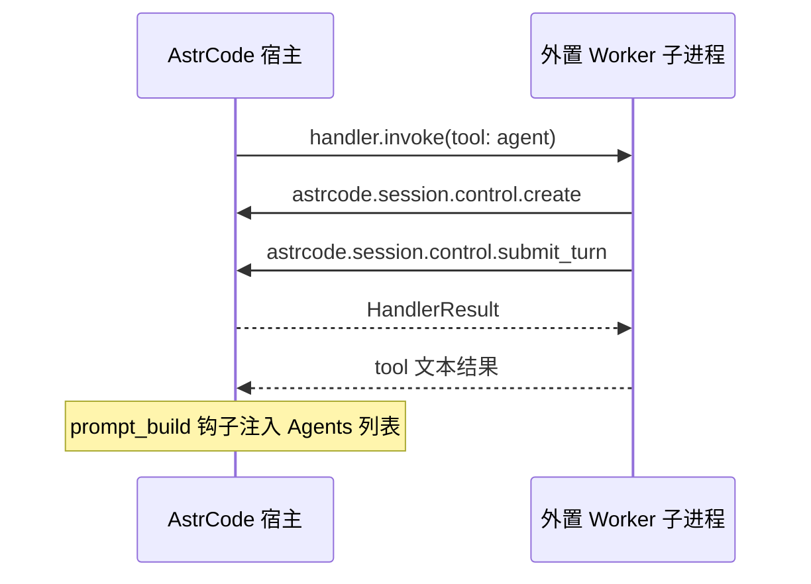

# 磁盘扩展作者入门指南

面向通过 **s5r 子进程** 接入 AstrCode 的扩展作者（非进程内 bundled 扩展）。

## 我该用哪个 prelude？

| 模块 | 适用场景 |
|------|----------|
| `astrcode_extension_sdk::prelude` | **进程内** Rust 扩展：实现 `Extension` trait，用 `Registrar` 注册 |
| `astrcode_extension_sdk::worker_prelude` | **磁盘** 扩展：独立可执行文件，`Worker::run_stdio()` |

二者不要混用：磁盘扩展没有 `Extension` trait，只有 Worker + s5r 帧协议。

## 最小示例

```rust
use astrcode_extension_sdk::{builder::tool, worker_prelude::*};

#[tokio::main]
async fn main() {
    if let Err(e) = run().await {
        eprintln!("extension failed: {} ({})", e.message, e.code);
        std::process::exit(1);
    }
}

async fn run() -> Result<(), ErrorPayload> {
    let mut worker = Worker::new("my-ext").version("0.1.0");

    worker.tool(
        tool("ping")
            .description("Returns pong")
            .parameters(serde_json::json!({"type": "object"}))
            .build(),
        tool_handler(|_ctx| async { Ok(tool_text("pong", false)) }),
    );

    worker.run_stdio().await
}
```

`extension.json` 只负责**发现与启动**，工具/钩子定义在代码里注册并自动生成握手 manifest：

```json
{
  "protocol": { "s5r": "1.0" },
  "command": ["./my-ext"]
}
```

## 为什么 manifest 与 handler 要一起注册？

旧写法在 JSON `manifest()` 里写一遍 `tools`，又在 `register_tool("ping", ...)` 注册一遍，名称不一致时**静默失败**（宿主有工具、子进程无 handler）。

现用 `worker.tool(def, handler)`：**同一次调用**写入 manifest 与 handler 表。

## 类型化参数

避免手写 `event["input"]["arguments"]["name"]`：

```rust
use serde::Deserialize;

#[derive(Deserialize)]
struct GreetArgs { name: String }

worker.tool(
    tool("greet").description("Greet").parameters(/* JSON Schema */).build(),
    tool_handler_args(|args: GreetArgs, _ctx| async move {
        Ok(tool_text(format!("hello, {}!", args.name), false))
    }),
);
```

钩子同理：`hook_handler_args` + `parse_hook_input`（反序列化 `event["input"]`）。

## 调用宿主能力

```rust
let out = HostClient::call(
    "astrcode.llm.small_chat",
    serde_json::json!({ "messages": [...] }),
).await?;
```

须在 manifest 中声明 capability（如 `small_model`）：

```rust
worker.capability("small_model");
```

完整 wire 名与能力对照见 [extension-system.md](extension-system.md)。

## 错误处理

Handler 返回 `Result<HandlerResult, ErrorPayload>`，与宿主侧一致（`code` / `message` / `hint` / `retryable`）：

```rust
return Err(ErrorPayload::new("invalid_input", "name is required")
    .with_hint("pass {\"name\": \"...\"} in arguments"));
```

`ErrorPayload` 提供 `with_hint` 若已实现；否则用 `new` 后手动设置字段。

## 取消

长时间 tool 应轮询 `ctx.cancel_token.is_cancelled()`；宿主 `stop()` 或 turn 取消会经 s5r `Cancel` 消息传递。

## 调试

- **stderr**：子进程 stderr 由宿主读取并记录（可 `eprintln!` 调试，勿污染 stdout——stdout 用于 s5r 帧）。
- **握手失败**：检查 `protocol.s5r` 是否为 `1.0`、`extension_id` 是否与目录名一致。
- **工具不出现**：确认 `worker.tool()` 已调用且 `run_stdio()` 未提前退出。
- **E2E 参考**：`crates/astrcode-extensions/tests/s5r-guest/`

## 测试 HostClient

```rust
use std::sync::Arc;
use astrcode_extension_sdk::worker::{HostApi, inject_host_api};

struct MockHost;
#[async_trait::async_trait]
impl HostApi for MockHost {
    async fn call(&self, cap: &str, _input: Value) -> Result<Value, ErrorPayload> {
        Ok(serde_json::json!({ "echo": cap }))
    }
    async fn call_stream(&self, cap: &str, input: Value) -> Result<Value, ErrorPayload> {
        self.call(cap, input).await
    }
}

let _ = inject_host_api(Arc::new(MockHost));
```

单元测试在调用 `HostClient::call` 前注入；集成测试用真实子进程 + `s5r_e2e_test`。

## 进一步阅读

- [s5r-protocol.md](s5r-protocol.md) — 线缆消息与握手方向
- [extension-system.md](extension-system.md) — 宿主加载、能力表、架构

---

## 外置 agent-tool 类插件

内置的 `astrcode-extension-agent-tools` 是**进程内**扩展（`Extension` trait + `session_ops` 直接调用）。  
若你要做**磁盘外置**、独立二进制分发的 agent 委派插件，走 **s5r Worker**，通过 `HostClient` 调用 `astrcode.session.control.*`。

### 先选路径

| 目标 | 推荐 |
|------|------|
| 与内置 agent-tools 完全等价（同步等待子 Agent、`tool_policy` 禁嵌套 agent 等） | 在仓库内新增 `astrcode-extension-*` **bundled**  crate，用 `prelude` |
| 独立安装包、`extension.json` 启动、用户目录分发 | s5r **Worker** + 下文结构 |
| 仅需「后台派生子 Agent + 完成后通知」 | 外置 Worker **可行**（`wait_for_result: false`） |
| 必须在 tool 内**同步阻塞**等子 Agent 跑完 | 外置目前受限：peer 线程上 `wait_for_result: true` 会死锁，宿主会拒绝 |

### 目录与安装

用户级：

```text
~/.astrcode/extensions/my-agent-tools/
  extension.json
  my-agent-tools.exe    # Windows；Unix 无 .exe
```

项目级：`<repo>/.astrcode/extensions/my-agent-tools/`（同上）。

`extension.json` 只负责启动，**不要**在这里重复写 tools 列表：

```json
{
  "protocol": { "s5r": "1.0" },
  "command": ["C:/path/to/my-agent-tools.exe"]
}
```

### 独立工程骨架

```text
my-agent-tools/
  Cargo.toml
  src/
    main.rs
    agents.rs      # 扫描 ~/.astrcode/agents、.astrcode/agents/*.md
```

`Cargo.toml`：

```toml
[package]
name = "my-agent-tools"
version = "0.1.0"
edition = "2021"

[[bin]]
name = "my-agent-tools"
path = "src/main.rs"

[dependencies]
astrcode-extension-sdk = { path = "…/astrcode/crates/astrcode-extension-sdk" }
serde = { version = "1", features = ["derive"] }
serde_json = "1"
tokio = { version = "1", features = ["rt-multi-thread", "macros"] }
```

`Worker::new` 的 id 建议与目录名一致，例如 `"my-agent-tools"`。

### 必须声明的能力与钩子

```rust
let mut worker = Worker::new("my-agent-tools")
    .version("0.1.0")
    .capability("session_control");   // wire: session_control → astrcode.session.control.*

// 向主 Agent 注入 [Agents] 列表（等同内置 on_prompt_build）
worker.hook(
    "prompt_build",
    "non_blocking",
    hook_handler(|_ctx| async move {
        let agents_md = discover_agents_markdown(); // 自行扫描 .md
        Ok(HandlerResult::effect(
            "prompt_contributions",
            serde_json::json!({ "agents": [agents_md] }),
        ))
    }),
);
```

`prompt_build` 的 effect 名必须是 `prompt_contributions`（宿主 `parse_prompt_build_result` 约定）。

### `agent` 工具（核心）

参数 schema 与内置一致（`camelCase`，给 LLM 用）：

```rust
#[derive(Deserialize)]
#[serde(rename_all = "camelCase")]
struct AgentArgs {
    prompt: String,
    description: String,
    subagent_type: Option<String>,
    #[serde(default = "default_true")]
    wait_for_result: bool,
}
const fn default_true() -> bool { true }
```

注册（**并行**执行，避免阻塞其它 tool）：

```rust
use astrcode_extension_sdk::tool::ExecutionMode;

worker.tool(
    tool("agent")
        .description("Delegate to a subagent…")
        .parameters(/* 与内置 AGENT_TOOL_PARAMETERS 相同 */)
        .execution_mode(ExecutionMode::Parallel)
        .build(),
    tool_handler_args(|args: AgentArgs, _ctx| async move {
        run_agent_via_host(&args).await
    }),
);
```

### 通过 HostClient 派生子会话

tool handler 里从 `event` 取 `session_id` / `tool_call_id` / `working_dir`（宿主经 `handler.invoke` 传入）：

```rust
fn tool_context_from_event(event: &serde_json::Value) -> (&str, &str, &str) {
    let input = event.get("input").unwrap_or(event);
    (
        input["session_id"].as_str().unwrap_or(""),
        input["tool_call_id"].as_str().unwrap_or(""),
        input["working_dir"].as_str().unwrap_or("."),
    )
}
```

创建子会话：

```rust
let (parent_id, tool_call_id, working_dir) = tool_context_from_event(&event);

let created = HostClient::call(
    "astrcode.session.control.create",
    serde_json::json!({
        "name": agent_name,
        "system_prompt": system_prompt,
        "model_preference": model,
        "ephemeral": true,
        "tool_call_id": tool_call_id,
        "working_dir": working_dir
    }),
).await?;
let child_id = created["session_id"].as_str().unwrap();
```

提交 turn（**外置扩展请用异步**，避免 peer 死锁）：

```rust
let submitted = HostClient::call(
    "astrcode.session.control.submit_turn",
    serde_json::json!({
        "target_session_id": child_id,
        "user_prompt": args.prompt,
        "wait_for_result": false,
        "notify_parent_on_complete": format!(
            "Subagent '{}' finished: {}", agent_name, args.description
        ),
        "recycle_on_complete": true,
        "tool_call_id": tool_call_id
    }),
).await?;
// status == "backgrounded" → 返回说明文本给主 Agent
```

若用户传 `waitForResult: true`，外置实现应降级为 `false` 并说明「外置插件仅支持后台子 Agent」，或返回带 hint 的 `ErrorPayload`。

### Agent 定义文件从哪来？

内置扩展用 `astrcode-support` 扫描 `~/.astrcode/agents`、`项目/.astrcode/agents` 下的 Markdown+frontmatter。  
外置二进制可：

- 在插件内**复制/简化**扫描逻辑（只依赖 `std` + 简单 frontmatter 解析），或
- 把若干内置 agent 编进 `include_str!`（参考 `astrcode-extension-agent-tools/src/builtin_agents/`）。

### 与 AstrCode 的衔接（数据流）



宿主加载：`ExtensionLoader` 读 `extension.json` → 启动子进程 → `Initialize` 交换 manifest → `S5rExtension::register` 把 tools/hooks 注册进 `ExtensionRunner`，之后与内置扩展一样参与 `pre_tool_use` / `prompt_build` / LLM tool 调用。

### 参考代码

| 用途 | 位置 |
|------|------|
| 内置 agent 完整逻辑（进程内） | `crates/astrcode-extension-agent-tools/` |
| s5r Worker 写法 | `crates/astrcode-extensions/tests/s5r-guest/src/main.rs` |
| E2E | `cargo test -p astrcode-extensions --test s5r_e2e_test` |

### 本地调试

```bash
# 1. 编译插件
cargo build --release

# 2. 放到扩展目录并写 extension.json

# 3. 启动 AstrCode 后看日志；插件调试输出写 stderr，不要写 stdout
RUST_LOG=astrcode_extensions=debug astrcode ...
```

若工具未出现：检查 `extension_id`、握手是否成功、是否声明 `session_control`、handler 是否在 `worker.tool()` 注册。
