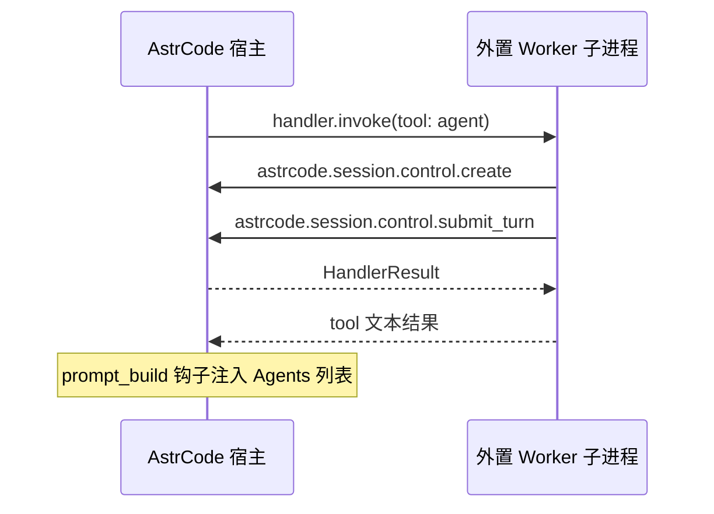

# 磁盘扩展作者入门指南

面向通过 **s5r 子进程** 接入 AstrCode 的扩展作者（非进程内 bundled 扩展）。

## 我该用哪个 prelude？

| 模块 | 运行边界 | 注册与上下文 | 宿主调用与错误 |
|------|----------|--------------|----------------|
| `astrcode_extension_sdk::prelude` | 仓库内、**进程内** bundled Rust 扩展 | 实现 `Extension`；用 `manifest()` + `Registrar`；handler 接收宿主构造的 `ToolContext` / hook context | `ctx.host()` 返回 owned typed domain clients；返回 `ExtensionError` / lossless `HostError` |
| `astrcode_extension_sdk::worker_prelude` | `extension.json` 启动的**磁盘**独立进程 | `Worker` 同时生成握手 manifest 与 handler registry；handler 接收 `WorkerCallContext` 或 wire input | task-local 静态 `HostClient` 经 S5R invoke；返回 `ErrorPayload` |

边界由 SDK re-export 强制：bundled prelude 不导出 `Worker`、静态 `HostClient` 或 S5R wire 类型；
worker prelude 不导出 `Extension`、`Registrar` 或 bundled 的生产 context。共享 DTO 从 SDK 稳定模块
re-export，但两套 runtime 入口、context 和错误返回类型不能互换。

测试入口也分开：bundled 使用 `astrcode_extension_sdk::testing` 的 context builders、
`MockExtensionHost`、`RegistrationHarness` 与 `ExtensionLifecycleHarness`；worker 单元测试通过
`worker::testing::with_host_api` 在异步作用域内注入 `HostApi`，协议验收使用真实子进程 E2E。

## 最小示例

```rust
use astrcode_extension_sdk::worker_prelude::*;

#[tokio::main]
async fn main() {
    if let Err(e) = run().await {
        eprintln!("extension failed: {} ({})", e.message, e.code);
        std::process::exit(1);
    }
}

async fn run() -> Result<(), ErrorPayload> {
    let mut worker = Worker::new("my-ext");
    worker.version("0.1.0");

    worker.tool(
        tool("ping")
            .description("Returns pong")
            .parameters(serde_json::json!({"type": "object"}))
            .build(),
        tool_handler(|_ctx| async { Ok(tool_text("pong", false)) }),
    )?;

    worker.run_stdio().await
}
```

`extension.json` 只负责**发现与启动**，工具/钩子定义在代码里注册并自动生成握手 manifest：

```json
{
  "extension_id": "my-ext",
  "protocol": { "s5r": "2.0" },
  "command": ["./my-ext"]
}
```

## 为什么 manifest 与 handler 要一起注册？

旧写法在 JSON `manifest()` 里写一遍 `tools`，又在 `register_tool("ping", ...)` 注册一遍，名称不一致时**静默失败**（宿主有工具、子进程无 handler）。

现用 `worker.tool(def, handler)`：**同一次调用**写入 manifest 与 handler 表。

SDK builder 创建的工具默认不启用 provider strict。只有确认 Schema 满足所有目标 provider 的
strict JSON Schema 子集时才调用 `.strict()`：

```rust
tool("ping")
    .description("Returns pong")
    .parameters(serde_json::json!({
        "type": "object",
        "properties": {},
        "additionalProperties": false
    }))
    .strict()
    .build()
```

宿主会将 strict 声明写入 S5R manifest，并在 profile 同时声明 `supportsStrictToolUse` 时为 OpenAI
或 Anthropic 编译对应的 strict Schema；工具定义本身不需要复制两份 provider 专用 Schema。
Provider strict 只支持完整 JSON Schema 的子集，而且不同 provider 的子集并不相同；例如
`oneOf`、`patternProperties` 等关键字不能假定跨 provider 可用。显式 strict 但无法安全编译的
结构会在发请求前返回带工具名与 Schema 路径的本地错误，避免悄悄削弱扩展作者声明的契约。
MCP 工具保持 non-strict；Anthropic 达到单次请求 strict 聚合上限时，溢出工具只在 wire 副本上
确定性降级并记录 warning。

## 类型化参数

避免手写 `event["input"]["arguments"]["name"]`：

```rust
use serde::Deserialize;

#[derive(Deserialize)]
struct GreetArgs { name: String }

worker.tool(
    tool("greet").description("Greet").parameters(/* JSON Schema */).build(),
    tool_handler_args(|args: GreetArgs, _ctx| async move {
        Ok(tool_text(format!("hello, {}!", args.name), false))
    }),
)?;
```

钩子同理：`hook_handler_args` + `parse_hook_input`（反序列化 `event["input"]`）。

## 调用宿主能力

本节的静态 `HostClient` 只属于 `worker_prelude`，依赖当前 S5R handler 的 task-local 调用范围。
bundled 扩展不要调用它；bundled handler 应从 `ctx.host()` 取得 `ModelClient`、
`SessionControlClient`、`WorkspaceClient` 等 owned domain client。

主模型与小模型分别声明、分别调用：

```rust
use astrcode_extension_sdk::worker_prelude::*;

// 主模型（当前 session 的 activeModel）
worker.capability(ExtensionCapability::MainModel);
let out = HostClient::models().main_chat(vec![
    LlmMessage::user("summarize this"),
]).await?;

// 小模型（activeSmallModel）
worker.capability(ExtensionCapability::SmallModel);
let out = HostClient::models().small_chat(vec![
    LlmMessage::user("tag this line"),
]).await?;

// 受限子进程（总超时包含并发排队，cwd 必须在 workspace 内）
worker.capability(ExtensionCapability::ProcessSpawn);
let output = HostClient::process().spawn(HostProcessRequest::new("rustc")).await?;

// 受限出站 HTTP(S)
worker.capability(ExtensionCapability::NetworkClient);
let response = HostClient::network().send(
    HostNetworkRequest::get("https://example.com")
).await?;
// response.final_url 是完成受限重定向后的地址。

// 创建或精确编辑工作区内的非敏感文件
worker.capability(ExtensionCapability::WorkspaceWrite);
let written = HostClient::workspace().write(HostWorkspaceWriteRequest {
    path: "notes/result.txt".into(),
    content: "done".into(),
}).await?;

// 跨会话检查（返回 SDK 定义的稳定 DTO，不暴露内部 SessionReadModel）
worker.capability(ExtensionCapability::SessionInspect);
let sessions = HostClient::session_inspect().list().await?;
let model = HostClient::session_inspect()
    .read_model(&sessions.sessions[0].session_id)
    .await?;

// 在当前 handler 的 workspace context 中创建独立 root session；不接受调用方路径参数
worker.capability(ExtensionCapability::InputDelivery);
let root = HostClient::session_control().create_root().await?;

// 注册公开 JSON 路由；路由和 handler 从同一注册调用生成 manifest
worker.capability(ExtensionCapability::PublicHttp);
worker.http_route(
    ExtensionHttpRoute::public(ExtensionHttpMethod::Post, "/my-plugin/{id}"),
    http_handler(|request, _ctx| async move {
        Ok(ExtensionHttpResponse::json(200, serde_json::json!({
            "id": request.path_params.get("id"),
            "body": request.body,
        })))
    }),
)?;

// 调用另一插件的公开路由
worker.capability(ExtensionCapability::PublicHttpDispatch);
let response = HostClient::extension_http().dispatch_public(
    ExtensionHttpDispatchRequest::new(ExtensionHttpMethod::Post, "/other-plugin/run")
        .json_body(serde_json::json!({ "job": 1 }))
).await?;
```

`network.client` 的作者 API 以原始字节返回响应 body，S5R 线缆使用 base64。请求的
body 解码后不得超过 10 MiB，`max_bytes` 不得超过 10 MiB，`timeout_ms` 必须位于
`1..=60_000`；`Manual` 不跟随重定向，
但仍会返回受 `max_bytes` 限制的原始 3xx 响应 body。同名响应头的重复值不会保留。worker 与
web-tools 共享宿主的全局并发上限，当前协议不提供 extension 级公平配额。
进程请求的 `stdin` 以 UTF-8 字节计最多 1 MiB。

`workspace_write`、`process_spawn` 与 `network_client` 都是敏感授权；只在插件确实需要时声明。前者拒绝越界、symlink 和密钥类路径；进程执行不是
操作系统沙箱，后者允许访问宿主网络可达的 HTTP(S) 地址。两者均有并发、总超时和
I/O 大小限制，并响应会话取消。

S5R 同时支持 `public_http` 和复用宿主 bearer token 的 `authenticated_http`；两者都不能
注册在 `/api` 下。s5r 工具默认串行；显式声明 `ExecutionMode::Parallel` 时，宿主会在同一
worker 内启用最多 8 个并行调用，并按 request id 隔离 session/working directory 上下文。
S5R 2.0 握手必须声明 `parent_invoke_id` wire feature，不再为旧 worker 降级。
`public_http_dispatch` 仍拒绝同步调用自己的公开
路由，因为路由和非并行 handler 需要取得顺序执行通道，重入会形成等待环。

作为边界对照，进程内 bundled 工具通过私有字段 `ToolContext` 的 accessor 读取调用事实；这不是
磁盘 worker 可导入或构造的 context：

- `ctx.main_model_id()` — 需声明 `main_model`
- `ctx.small_model_id()` — 需声明 `small_model`
- `ctx.available_tools()` — 当前 turn 可见工具定义
- `ctx.paths()` / `ctx.host()` — 已绑定 extension attribution 的路径与类型化宿主客户端

它不会暴露 core `ToolExecutionContext`、裸 `SessionOperations` 或事件 sink。

bundled host 错误使用 `HostError`：它无损保留 `code` / `message` / `hint` / `retryable` /
`details`，并通过 `class()` 提供常见错误分类。worker 线缆边界继续使用同字段的
`ErrorPayload`；不要在 worker handler 签名中改用 `ExtensionError`。

完整 wire 名与能力对照见 [extension-system.md](extension-system.md)。

## 错误处理

Handler 返回 `Result<HandlerResult, ErrorPayload>`，与宿主侧一致（`code` / `message` / `hint` / `retryable`）：

```rust
use astrcode_extension_sdk::WireErrorCode;

return Err(ErrorPayload::new(WireErrorCode::InvalidInput, "name is required")
    .with_hint("pass {\"name\": \"...\"} in arguments"));
```

`ErrorPayload::with_hint()` 可链式补充可操作建议；可重试错误再使用
`ErrorPayload::retryable(true)` 明确标记。

## 取消

worker 的长时间 tool 应轮询 `WorkerCallContext::cancel_token()`；宿主取消经 S5R `Cancel` 消息传递。
bundled handler 则读取 `ctx.cancellation()`，后台循环使用 `ctx.tasks().cancellation()` 或把调用取消
令牌克隆进受管任务。两种 token 来源不能跨 prelude 混用。

## 调试

- **stderr**：宿主会持续 drain 子进程 stderr 以避免阻塞，但当前不保存或转发这些行；
  调试时不要向 stdout 写日志，stdout 专用于 S5R 帧。
- **握手失败**：检查 `protocol.s5r` 是否为 `2.0`、`extension_id` 是否符合命名规则；
  为了诊断清晰，建议与目录名一致，但宿主不强制两者相等。
- **工具不出现**：确认 `worker.tool()` 已调用且 `run_stdio()` 未提前退出。
- **E2E 参考**：`crates/astrcode-extensions/tests/s5r-guest/`

## 测试 Worker `HostClient`

```rust
use std::sync::Arc;
use astrcode_extension_sdk::{
    WireErrorCode,
    worker::testing::{HostApi, with_host_api},
    worker_prelude::{ErrorPayload, HostClient, LlmMessage},
};
use serde_json::Value;

struct MockHost;
#[async_trait::async_trait]
impl HostApi for MockHost {
    async fn call(&self, cap: &str, _input: Value) -> Result<Value, ErrorPayload> {
        match cap {
            "astrcode.llm.main_chat" => Ok(serde_json::json!({
                "content": "mocked",
                "model": "test-main"
            })),
            _ => Err(ErrorPayload::new(WireErrorCode::UnknownCapability, cap)),
        }
    }
    async fn call_stream(&self, cap: &str, input: Value) -> Result<Value, ErrorPayload> {
        self.call(cap, input).await
    }
}

let output = with_host_api(Arc::new(MockHost), async {
    HostClient::models()
        .main_chat(vec![LlmMessage::user("hello")])
        .await
}).await?;
```

单元测试把类型化领域 client 调用包在作用域内；并发测试各自持有 mock，不修改进程级全局状态。
`tokio::spawn` 创建的新任务不会继承这个测试作用域；需要在新任务内再次调用 `with_host_api`。
`HostApi` 和 raw invoke 只是
`worker::testing` 的 transport seam，不在 `worker_prelude` 中。集成测试使用真实子进程 +
`s5r_e2e_test`。

## 进一步阅读

- [s5r-protocol.md](s5r-protocol.md) — 线缆消息与握手方向
- [extension-system.md](extension-system.md) — 宿主加载、能力表、架构

---

## 外置 agent-tool 类插件

内置的 `astrcode-extension-agent-tools` 是**进程内**扩展（`Extension` trait +
`ctx.host().session_control()` 类型化调用）。
若你要做**磁盘外置**、独立二进制分发的 agent 委派插件，走 **s5r Worker**，通过 `HostClient` 调用 `astrcode.session.control.*`。

### 先选路径

| 目标 | 推荐 |
|------|------|
| 与内置 agent-tools 完全等价（同步等待子 Agent、`tool_selection` 禁嵌套 agent 等） | 在仓库内新增 `astrcode-extension-*` **bundled**  crate，用 `prelude` |
| 独立安装包、`extension.json` 启动、用户目录分发 | s5r **Worker** + 下文结构 |
| 仅需「后台派生子 Agent + 完成后通知」 | 外置 Worker **可行**（`wait_for_result: false`） |
| 必须在 tool 内**同步阻塞**等子 Agent 跑完 | 外置目前受限：peer 线程上 `wait_for_result: true` 会死锁，宿主会拒绝 |

### 目录与安装

用户级：

```text
~/.astrcode/extensions/my-agent-tools/
  extension.json
  my-agent-tools.exe    # Windows；Unix 无 .exe
```

项目级：`<repo>/.astrcode/extensions/my-agent-tools/`（同上）。

`extension.json` 声明发现期身份与启动方式，**不要**在这里重复写 tools 列表。`extension_id`
必须与 `Worker` 生成的握手 manifest 一致：

```json
{
  "extension_id": "my-agent-tools",
  "protocol": { "s5r": "2.0" },
  "command": ["C:/path/to/my-agent-tools.exe"]
}
```

### 独立工程骨架

```text
my-agent-tools/
  Cargo.toml
  src/
    main.rs
    agents.rs      # 扫描 ~/.astrcode/agents、.astrcode/agents/*.md
```

`Cargo.toml`：

```toml
[package]
name = "my-agent-tools"
version = "0.1.0"
edition = "2021"

[[bin]]
name = "my-agent-tools"
path = "src/main.rs"

[dependencies]
astrcode-extension-sdk = { path = "…/astrcode/crates/astrcode-extension-sdk" }
serde = { version = "1", features = ["derive"] }
serde_json = "1"
tokio = { version = "1", features = ["rt-multi-thread", "macros"] }
```

`Worker::new` 的 id 建议与目录名一致，例如 `"my-agent-tools"`。

### 必须声明的能力与钩子

```rust
let mut worker = Worker::new("my-agent-tools");
worker
    .version("0.1.0")
    .capability(ExtensionCapability::SessionControl);

// 向主 Agent 注入 [Agents] 列表（等同内置 on_prompt_build）
worker.on_prompt_build(
    hook_handler(|_ctx| async move {
        let agents_md = discover_agents_markdown(); // 自行扫描 .md
        Ok(HandlerResult::effect(
            "prompt_contributions",
            serde_json::json!({ "agents": [agents_md] }),
        ))
    }),
)?;
```

固定模式 hook 不通过 `Worker::hook` 注册：`prompt_build`、`pre_compact`、`post_compact`
固定为 `blocking`，`after_provider_response` 固定为 `advisory`，分别使用对应的 `on_*`
方法；`continue_after_stop` 使用带 options 的 `on_continue_after_stop`。宿主会拒绝 mode
与实际 dispatcher 语义不一致的手写 manifest。

`prompt_build` 的 effect 名必须是 `prompt_contributions`（宿主 `parse_prompt_build_result` 约定）。

### `agent` 工具（核心）

参数 schema 与内置一致（`camelCase`，给 LLM 用）：

```rust
#[derive(Deserialize)]
#[serde(rename_all = "camelCase")]
struct AgentArgs {
    prompt: String,
    description: String,
    subagent_type: Option<String>,
    #[serde(default = "default_true")]
    wait_for_result: bool,
}
const fn default_true() -> bool { true }
```

注册（**并行**执行，避免阻塞其它 tool）：

```rust
use astrcode_extension_sdk::tool::ExecutionMode;

worker.tool(
    tool("agent")
        .description("Delegate to a subagent…")
        .parameters(/* 与内置 AGENT_TOOL_PARAMETERS 相同 */)
        .execution_mode(ExecutionMode::Parallel)
        .build(),
    tool_handler_args(|args: AgentArgs, ctx| async move {
        run_agent_via_host(&args, &ctx).await
    }),
)?;
```

### 通过 HostClient 派生子会话

`tool_handler_args` 在反序列化 arguments 的同时保留宿主经 `handler.invoke` 传入的调用事实，
handler 可直接从 `WorkerCallContext` 读取：

- `ctx.session_id()`：当前 session；
- `ctx.require_session_id()`：要求 session 事实存在，否则返回稳定的 `context_unavailable`；
- `ctx.tool_call_id()`：宿主归属的当前 tool call；非工具入口为 `None`；
- `ctx.working_dir()`：宿主校验后的工作目录；
- `ctx.require_working_dir()`：要求 workspace 事实存在，否则返回稳定的 `context_unavailable`；
- `ctx.turn_id()`：当前 tool call 所属 turn 的真实 ID；会话外调用为 `None`。

创建子会话：

```rust
let _parent_session_id = ctx.require_session_id()?;
let mut request = HostCreateSessionRequest::new(agent_name);
request.system_prompt = Some(system_prompt);
request.model_preference = Some(model);
request.ephemeral = true;
request.tool_selection = Some(SessionToolSelectionDto::all_except(["agent"]));

let created = HostClient::session_control().create_child(request).await?;
let child_id = created.session_id;
```

子会话始终继承父 session 的 workspace，创建请求不接受独立的工作目录。

`tool_selection` 是子会话工具可见性策略。外置 agent 默认建议使用
`SessionToolSelectionDto::all_except(["agent"])`，避免子 agent 继续嵌套创建 agent；若需要更严格的工具边界，可改用
`SessionToolSelectionDto::only(["tool_a", "tool_b"])` 白名单。

提交 turn（**外置扩展请用异步**，避免 peer 死锁）：

```rust
let mut request = HostSubmitTurnRequest::background(child_id, args.prompt);
request.notify_parent_on_complete = Some(format!(
    "Subagent '{}' finished: {}", agent_name, args.description
));
let submitted = HostClient::session_control().submit_turn(request).await?;
// HostSubmitTurnOutput::Backgrounded { .. } → 返回说明文本给主 Agent
```

若用户传 `waitForResult: true`，外置实现应降级为 `false` 并说明「外置插件仅支持后台子 Agent」，或返回带 hint 的 `ErrorPayload`。

`tool_call_id` 由宿主从当前调用上下文写入 create/submit 的内部请求，worker 不能在 wire 请求中指定或伪造。

### 会话状态与扩展事件

会话内的扩展私有状态使用 typed client；同一个 handler 可直接写后读：

```rust
HostClient::session_state()
    .write(HostSessionStateWriteRequest {
        key: "last-run".into(),
        content: "complete".into(),
    })
    .await?;
let state = HostClient::session_state()
    .read(HostSessionStateReadRequest {
        key: "last-run".into(),
    })
    .await?;
```

key 只接受 1–128 个 ASCII 字母、数字、`_`、`.`、`-`，且不能是 `.` 或 `..`；缺失值通过
`state.content == None` 表达，state value 以 UTF-8 字节计最多 1 MiB。发射 manifest
中已声明的事件同样使用 typed client：

```rust
HostClient::events()
    .emit(HostEventEmitRequest {
        event_type: "my_extension.completed".into(),
        schema_version: 1,
        payload: serde_json::json!({ "status": "ok" }),
    })
    .await?;
```

每个事件声明的 `max_payload_bytes` 必须位于 1 byte..=1 MiB，发射时仍按该声明值校验。

### Agent 定义文件从哪来？

内置扩展通过 SDK 的宿主路径 API 扫描 `~/.claude/agents`、`~/.astrcode/agents` 以及对应的项目目录。
Agent frontmatter 支持 `tools` 白名单和 `disallowedTools` 黑名单；省略两者时继承父 session 的工具边界，
两者同时存在时黑名单优先。各内置 Agent 的附加限制定义在各自 Markdown frontmatter 中：
`explore` 使用只读白名单，`reviewer` 额外获得仅用于检查和验证的 `Bash`，`execute` 通过
`disallowedTools: Task` 禁止递归委派；
Claude 名称 `Task` 会被规范化为 AstrCode 工具名 `agent`。最终有效工具集仍会与整条父 session
边界取交集，不能通过 Agent 配置扩大权限。自定义 Agent 若省略两者则不会附加隐藏限制。

外置二进制可：

- 在插件内**复制/简化**扫描逻辑（只依赖 `std` + 简单 frontmatter 解析），或
- 把若干内置 agent 编进 `include_str!`（参考 `astrcode-extension-agent-tools/src/builtin_agents/`）。

### 与 AstrCode 的衔接（数据流）


```mermaid
sequenceDiagram
    participant Host as AstrCode 宿主
    participant Ext as 外置 Worker 子进程
    Host->>Ext: handler.invoke(tool: agent)
    Ext->>Host: astrcode.session.control.create
    Ext->>Host: astrcode.session.control.submit_turn
    Host-->>Ext: HandlerResult
    Ext-->>Host: tool 文本结果
    Note over Host: prompt_build 钩子注入 Agents 列表
```

宿主加载：`ExtensionLoader` 读 `extension.json` → 启动子进程 → `Initialize` 交换 manifest → `S5rExtension::register` 把 tools/hooks 注册进 `ExtensionRunner`，之后与内置扩展一样参与 `pre_tool_use` / `prompt_build` / LLM tool 调用。

### 参考代码

| 用途 | 位置 |
|------|------|
| 内置 agent 完整逻辑（进程内） | `crates/astrcode-extension-agent-tools/` |
| s5r Worker 写法 | `crates/astrcode-extensions/tests/s5r-guest/src/main.rs` |
| E2E | `cargo test -p astrcode-extensions --test s5r_e2e_test` |

### 本地调试

```bash
# 1. 编译插件
cargo build --release

# 2. 放到扩展目录并写 extension.json

# 3. 启动 AstrCode 后看日志；插件调试输出写 stderr，不要写 stdout
RUST_LOG=astrcode_extensions=debug astrcode ...
```

若工具未出现：检查 `extension_id`、握手是否成功、是否声明 `session_control`、handler 是否在 `worker.tool()` 注册。
