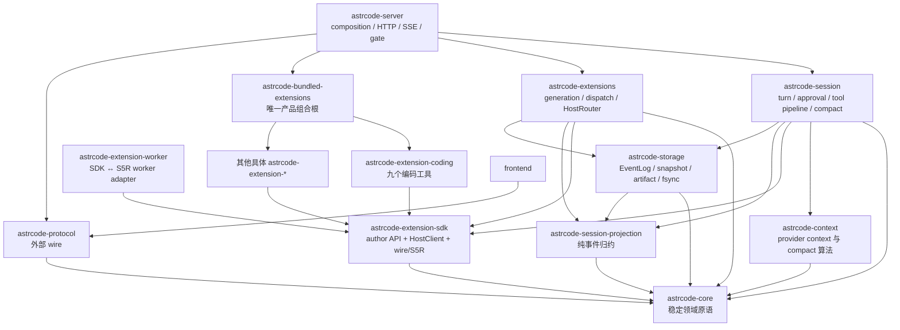
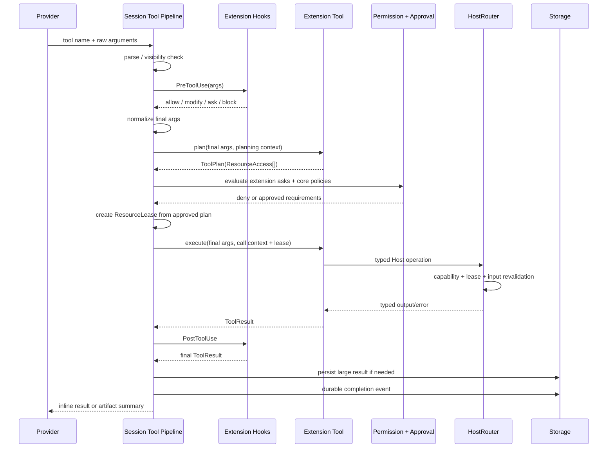

# PR #47 本地候选：从零设计审查与收敛记录

> 日期：2026-08-14  
> 分支：`whatevertogo/s5r3-phase-0`  
> 远端 PR：[feat(extensions): S5R 3.0 协议升级与作者/宿主契约统一（Phase 0，WIP）](https://github.com/whatevertogo/astrcodey/pull/47)  
> 审查对象：远端 PR head `5a0ece23216f2321a32e64d61f84eacf94420f9e`，以及其上的本地未提交候选  
> 设计前提：不保留旧架构兼容路径；以长期可维护性、单一事实来源、清晰依赖方向和可证明的安全边界为优先级  
> 关系：`docs/architecture/unified-extension-tool-runtime.md` 规定最终 Extension 工具架构；本文记录为什么这样设计、当前实现到达了哪里、审查中修了什么以及还不能忽略什么

## 0. 如何阅读本文

本文刻意区分四类结论：

1. **最终决策**：即使从零开始也会选择的长期结构；不再保留平行方案。
2. **当前实现**：本地候选已经做到、并且与最终决策一致的部分。
3. **本轮修复**：审查中发现了真实 producer → consumer 断点，并已经修改的部分。
4. **剩余阻塞或风险**：不能用注释、兼容分支或局部补丁伪装成已经解决的问题。

本文不是为了证明“大方向正确，所以细节都没问题”。相反，大方向确定后，每条数据流仍需分别检查：

```text
输入来自哪里
    → 在哪个信任边界校验
        → 谁拥有可变状态
            → 谁做映射
                → 谁执行副作用
                    → 谁确认 durable / terminal 状态
                        → 最终消费者看到什么
```

跨边界出现相似结构不一定是重复；如果两端有不同的版本、serde、权限或稳定性契约，显式映射就是必要成本。反过来，没有新增语义、所有字段逐层原样复制、也没有独立生命周期的包装，才是应删除的抽象。

---

## 1. 审查范围与规模

### 1.1 三个不同的差异面

不要把远端 PR、远端 head 上的本地收敛、最终本地候选混成一个数字：

| 差异面 | 当前规模 | 含义 |
| --- | ---: | --- |
| `origin/main...HEAD` | 367 files，`+44,058 / -19,985` | 已推送到 PR #47 的 S5R 3.0 大重构 |
| `HEAD` 到本地工作区 | 236 files，约 `+5.4k / -19.5k` | 本轮删除旧工具/contract 路径、Projection/Compact 收敛和问题修复 |
| `origin/main` 到本地工作区 | 393 files，约 `+40.6k / -30.6k` | 用户最终会审阅的实际本地候选 |

远端 PR 当前为 `OPEN`、`MERGEABLE`，远端 head 的旧 CI 全绿。那些检查只证明提交
`5a0ece2`，**不能证明当前未提交候选**。本地候选必须重新完成 Rust、前端、协议生成、依赖边界和 S5R 验证。

### 1.2 为什么变化很多

变化多不是一个单独的质量问题；关键是每一类变化是否对应必要边界。本候选同时包含：

- S5R 2.x → 3.0 的协议、peer、worker、host routing 与 conformance 重构；
- 删除 `astrcode-extension-contract` 物理 crate，并把 wire/S5R 契约收回 SDK 的逻辑模块；
- 删除约 8.7k 行旧 `astrcode-tools`，把编码工具迁入 `astrcode-extension-coding`；
- 用 typed Host capability 替代第一方工具直接访问 Session/Storage/进程内部对象；
- 把工具执行收敛为统一的 plan → approval → lease → execute 管线；
- 重整 Session Projection，使 provider context、展示事实、执行状态、agent link 不再堆在一个根类型；
- 把 Compact 大文件拆成同步公共 pipeline，并修正持久化与 hook 顺序；
- 增加大工具结果的通用 artifact 化和 `read_tool_result`；
- 清理 server/protocol/frontend 中旧内置工具和旧 Compact 状态。

如果只做文件移动，变化虽大但价值低；这里可接受的前提是：旧路径确实被删除、依赖方向被 guard、运行时只剩一套语义，而不是新旧两套都保留。

### 1.3 本轮审查方法

本轮没有按 crate 名称逐个“看起来整洁”地打分，而是按以下链路审查：

1. provider tool schema/arguments 的产生与冻结；
2. Extension hook 对最终参数的变换或 gate；
3. planner 声明资源；
4. Session 权限策略与审批记忆；
5. ResourceLease 签发与 HostRouter 二次强制校验；
6. 文件、进程、网络、artifact 等真实副作用；
7. ToolResult 的 PostToolUse、预算、持久化和 provider 展示；
8. durable event → projection → runtime context → HTTP/frontend；
9. Compact snapshot → summary → fingerprint → append → fsync → hook；
10. Extension 配置 candidate → validation → persistence → publication → runtime apply。

---

## 2. 执行摘要

### 2.1 最终判断

整体方向是对的，而且比“保留内置工具，再给 Extension 包一层”更干净：

- **所有 provider-visible 工具都属于 Extension**；
- **bundled 与 worker 共享语义，不强制共享 transport**；
- **`astrcode-tools` 和 `astrcode-extension-contract` 物理 crate 删除**；
- **Extension SDK 保留 authoring、host client、wire/S5R 的逻辑边界**；
- **Session 只消费冻结的 Extension view 和稳定 port，不依赖具体 Extension Runtime**；
- **Projection 按生命周期拆，不按 `system/user` 角色拆**；
- **Compact 保持同步 turn-boundary 流程，不引入后台 coordinator 或双读模型**；
- **工具输出预算由 Host 与 Session 统一承担，不把 `maxOutputTokens` 兼容字段塞回每个工具**。

这些不是为了减少 crate 数量，而是为了让每个事实只有一个 owner、每个副作用只有一条授权路径、每个外部边界只有一次显式映射。

### 2.2 当前还不能宣称“完全收口”

本地候选仍有一个明确的高优先级架构阻塞：**PTY 进程树所有权没有跨平台闭环**。`portable-pty`
自己 spawn 并只返回 opaque child；现有 Host supervisor 不能在 spawn 前建立 Unix process-group/Windows
Job Object 的统一所有权，也不能覆盖 spawn cancellation 到 handle 注册之间的窗口。只给 Unix 发 group
signal 或在 Windows spawn 后补挂 Job，都不是可证明正确的跨平台方案。

此外还有几个应明确保留在 merge assessment 中的风险：

- 多个 `PreToolUse` Extension 中，首个 `Ask` 仍会短路后续 Extension gate；
- 外部 S5R Extension 的配置纯校验能力尚未达到与进程内 Extension 完全对等；
- `read_tool_result` 尚缺一条穿过 Coding → lease → HostRouter → Session/Storage → commit 的整链集成测试；
- artifact fsync retry 已修，但还缺故障注入和 temp → fsync → rename 的完整原子写证明；
- 当前未提交候选尚需完整验证，远端旧绿灯不能代替。

### 2.3 不应重新引入的“简化”

以下做法看起来文件少，实际会破坏边界：

- 把 bundled Extension 直接做回 `astrcode_core::tool::Tool` 特权路径；
- 让 server 识别 `shell`、`terminal`、`read_tool_result` 等具体工具名；
- 让 Extension planner 直接访问 Host，以“顺便校验路径/进程”为由产生副作用；
- 把 ResourceLease 当成 capability 的别名，而不在每次 Host 操作再次校验；
- 把 system prompt 和所有 user/assistant/tool 消息拆成两个可独立变更的 projection；
- 为 Compact 新建后台 worker、candidate store、revision CAS 或第二套 provider read model；
- 为了兼容旧 shell 参数而恢复 `maxOutputTokens`；
- 为了少一个映射，直接把 core enum 暴露成 HTTP/S5R wire enum；
- 给当前始终共同编译的 S5R/wire 加没有收益证据的 Cargo feature 矩阵。

---

## 3. 从零设计时的不可违反不变式

### 3.1 数据所有权

1. EventLog 是 durable session facts 的唯一事实来源。
2. Projection 只做纯事件归约，不做 I/O、provider 请求、hook 或 Compact 策略。
3. Extension Runtime 是 registration、generation、handler index 和 session-scoped Host resource 的 owner。
4. Session 是 turn、provider context 组装、权限审批、工具编排和 Compact 的 owner。
5. Storage 是日志、快照、artifact、fsync 和文件格式的 owner；不决定何时 Compact 或何时审批。
6. Server 是 composition 与 transport 边界；不维护第二套工具或 Compact 状态机。
7. Frontend 只消费 wire/live facts；不解释 durable event，也不推断新的业务状态来源。

### 3.2 工具调用

1. provider 看到的 definition、真正 planner、真正 executor 必须来自同一 Extension generation。
2. PreToolUse 修改后必须重新 normalize 并按最终参数 plan。
3. planner 必须是无副作用声明阶段；HostClient 在 planning scope 中 fail closed。
4. approval 只批准 plan，不直接批准任意后续 Host 调用。
5. execute 必须携带不可由 Extension 作者构造的 call-scoped ResourceLease。
6. HostRouter 对 capability、lease、路径/handle/input 边界分别校验，任一缺失都 fail closed。
7. Extension Ask、core resource Ask 和显式 Deny 必须可组合；任何 Deny 优先。
8. approval memory 只能消解产生它的确切 rule key，不能跳过后续策略。
9. ToolResult 的大小策略必须与工具身份无关，并在 durable commit 前统一执行。
10. 长寿命进程、PTY、后台 task 必须有明确 session/extension owner、取消、回收和 tracing。

### 3.3 Projection 与 Compact

1. system prompt 具有独立配置生命周期，但 transcript 必须保持 user/assistant/tool/synthetic 的全序。
2. 同一 durable event 可以 fan-out 到多个子 projection；这不是重复事件。
3. 跨子 projection 的查询由 root read model 组合，子 projection 不反向依赖兄弟模块。
4. Compact snapshot 必须在 PreCompact 之后重读并冻结。
5. rewrite 必须覆盖完整 turn 前缀，保留 source seq 之后的 tail。
6. rewrite 必须用 system prompt + source prefix fingerprint 拒绝 stale source。
7. EventLog fsync 成功前不得发送成功终态或 PostCompact。
8. checkpoint 是 rewrite durable 后的恢复优化；失败不回滚已 durable rewrite。
9. manual、auto、reactive 共用一个同步 pipeline，只在入口策略和失败处理上不同。
10. 每次尝试恰好一个 `Started` 和一个 `Completed`/`Skipped`/`Failed`。

### 3.4 边界与 DTO

1. DTO 只存在于 HTTP/SSE、S5R、MCP、frontend 生成协议和版本化持久化格式。
2. 内部函数调用不创建同构 DTO。
3. 有版本、serde、权限或稳定性差异的边界必须显式映射。
4. 内部 enum 不直接成为 wire enum；wire value 稳定性由协议测试锁定。
5. 跨磁盘/RPC 的值即使上游校验过，执行覆盖、删除、进程控制前仍需重验。

---

## 4. 目标依赖方向

本节箭头 `A --> B` 表示 **A 依赖 B**。



### 4.1 为什么保留 `astrcode-bundled-extensions`

“全部走 Extension”不等于 server 直接依赖全部具体 Extension。产品需要一个组合根回答“这个二进制链接哪些第一方扩展”，但 Runtime 只应回答“如何加载和运行扩展”。因此：

- `astrcode-bundled-extensions` 可以生产依赖具体第一方 Extension；
- server 生产代码只依赖组合根与 Runtime；
- session 只依赖 SDK port；
- Runtime 不依赖任何具体 Extension；
- server 的少量 dev-dependency 可以作为集成测试 fixture，但不能承担生产组装。

`scripts/check-deps.py` 现在显式维护 concrete Extension 完整集合，并强制唯一生产 composition root。这样新增一个 `astrcode-extension-*` 时不能悄悄绕开架构边界。

### 4.2 为什么 SDK 仍可依赖 core

SDK 需要稳定的 tool definition、LLM message、session ID、resource plan 等领域原语。删除这条依赖只会制造逐字段镜像类型，并不能产生新的真实边界。

真正需要独立 DTO 的地方是 S5R wire。SDK 内部可以同时拥有：

```text
extension/*  作者语义
host/*       typed HostClient
wire/*       严格可序列化 DTO/catalog
s5r/*        framing/peer/protocol state
```

物理同 crate 不代表逻辑混层；反而避免 `contract → SDK re-export → worker/runtime` 的过渡期搬运。条件是 wire module 不直接泄漏宿主实现，也不能因为在 SDK 内就绕过显式 mapping。

### 4.3 为什么不增加 S5R Cargo feature

当前 SDK、worker 和 host runtime 共同编译 wire/catalog，并用 parity/conformance 测试锁定。没有已测量的编译时间、二进制体积或 no-wire consumer 需求时，增加 feature 会带来：

- `default`、`all-features`、worker、host、author SDK 的组合矩阵；
- 公共类型在某些 feature 下消失；
- operation catalog parity 只能在部分组合中验证；
- 下游需要理解内部 transport 细节。

因此当前最优设计是**逻辑模块隔离，不做 Cargo feature gate**。未来只有出现明确的 no-wire consumer 且收益可测量时，才考虑 gate transport/runtime 实现；不能 gate 被 manifest、HostClient 和 catalog 共同引用的契约类型。

---

## 5. 所有工具统一走 Extension

### 5.1 最终语义路径



这条路径同样适用于第一方 Coding Extension、其他 bundled Extension 和 S5R worker。区别只在 `ToolHandler` 与 HostClient 的 transport adapter，不在权限或资源语义。

### 5.2 为什么删除 `astrcode-tools`

旧 crate 同时承担四种责任：

- provider-facing schema 和结果文本；
- 文件/进程真实实现；
- session-scoped 后台进程 registry；
- server bootstrap/cleanup 特例。

这造成 Extension 与 builtin 两套 catalog、两套执行 context、两套资源所有权和 server 工具名特例。最干净的拆法不是把整个旧 crate 塞进 Extension，而是按责任迁移：

| 旧责任 | 新 owner |
| --- | --- |
| `read/write/edit/patch/glob/grep/shell/terminal/read_tool_result` schema 与产品语义 | `astrcode-extension-coding` |
| workspace 路径、read-before-write observation、patch、搜索原语 | Extension Runtime `HostRouter::workspace` |
| pipes/PTY process、handle、session cleanup | Extension Runtime process resource scope |
| provider-visible tool catalog | 冻结的 `ExtensionView` |
| approval 和执行编排 | Session tool pipeline |
| 大结果预算和 durable artifact | Session + Storage |
| 具体第一方 Extension 选择 | bundled composition root |

迁移完成后不应存在 `native_tool()`、`BuiltinToolCatalog`、server tool cleanup list 或“只有内置工具可访问”的 raw execution context。

### 5.3 Coding Extension 的唯一职责

Coding Extension 负责九个面向模型的工具契约：

```text
read
read_tool_result
write
edit
patch
glob
grep
shell
terminal
```

它应当知道：

- 参数 schema 和语义默认值；
- 哪些最终参数对应哪些 ResourceAccess；
- 如何组合 typed WorkspaceClient、ProcessClient、ToolResultClient；
- 对模型友好的成功/错误/分页/超时展示；
- shell/terminal 的产品语义与扩展配置。

它不应知道：

- EventLog 或 Projection 类型；
- Session 内部路径结构；
- approval policy 顺序；
- Host 真实文件句柄、进程表或 storage repo；
- HTTP/frontend DTO；
- provider tokenizer 或全局上下文预算。

### 5.4 planner 为什么不能调用 Host

plan 的作用是把最终参数解释成资源意图，不是“试运行”。如果 planning 可以访问 Host：

- 权限批准前就可能读文件、启动进程或请求网络；
- plan 结果依赖外部瞬时状态，重试和审计不可重复；
- worker task 可以脱离 planning scope 后继续调用；
- bundled 与 S5R 的副作用边界不同。

当前 Worker HostClient 已改成只认 invocation task-local scope；在 handler 内 `tokio::spawn` 后脱离 scope，会返回 `ContextUnavailable`，不再静默回退到全局/detached peer。这个 fail-closed 行为是正确边界，不应为“方便异步”恢复全局 Host API。

### 5.5 approval 必须组合，不是二选一

Extension hook Ask 表示扩展自有业务 gate；core Ask 表示资源或平台安全 gate。两者不是替代关系。例如：

```text
Extension: “这个部署动作需要确认”
Core:      “该工具声明了 Process 资源，需要允许启动进程”
```

若 Extension Ask 获批后直接执行，就绕过了 Process/File policy；若 core Ask 覆盖 Extension Ask，又丢失扩展业务约束。当前 Session 使用 `PreparedToolApproval[]` 顺序结算独立条件，任一拒绝即停止，全部允许后才执行。

approval history 同样必须按精确 rule key 结算：

```text
extension:<extension_id>:<rule_key>
process-resource:<tool_name>
opaque-resource:<tool_name>
```

记住第一条 `AllowAlways` 只表示跳过第一条 Ask，然后继续评估后续策略；不能直接把整个工具调用标记 Allow。

### 5.6 为什么 Process approval 按资源而不是工具名

只匹配 `shell|terminal` 会让名为 `run_tests`、`build`、`deploy` 的 Extension 工具通过
`HostResource::Process` 启动任意命令而不触发 manual approval。工具名属于展示契约，不是安全边界。

当前 `ProcessResourceAskPolicy` 检查 plan 中的 `ResourceAccess::Host(HostResource::Process)`，因此任何进程型工具都进入同一策略。命令参数只用于生成更清晰的 prompt，不用于决定是否需要审批。

### 5.7 当前 PreToolUse 仍需最终收口的语义

Runtime 目前顺序执行匹配的 PreToolUse handler：`ModifyInput` 会继续，但首个 `Ask` 或 `Block` 会立即返回。`Block` 短路是合理的；首个 `Ask` 短路会让后续 Extension 的 Ask/Block/ModifyInput 不被观察。

从零设计的干净方案不是给当前 enum 再加几个特殊分支，而是把两类职责分开：

1. **transform phase**：按确定顺序组合 `ModifyInput`，最终得到 canonical args；
2. **admission phase**：在相同 canonical args 上收集所有 Ask，并让任意 Block 覆盖；
3. Session 对 Extension admission requirements 与 core permission requirements 一次组合；
4. plan 始终针对 transform 后最终参数执行。

在没有明确 hook ordering、冲突和 wire contract 之前，不应做只支持“两个 Ask”的半聚合类型。当前问题应保持可见，作为后续协议级收口，而不是塞进 Session workaround。

---

## 6. ResourceAccess、capability 与 lease

### 6.1 三类资源足够表达当前边界

```rust
pub enum ResourceAccess {
    File {
        operation: FileOperation,
        path: String,
        recursive: bool,
    },
    Host(HostResource),
    Opaque,
}
```

- `File`：可精确到 read/search/write/read-write、路径和递归范围；
- `Host`：Process、ToolResultArtifact、Session、Model、Network、Event、ExtensionHttp 等能力域；
- `Opaque`：副作用不经过 Host，平台无法细分或强制执行，manual 模式必须明确 Ask。

不要为每个 Host DTO 都创建一个 ResourceAccess enum 变体。ResourceAccess 表示用户批准的资源域；具体 request 限制仍属于 typed DTO 与 Host 边界校验。

### 6.2 三道校验各自解决不同问题

| 校验 | 回答的问题 | 不能替代什么 |
| --- | --- | --- |
| manifest capability | 这个 Extension 是否声明过此 Host 能力 | 不能说明本次调用是否获批 |
| ResourceLease | 本次 tool call 的 plan 是否包含该资源 | 不能替代路径/handle/input 校验 |
| Host request validation | 实际 path、handle owner、范围、大小是否合法 | 不能扩大 capability 或 lease |

只有三者同时通过才执行真实副作用。Capability 不是永久授权；plan 不是可信事实；lease 不是输入净化。

### 6.3 Process handle 所有权

handle 必须绑定 `(session_id, extension_id, process_id)`，并由 Host session resource scope 持有。

必须满足：

- 其他 session 或 Extension 猜到 ID 也无法访问；
- call-owned process 随 invocation cancellation 终止并释放 quota；
- session-owned process 可跨单次调用读取，但随 session close 回收；
- Extension reload 的访问策略明确，不依赖 handler 内 static；
- pipes 与 PTY 都终止整个进程树，而不是只 kill 直接 child；
- spawn 成功到 handle 登记之间由 RAII owner 覆盖。

本轮已修：

- `Call + cancellation=None` 不再静默降级为 Session lifetime，而是 fail closed；
- call-owned read cancellation 先从 handle store 移除，再终止，避免重复取消耗尽 quota；
- PTY 与 pipes 一样执行 `env_clear + allowlist + noninteractive env`；
- `/bin/sh` process E2E 明确 `#[cfg(unix)]`，跨平台 fail-closed 测试不依赖 shell。

### 6.4 PTY 为什么仍是阻塞项

当前 pipes 可由 `SupervisedCommand` 自己 spawn，因此能在 Unix 建立 process group、在 Windows 用
Job Object 包住进程树。PTY 由 `portable_pty::SlavePty::spawn_command` 内部 spawn，只返回 opaque
`Child`：

- Unix 实现虽然调用 `setsid()`，当前 controller 仍只 kill/wait 直接 child；
- Windows ConPTY 直接 `CreateProcessW`，没有 `CREATE_SUSPENDED`；
- 正确绑定 Windows Job Object 需要 suspended spawn → assign job → resume，spawn 后补挂存在逃逸窗口；
- `spawn_blocking` future 被取消、writer/reader 初始化失败或 handle 插入前失败，都可能留下未登记 child。

最干净的长期方案二选一：

1. Host supervision 层自己拥有 openpty/ConPTY 创建与 process spawn，返回统一 `SupervisedPtyChild`；
2. fork/upstream `portable-pty`，增加 pre-spawn flags、suspended spawn 和 child-supervisor handoff hook。

在此之前，不接受以下“看起来修了”的方案：

- 只在 Unix 对 direct pid 发 process-group signal；
- Windows spawn 后再 attach Job Object；
- 只给 opaque child 包一个 Drop，但仍无法管 descendants；
- 把风险写进注释后宣称 session cleanup 已闭环。

---

## 7. `maxOutputTokens`：删掉工具兼容字段，保留正确的三层预算

### 7.1 结论

旧 shell/coding tool 的 `maxOutputTokens` 不应保留，也不应通过 Extension config 重新包装成同名字段。Extension 系统可以实现其真实目标，而且边界更准确。

需要区分三个完全不同的问题：

| 问题 | 正确 owner | 正确单位 |
| --- | --- | --- |
| 子进程持续输出会不会耗尽内存 | Host process service + Coding 聚合器 | bytes / handle |
| 一次 ToolResult 是否太大，不能直接进入 transcript | Session tool-result budget + Storage artifact | bytes / result |
| provider 这次最多生成多少模型输出 | Context token budget + `LlmRequest` | tokens / request |

把它们都叫 `maxOutputTokens` 会让工具猜 tokenizer、把字节流误当 token，并让每个 Extension 实现不同截断规则。

### 7.2 当前通用替代契约

1. Host process 的 stdout、stderr、combined buffer 都有固定字节上限；Coding 前台聚合最多保留 1 MiB combined 尾部，并报告 dropped bytes。
2. PostToolUse 之后、durable completion 之前，Session 对**所有 Extension**执行统一预算：超过 30,000 bytes 自动写 session-owned artifact。
3. provider 只收到约 2,000 字符 preview、opaque `artifactId` 和分页说明。
4. `read_tool_result` 用 UTF-8 byte cursor 读取，单页 `4..=20,000` bytes；最大页严格低于 30,000 inline 阈值，避免分页结果再次 artifact 化并形成递归 artifact。
5. 大量小结果的累计上下文仍由 provider token accounting 和 Compact 处理，不维护一套无法重写 durable history 的伪“总字符预算”。

### 7.3 什么字段可以继续存在

语义明确的分页/查询字段可以存在：

- `maxBytes`：读取已有字节内容的一页；
- `byteOffset` / `nextByteOffset`：UTF-8 安全游标；
- `maxMatches`：搜索结果条数；
- `lineLimit` / `maxChars`：读取产品契约中的显式显示范围；
- `timeoutSecs`：进程时间预算。

这些字段控制具体操作，不假装控制 provider token。

### 7.4 哪个 `max_output_tokens` 必须保留

模型请求级 `LlmRequest.max_output_tokens` 和 Compact 的 `compact_max_output_tokens` 必须保留。它们由
Context/Session 根据模型限制、当前 prompt token 和最小输出预算计算，并直接传给 provider。删除这些字段会失去真正的 token 边界；它们与旧工具兼容字段同名相似但语义完全不同。

---

## 8. Tool-result artifact 设计

### 8.1 owner 与 ID

artifact 由 Storage 写入当前 session 的 tool-results 目录；Extension 只看到 opaque ID。读取时 Storage 重新验证：

- ID 只能是单个普通文件名 component；
- 必须满足 `result-<sha256>[-suffix].txt` 格式；
- 不接受绝对路径、`..`、separator 或跨 session path；
- 文件长度、byte offset、UTF-8 边界和 page size 都在读取边界校验。

ID 可以从 tool name + call ID 确定性哈希得到，但不能把原始 tool name、call ID 或路径直接暴露给 Extension。

### 8.2 UTF-8 分页

游标必须是 byte offset，而不是 char index：文件 seek、长度和协议上限都以 bytes 定义。Storage 在读取时：

1. 验证 offset 不超过文件；
2. 验证 offset 不是 UTF-8 continuation byte；
3. 最多读取 `max_bytes`；
4. 若末尾截在多字节字符中，回退到最后一个完整字符；
5. 返回实际 `returned_bytes` 和可信 `next_byte_offset`。

调用方必须使用上一页返回的 `nextByteOffset`，不能用字符数或自己相加推测。

### 8.3 durability

新 artifact 成功返回前必须完成：

```text
write all bytes
    → file sync_all
        → tool-results directory fsync
            → parent session directory fsync
```

本轮修正了 retry 漏洞：如果第一次 file/dir fsync 失败但文件已经存在，下一次相同输入不能仅比较内容后直接成功；现在 existing-content 路径会重新 sync file 与两级目录。

仍建议最终把写入改成统一的 `temp → write → file fsync → no-replace rename → dir fsync` primitive，并配故障注入。当前 direct `create_new` 若在 `write_all` 中途失败，可能留下 partial final-name 文件；重试会使用 suffix，功能可继续但会留下 orphan。这个问题不应和已修的 fsync retry 混为一谈。

---

## 9. Session Projection：不按 system/user 拆，按生命周期拆

### 9.1 直接回答“projection 要不要分 system 和 user”

**不要按 system/user 角色拆。**

正确拆法是：system prompt 单独保存；其余 provider-visible transcript 保持一个有序消息流。

原因：

- system prompt 来自 session 配置，具有 fingerprint、source、extra prompt 和替换生命周期；
- provider request 通常把 system prompt 放在 envelope/首部，不应把旧 system message 当普通 transcript 重放；
- user、assistant、tool result 和 synthetic context 共同组成严格协议顺序；
- Compact 必须按完整 turn 边界切前缀，不能分别压 user 与 assistant/tool；
- tool-call request/result 的配对依赖同一全序；
- `TurnAbortedContext`、compact summary 等 synthetic message 也不是简单的 user 业务消息。

因此最终形状是：

```rust
pub struct SessionReadModel {
    pub identity: SessionIdentity,
    pub stats: SessionEventStats,
    pub system_prompt: SessionSystemPrompt,
    pub model_context: SessionModelContext,
    pub presentation: SessionPresentation,
    pub execution: SessionExecutionState,
    pub agent_sessions: Vec<AgentSessionLinkView>,
}

pub struct SessionModelContext {
    pub messages: Vec<SequencedLlmMessage>,
    pub usage: Option<ContextUsageView>,
    pub compactions: Vec<CompactionView>,
}
```

这里 `messages` 可以包含 role 为 user/assistant/tool/synthetic-system 的历史事件产物，但
`context_snapshot()` 会通过统一 provider transcript 规则过滤旧 system message，并用
`SessionSystemPrompt` 构造当前请求。一个 ordered stream 不等于所有消息都直接发给 provider。

### 9.2 为什么按五种职责拆

| 子 projection | 它回答的问题 | 不应拥有 |
| --- | --- | --- |
| `system_prompt` | 当前 session 请求使用哪个 system prompt | transcript、UI phase |
| `model_context` | provider 可见的有序消息、usage anchor、compact 元数据 | pending approval、标题 |
| `presentation` | 首条用户消息、错误/recap 等稳定展示事实 | provider context、运行时 gate |
| `execution` | phase、unsettled turn、pending input/tool/approval、active step | LLM message 内容 |
| `agent_sessions` | 父 session 看到的 child link 与终态 | child session 完整状态 |

identity/stats 保持 root 字段，因为它们是所有读法的基本定位，而不是某一个子 projection 的私有状态。

### 9.3 fan-out 不是重复

`UserMessage` 同时：

- 进入 `model_context.messages`；
- 从 `execution.pending_inputs` 删除匹配的 accepted input；
- 首次出现时写 `presentation.first_user_message`。

这三个事实来自同一个 durable event，但服务不同查询。为避免 fan-out 而拆成三个 durable event，会引入事件间原子性和顺序问题，反而更糟。

固定 reducer 顺序：

```text
validate session / seq / first event / rewrite fingerprint
    → update stats
        → model_context.apply_event
            → presentation.apply_event
                → execution.apply_event
                    → agents.apply_event
                        → update narrow root identity fields
```

### 9.4 为什么跨 projection 查询留在 root

`tool_calls_needing_interruption()` 需要组合：

- `model_context.messages` 中已经请求但没有回答的 tool call；
- `execution.pending_tool_calls` 中当前未结算的 durable 状态。

如果把它放进任一子模块，就会产生兄弟模块反向依赖。root read model 是天然 composition boundary，因此该查询留在 root 是正确的。

### 9.5 `SessionSummaryProjection` 不是双读模型

summary projection 只维护列表页需要的 session ID、时间、工作目录、model、phase、cursor、首条消息等轻量字段；它不提供 provider context，也不参与 Compact。它是同一 EventLog 的窄查询优化，不是第二套 session 业务事实或 Compact candidate view。

### 9.6 Projection 文件职责

| 文件 | 唯一职责 |
| --- | --- |
| `session-projection/src/lib.rs` | crate 文档、模块声明和显式 public export |
| `error.rs` | reducer 与 model-context validation 共用的 `ProjectionError` |
| `model.rs` | root composition、identity/stats、summary 与跨子 projection 查询 |
| `model_context.rs` | system prompt、sequenced transcript、usage、compaction、rewrite fingerprint/替换 |
| `presentation.rs` | 首条用户消息与非 provider 展示 artifact |
| `execution.rs` | phase、turn、pending input/tool/approval 与 active step |
| `agents.rs` | child-agent link 与终态 |
| `reducer.rs` | 顺序校验、batch prepare/apply、replay、summary projection 与 fan-out |
| `reducer/tests.rs` | 跨 projection、batch、replay 集成场景；局部测试留在所属模块 |

Projection crate 必须继续只依赖 core、serde、chrono、thiserror；不得依赖 storage、context、session 或 server。

---

## 10. `context_snapshot()` 是运行时组装边界

Projection 保存 durable-derived state；provider request 需要当前 system prompt、经过 provider 规则过滤的 transcript 和 usage anchor。这一映射属于 Session，因为 Session 同时知道 Projection 与 Context：

```text
SessionReadModel
    system_prompt
    model_context.messages
    model_context.usage
        → session::projection_context::context_snapshot
            → ContextSnapshot
                → normal turn / manual compact / auto compact / reactive compact
```

不应让 Projection 依赖 `astrcode-context` 来直接返回 `ContextSnapshot`，也不应让 server 重复组装 provider transcript。

当前 usage anchor 需要 owned covered prefix，而 `ContextSnapshot` 也拥有完整消息；这会产生必要克隆。除非 Context API 改为共享不可变 slice/Arc，并能保持 provider filtering 后的 covered 语义，否则抽一个“避免 clone helper”只会隐藏所有权成本。

---

## 11. Compact：同步、单 pipeline、durable 后通知

### 11.1 为什么保持同步

当前需求没有并行 user turn 与后台 compact candidate 的产品必要性。同步 Compact 有一个很强的可证明边界：在一个 operation/turn 内冻结、生成、提交或失败。

引入后台 worker 会立刻要求回答：

- candidate 生成期间新 tail 如何合并；
- revision/CAS 与 fingerprint 谁是唯一冲突机制；
- candidate 放在哪、何时回收；
- app 重启后任务是否恢复；
- hook 的 started/post/terminal 如何保证恰好一次；
- manual 409、auto fallback、reactive retry 如何跨 coordinator 表达；
- frontend 是否需要 pending/deferred 第二状态机。

这些都不是当前目标所需，因此不增加 worker、Coordinator、candidate、retry queue、try-lock/park 或双读模型。

### 11.2 公共 pipeline

manual、auto、reactive 的公共顺序固定为：

1. 发 `CompactionStarted`；
2. 调用 `PreCompact`；block → `Skipped`；
3. hook 后重读 `SessionReadModel`；
4. `context_snapshot()` 冻结 system prompt、messages、source seq；
5. manual 可先写完整 transcript snapshot；
6. 按完整 turn 边界生成 LLM summary；LLM/parse 失败按现有规则 deterministic fallback；
7. 使用当前 provider 和工具定义更新 pre/post token；
8. post-compact enrich；
9. 用 `source_seq + source_fingerprint` append `TranscriptRewritten`；
10. `sync_durable_events()` 成功后才确认 durable；
11. checkpoint 失败只 warning；
12. durable confirmed 后调用 `PostCompact`，失败只 warning；
13. 恰好一个 `Completed`、`Skipped` 或 `Failed`。

### 11.3 三个入口的差异只留在入口

| 入口 | operation 语义 | pipeline 失败后的行为 |
| --- | --- | --- |
| manual | 全程持 session operation guard；active turn 直接 409 | 向调用方返回 error/skip |
| auto | turn 阈值触发；breaker 决定 LLM 或 deterministic | 继续使用原 context |
| reactive | provider prompt-too-long 后，单 turn 最多一次 | 仅 compact committed 后重试 provider |

不要复制三套 Compact 控制流；差异只应是 strategy、是否尝试 LLM、是否写 transcript snapshot，以及调用方如何处理 outcome。

### 11.4 breaker 必须区分三态

一个 bool `llm_failed` 无法表达“根本没请求 LLM”。PreCompact block、无可压缩 turn、前置读取失败都属于 NotAttempted；把它们当成功会错误关闭 half-open breaker、清零既有失败。

当前使用：

```rust
enum LlmCompactAttempt {
    NotAttempted,
    Succeeded,
    Failed,
}
```

- `Failed`：累计失败，达到阈值或 half-open 失败则 cooldown；
- `Succeeded`：关闭 breaker 并清零；
- `NotAttempted`：closed 状态保留既有失败；half-open 回到 cooldown。

从零设计还可以让 `should_attempt()` 返回一个 attempt permit，由 Drop/finish 保证 half-open probe 不因 task cancellation 永久挂起。但在没有可复现取消缺口前，不值得再加一个抽象；当前 tri-state 已解决已确认回归。

### 11.5 Compact 文件职责

| 文件 | 唯一职责 |
| --- | --- |
| `compaction/mod.rs` | 模块说明与最小导出 |
| `pipeline.rs` | hook、重读、summary/fallback、token、enrich、persist、post hook、terminal |
| `turn.rs` | auto planning、reactive retry、turn 内 snapshot 刷新、breaker 结算 |
| `manual.rs` | idle manual 入口、runtime view/tool snapshot、调用公共 pipeline |
| `persistence.rs` | fingerprint、rewrite append、fsync、best-effort checkpoint |
| `circuit_breaker.rs` | auto LLM compact 的进程内状态机 |
| `projection_context.rs` | `SessionReadModel` → `ContextSnapshot`，不承载 Compact policy |
| `payload.rs` | durable/live payload construction，不承载控制流 |

### 11.6 fsync 失败后的可见性仍需明确

当前 append 会先更新进程内 projection，再单独调用 fsync；若 fsync 失败，当前 turn 会显式沿用冻结的旧 snapshot，且不会 PostCompact/Completed。这保证了当前请求不把未确认 rewrite 当成功。

但从零设计必须继续明确：**fsync 失败后是否允许 session 接受后续 turn**。进程内 projection 已看到 rewrite，而磁盘 durable 状态不确定；简单回滚也不安全，因为写入可能实际上已经到达磁盘。

最强语义是二选一：

1. storage 提供 append+fsync+projection publish 的单个 durable-confirmed 提交边界；或
2. fsync 失败后把 session 标记为 storage-degraded，阻止后续 mutation，直到重开/replay 重新确定事实。

这不是引入异步 Compact 或第二读模型，而是完善 durable event sink 的通用提交语义。当前实现已有本 turn fallback，但应把跨 turn 行为列为持久化风险，不应只靠日志 warning。

---

## 12. Extension 配置：candidate validation 必须先于保存和发布

### 12.1 已确认的旧错误流

旧流程是：

```text
parse candidate
    → save/publish raw + effective config
        → update runner expected config
            → on_config_changed
                → Extension 才发现非法值并拒绝
```

例如 Coding Extension 要求 `shellTimeoutSecs` 在 `1..=600`。写入 `0` 时，HTTP 可以显示 reload 成功，磁盘/effective config 已是新值，但运行中 Extension 仍保留旧值；重启后又可能 start 失败。用户观察、运行态和重启语义分叉。

### 12.2 当前收敛方向

SDK `Extension` 增加无副作用：

```rust
fn validate_config(&self, config: &ExtensionConfig) -> Result<(), ExtensionError>
```

ConfigManager 在 save/publish candidate 前调用 Runner 对全部已加载 Extension 做 validation。invalid candidate 必须：

- 不写磁盘；
- 不替换 raw/effective snapshot；
- 不替换 runner expected config；
- 不触发 runtime apply；
- HTTP 返回明确失败，而不是 warning + 200 success。

valid candidate 才进入 commit，然后 `on_config_changed` 只负责应用已验证值。

### 12.3 从零设计的完整两阶段协议

最干净的长期模型：

```text
prepare(candidate)
    core resolve/provider build
    declarative schema validation
    each extension pure validate_config
    no mutation

commit(prepared)
    persist config atomically
    publish raw/effective/expected config
    apply runtime callbacks
    surface structured apply errors / degraded status
```

纯 validation 失败必须原子拒绝整个 candidate。commit 后的 apply 失败属于 operational failure，不能假装 candidate 未提交，也不能静默 200；应返回结构化错误并标记对应 Extension degraded/last-known-state。

### 12.4 S5R parity

进程内 Extension 可以直接调用 Rust `validate_config`。外部 S5R Extension 若也支持 extension-owned config，最终需要同等契约：优先 manifest declarative JSON schema；只有 schema 无法表达的 invariant 才使用纯 validate operation。

不要通过把 config 内容塞进 bundled fingerprint、强制 unload/reload 来“验证”：这会先丢掉 last-known-good generation，并把输入错误变成生命周期故障。

---

## 13. Server、protocol 与 frontend 边界

### 13.1 Server 只做 composition 和映射

Server 可以：

- 构造 Runtime、bundled composition、SessionManager；
- 持 operation gate；
- 把 `ManualCompactionOutcome` 映射成 HTTP response；
- 把内部 projection 映射成既有 inspect DTO；
- 发布 SSE/live event；
- 将配置 validation/apply error 变成结构化 HTTP error。

Server 不可以：

- 按名字识别具体 Coding tool；
- 直接清理 shell/terminal registry；
- 自己拼 builtin + extension catalog；
- 解释 durable event 成第二套 session 状态；
- 拥有 Compact worker/pending state；
- 复制 Session 的 manual compaction outcome enum。

### 13.2 `/compact`

`/compact` 必须在普通输入接纳前识别并进入唯一 manual path。active turn 时返回 `CompactBlocked`/409，且不得产生：

- `UserInputAccepted`；
- `UserMessage("/compact")`；
- `CompactionStarted`。

同步响应只需要：

```text
{ compacted: bool, message: string }
```

path 已包含 session ID，不应回传重复字段；没有后台任务就不应保留恒为 false 的 `deferred`。

### 13.3 Frontend 状态

前端保留：

- durable/live `Phase::Compacting`；
- 根据当前 phase/operation 得出的 `canRequestCompact`；
- 本地 `compactSubmitting`，只覆盖点击请求到 server live event 到达的短窗口。

前端删除：

- 恒为 false 的 `compactPending`；
- 可完全由 phase 推导的第二份 `compacting`；
- 对 durable event 的自行解释。

### 13.4 Tool renderer

`read_tool_result` 不应复用普通 `read` renderer：前者展示 artifact ID、bytes、returnedBytes、hasMore、nextByteOffset；后者展示 workspace path/line range。共享视觉组件可以，但 registry 必须按工具契约分派。

Shell details 应优先显示执行 metadata 的实际 `timeoutSecs`，再 fallback 到模型 args 的 `timeout`。这样 extension 默认值或热更新后的真实生效值不会在 UI 中消失。

---

## 14. 文件职责清单

### 14.1 Extension SDK

| 区域 | 唯一职责 |
| --- | --- |
| `extension/*` | 作者注册、handler、hook、lifecycle、manifest、纯 config validation |
| `host/*` | typed domain clients、Host error mapping、author-facing call API |
| `wire/*` | 严格 S5R DTO、operation/error catalog、frame 与 bounded decoding |
| `s5r/*` | peer/session/protocol state、nested invoke、stream/cancel |
| `runtime_ports.rs` | Session/Runtime 之间稳定端口与不可变 turn view |
| `testing/*` | 作者 harness；不引入 production shortcut |

`wire` 可以被 SDK 内其他模块引用，但不能依赖 Runtime/Session/Storage 实现。

### 14.2 Extension Runtime

| 区域 | 唯一职责 |
| --- | --- |
| `runner/index.rs` | immutable handler index / generation publication |
| `runner/tool_adapter.rs` | SDK ToolHandler ↔ core Tool 的进程内边界映射 |
| `runner/tool_catalog_cache.rs` | scope + generation keyed immutable catalog cache |
| `runner/host_invoker.rs` | call context / Host invoke wiring |
| `runner/supervisor.rs` | Extension generation lifecycle/admission/drain |
| `host_router/capability.rs` | operation lookup、manifest capability、backend availability |
| `host_router/workspace*.rs` | workspace path/observation/patch/search 原语 |
| `host_router/process*.rs` | process handle、I/O、lifetime、session ownership |
| `host_router/tool_result.rs` | session-scoped artifact read adapter |
| `s5r_ext/*` | worker transport 到相同 runtime semantics 的 adapter |

### 14.3 Coding Extension

| 文件 | 唯一职责 |
| --- | --- |
| `lib.rs` | manifest、config、九个工具注册 |
| `files/read.rs` | read schema/plan/display |
| `files/write.rs` | write schema/plan/display |
| `files/edit.rs` | exact edit schema/plan/display |
| `files/patch.rs` | patch schema/plan/display |
| `files/search.rs` | glob/grep 产品语义 |
| `files/tool_result.rs` | opaque artifact pagination tool |
| `process/shell.rs` | foreground/background shell 产品状态机 |
| `process/terminal.rs` | PTY terminal 产品状态机 |
| `result.rs` | Coding 工具共享但有明确领域语义的结果构造 |

### 14.4 Storage

| 文件/区域 | 唯一职责 |
| --- | --- |
| `session_repo.rs` | EventLog/snapshot repo、append/replay/checkpoint/fsync |
| `tool_artifacts.rs` | artifact ID、write durability、UTF-8 byte pagination |
| `traits.rs` | 上层需要的 storage boundary traits |
| `types.rs` | storage boundary input/output types |
| `in_memory.rs` | 与 production trait 同语义的测试/内存实现 |

Storage 不应知道 `read_tool_result` 的 provider schema，也不应决定 30k inline budget；前者属于 Coding Extension，后者属于 Session context boundary。

---

## 15. 本轮确认并修复的问题

| 严重度 | 问题 | 修复 | 验证重点 |
| --- | --- | --- | --- |
| High | 非 `shell|terminal` 名称的 Process 工具在 manual 模式可能无审批启动进程 | 按 `HostResource::Process` Ask，不按工具名 | `shell/terminal/run_tests` 同一多样测试 |
| High | Extension Ask 获批后可能直接执行，绕过 core resource permission | `PreparedToolApproval[]` 组合 Extension/Core 要求，Deny 覆盖 | 双 Ask + deny-wins 测试 |
| High | approval memory 的 AllowAlways 可能跳过后续策略 | history 只消解当前 exact rule，然后继续 chain | 记住第一 Ask 后仍命中第二 Ask |
| High | Worker task-local Host scope 丢失后回退到全局 peer，可绕过 planning/lease | 删除全局 HostApi fallback，scope 外 `ContextUnavailable` | handler 内 spawned task fail closed |
| High | `read_tool_result` 允许 60k page，而 Session 超过 30k 再 artifact 化，形成嵌套/递归 artifact | SDK page max 改为 20k，Coding 复用 SDK 常量 | 最大页严格低于 inline threshold |
| Medium | `Call + no cancellation` 静默变 Session lifetime | fail closed | 跨平台纯测试 |
| Medium | call-owned read cancellation 只 kill 不移除 handle，可能耗尽 quota | pointer-safe remove 后 terminate | 综合 process handle 测试 |
| Medium | PTY 继承完整 Host env，与 pipes 策略不一致 | PTY 同样 `env_clear + allowlist + NONINTERACTIVE_ENV` | env 定向测试 |
| Medium | Compact skip/前置失败被当成 LLM 成功，错误关闭 breaker | `NotAttempted/Succeeded/Failed` 三态 | closed failure 保留 + half-open skip 回 cooldown |
| Medium | artifact 首次 fsync 失败后重试只比较内容，可能不再 sync file/dir | existing-content 路径重新 sync file + child/parent dir | artifact targeted tests |
| High | invalid Extension config 先保存/发布，再由 lifecycle 拒绝，HTTP 仍显示成功 | candidate 先 pure validate，再 save/publish/apply | invalid 不落盘/不发布，valid 热更新 |
| Medium | wire capability 新值未加入 protocol-owned 稳定值测试 | 加 `tool_result_read` | protocol enum wire test |
| Medium | frontend 无 `read_tool_result` 专用 renderer | 新 renderer 与 details | registry contract test |
| Low | shell 默认/热更新 timeout 不显示实际值 | metadata `timeoutSecs` 优先于 args | renderer 多样测试 |
| Medium | server agent summary test 仍期待 server 拼 `(explorer)` | server 保持 generic summary，agent type 留在 args/frontend | server projection test |
| Medium | Worker 测试仍构造旧 char cursor 字段 | 改 byte offset/max bytes | worker tests compile/run |
| Medium | SDK domain client operation coverage 漏新 Process/WorkspacePatch/ToolResult | 一条 catalog 多样测试覆盖所有 operation | SDK targeted test |
| Low | 依赖检查未强制 server/runtime 不依赖具体 Extension | concrete Extension 完整清单 + composition root guard | `scripts/check-deps.py` |
| Low | README/config/architecture 仍写旧 crate、八工具、旧 strict 行为 | 更新为 27 crates + Tauri、九个 Coding 工具、单 Extension 路径 | 文档与 dependency check |

---

## 16. 兼容策略

用户已明确不要求向后兼容，因此最终策略是：

- 删除 `astrcode-tools` 和旧 builtin catalog，不保留 adapter；
- 删除 `astrcode-extension-contract` crate，不提供旧 crate re-export；
- 不恢复旧 tool `maxOutputTokens` 字段；
- 不为旧 char cursor 提供 alias；
- internal projection snapshot 升 v5，旧 v4 snapshot 忽略并从 EventLog replay；
- durable event 仍可作为当前 EventLog 重建来源，但不增加旧缺字段的 serde alias 或迁移 adapter；
- 不改已有 `CompactEvent::{PreCompact, PostCompact}`、S5R 当前 wire names 和
  `TranscriptRewritten` 的安全语义，除非明确做下一次协议版本。

“不兼容”不等于“无版本边界”：S5R、snapshot、durable event 仍必须明确拒绝旧数据，错误要可诊断，不能用 default 把损坏伪装成成功。

---

## 17. 最适合长期维护的实施顺序

### 阶段 A：先固定事实与边界

1. 固定当前未提交基线，避免把并行改动混入不相关提交；
2. 写出 crate dependency rule，并让脚本守住；
3. 固定最终 tool flow、projection shape、Compact outcome 和 wire names；
4. 明确不兼容清单，避免实现中不断加 alias。

### 阶段 B：Extension 单路径

1. 在 SDK 定义 ToolPlan、HostResource、typed process/workspace/tool-result clients；
2. HostRouter 实现 capability + lease + input validation；
3. Coding Extension 迁移九个工具；
4. bundled composition 注册 Coding；
5. Session 只消费 Extension turn view；
6. server 删除 builtin 构造与 cleanup；
7. 删除 `astrcode-tools`。

### 阶段 C：契约收回 SDK

1. 把 wire/S5R 逻辑模块迁入 SDK；
2. 更新 worker/host/guest/conformance import；
3. 删除同构 re-export/adapter；
4. operation/error/catalog parity 通过后删除 `astrcode-extension-contract`；
5. 不增加无收益 feature gate。

### 阶段 D：Projection 与 Compact

1. 行为保持地拆 Projection 子模块；
2. 迁移全部消费者到 `system_prompt/model_context/presentation/execution/agents`；
3. snapshot v5 与 EventLog replay 验证；
4. 抽同步 Compact pipeline；
5. 固定 fsync → PostCompact → terminal 顺序；
6. 清理 server/frontend 死状态。

### 阶段 E：安全与 durability 收口

1. approval composition、exact rule memory、Process/Opaque resource Ask；
2. Host task-local fail closed；
3. tool-result artifact budget/pagination/durability；
4. config two-phase validation；
5. PTY supervision 做跨平台完整实现，不做半修；
6. 补最少但覆盖整链的集成场景。

### 阶段 F：提交拆分建议

为了让 PR 可审阅，最终至少按以下语义拆提交，而不是按“改了多少文件”：

1. `refactor(projection): split session read model by lifecycle`
2. `refactor(compaction): unify synchronous compact pipeline`
3. `refactor(extensions): route coding tools through extension runtime`
4. `refactor(extension-sdk): absorb wire and S5R contract modules`
5. `feat(session): persist and page oversized tool results`
6. `fix(security): compose approvals and enforce resource leases`
7. `fix(config): validate extension candidates before publication`
8. `refactor(server): remove builtin tool and compact compatibility state`
9. `docs(architecture): document final dependency and ownership model`

实际提交时必须只包含当前候选相关文件，不把已有并行脏差异机械 `git add -A` 混入。

---

## 18. 最小而完整的测试矩阵

### 18.1 Projection

一条多事件 replay 场景覆盖：

- user/assistant/tool/synthetic 消息顺序；
- first user title；
- pending input 消解；
- active step；
- agent link；
- error/recap presentation；
- summary projection。

一条 rewrite 场景覆盖：

- 替换 source prefix；
- 保留并发 tail；
- 清 usage 与 coverage 内 artifact；
- 追加 compaction metadata；
- stale fingerprint 拒绝。

另验证 root `tool_calls_needing_interruption()` 的跨 projection 组合，以及 v4 ignored/v5 round-trip。

### 18.2 Tool pipeline

用一条多样场景覆盖：

- Extension Ask + Process Ask 都出现；
- 第一条 AllowAlways 后第二条仍需 Ask；
- 任一 Deny 不执行；
- 最终 lease 精确到 plan；
- 非 `shell` 名 Process 工具同样 Ask；
- planning 中 Host 调用 fail closed；
- execute 中未声明 HostResource 被拒绝。

### 18.3 Artifact

一条真正的整链测试：

1. 任意 Extension tool 返回 >30k UTF-8 内容；
2. Session 自动持久化并提交 artifact summary；
3. 调用 `read_tool_result` 读取两页；
4. 验证 opaque ID/session scope；
5. 验证 UTF-8 boundary、returnedBytes、nextByteOffset 单调与第二页内容；
6. 两个 20k 以内页都不再 artifact 化。

这比每层各写多个只验证 struct 的测试更能防 wiring 回归。

### 18.4 Compact

参数化 manual/auto/reactive 公共 pipeline：

- Started/terminal 恰好一次；
- PreCompact block；
- LLM success；
- LLM API failure + deterministic Completed；
- parse failure + fallback；
- persist/fsync failure不 PostCompact；
- checkpoint failure仍 Completed；
- half-open NotAttempted 不关闭 breaker；
- reactive 只有 committed 才 retry。

### 18.5 Config

一条候选事务测试：

- invalid `shellTimeoutSecs=0` 返回错误；
- raw/effective/disk/runner/extension instance 都保持旧 120s；
- valid 180s 才保存、发布、apply；
- 下一次 shell metadata 报 180s；
- HTTP/frontend 不把 invalid reload 显示为成功。

### 18.6 跨平台 process

- 不 spawn 的 fail-closed 测试在所有平台跑；
- POSIX shell 综合执行只在 Unix 跑；
- Windows 若声明 PTY/process tree 支持，必须有真实 `cmd.exe`/ConPTY descendant PID E2E；
- session close、kill、timeout、spawn cancellation 都验证 descendants 消失，而不只验证 direct child exit。

---

## 19. 验收命令

当前本地候选完成后必须运行：

```bash
cargo fmt --all -- --check
python3 scripts/check-deps.py
git diff --check
cargo clippy --all-targets --all-features -- -D warnings
cargo test --all-features
cd frontend && npm run generate:protocol
cd frontend && npm run check
cd frontend && npm run build
```

同时保留关键定向验证：

```bash
cargo test -p astrcode-protocol protocol_owned_enum_wire_values_are_stable
cargo test -p astrcode-session permission::
cargo test -p astrcode-session extension_and_core_approval_requirements_compose_while_denial_wins
cargo test -p astrcode-session compaction::
cargo test -p astrcode-storage tool_artifacts
cargo test -p astrcode-extension-sdk
cargo test -p astrcode-extension-worker
cargo test -p astrcode-extensions --features testing
cargo test -p astrcode-server --features testing
```

远端 head 的旧 CI 可以作为跨平台基线，但只有本地改动提交并触发新 CI 后，才能宣称 PR candidate 通过多平台验收。

---

## 20. Merge assessment

### 20.1 已达到的结构目标

- 单一 Extension 工具路径；
- 具体第一方 Extension 只有 bundled composition root 生产依赖；
- Coding 工具只依赖 Extension SDK；
- `astrcode-tools` 删除；
- `astrcode-extension-contract` 删除，wire/S5R 逻辑边界保留；
- Projection 按职责拆，消息全序保留；
- Compact 同步 pipeline；
- 通用 tool-result artifact；
- approval/resource lease 安全链明显比旧名字匹配更强；
- server/frontend 旧状态与具体工具知识正在删除；
- 文档和 dependency guard 与目标态一致。

### 20.2 合并前必须满足

1. 当前未提交候选完整 Rust/frontend/协议/依赖验证全绿；
2. Runner config validation 改动通过 Clippy 且 invalid candidate 不落盘/不发布；
3. server/frontend 定向回归全绿；
4. 对 PTY supervision 做明确决定：本 PR 实现完整跨平台 owner，或禁用/标注未满足的 PTY 能力；不能在文档中宣称已保证 process-tree cleanup 而代码只 kill direct child；
5. 至少把 `read_tool_result` 整链测试作为 acceptance gap 明确记录；
6. 新提交触发远端多平台 CI，而不是复用旧 head 结果。

### 20.3 最终设计结论

如果今天从零开始，我仍会选择当前这条主线：

```text
一个 Extension 产品模型
    + 两种 transport
    + 一个 plan/approval/lease/execute 语义路径
    + 一个 EventLog 派生的 SessionReadModel
    + 一个同步 Compact 提交路径
    + 一个通用大结果 artifact 边界
    + 在真实 wire/storage/server/frontend 边界做显式映射
```

优雅不等于类型和文件最少，而是：一个事实只有一个 owner，一个动作只有一条授权路径，一个失败只有一个可观察终态。当前候选的大部分重整已经朝这个方向收敛；剩余工作应继续解决可证明的边界缺口，不再增加“以后可能用”的抽象或兼容分支。
