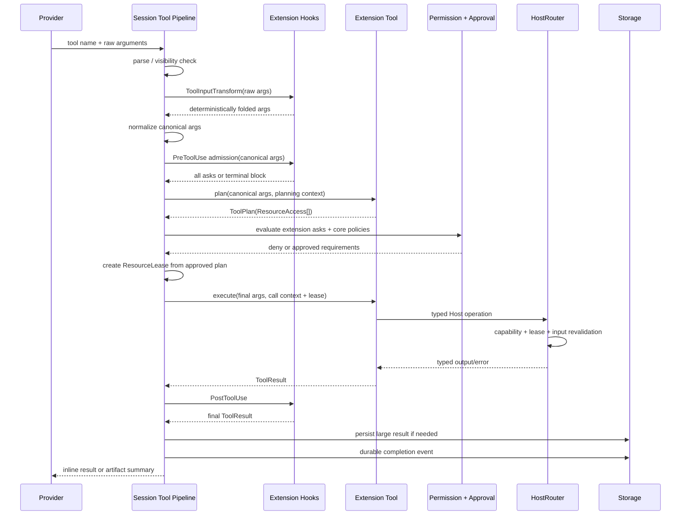

# PR #47 本地候选：从零设计审查与收敛记录

> 日期：2026-08-14
> 分支：`whatevertogo/s5r3-phase-0`
> 远端 PR：[feat(extensions): S5R 3.0 协议升级与作者/宿主契约统一（Phase 0，WIP）](https://github.com/whatevertogo/astrcodey/pull/47)
> 审查对象：远端 PR head `c9c07e58ef4f2ab4e300f808b1fbcdfa9d031c6d`，以及其上的本地未提交候选
> 设计前提：不保留旧架构兼容路径；以长期可维护性、单一事实来源、清晰依赖方向和可证明的安全边界为优先级
> 关系：`docs/architecture/unified-extension-tool-runtime.md` 规定最终 Extension 工具架构；本文记录为什么这样设计、当前实现到达了哪里、审查中修了什么以及还不能忽略什么

## 0. 如何阅读本文

本文刻意区分四类结论：

1. **最终决策**：即使从零开始也会选择的长期结构；不再保留平行方案。
2. **当前实现**：本地候选已经做到、并且与最终决策一致的部分。
3. **本轮修复**：审查中发现了真实 producer → consumer 断点，并已经修改的部分。
4. **剩余阻塞或风险**：不能用注释、兼容分支或局部补丁伪装成已经解决的问题。

本文不是为了证明“大方向正确，所以细节都没问题”。相反，大方向确定后，每条数据流仍需分别检查：

```text
输入来自哪里
    → 在哪个信任边界校验
        → 谁拥有可变状态
            → 谁做映射
                → 谁执行副作用
                    → 谁确认 durable / terminal 状态
                        → 最终消费者看到什么
```

跨边界出现相似结构不一定是重复；如果两端有不同的版本、serde、权限或稳定性契约，显式映射就是必要成本。反过来，没有新增语义、所有字段逐层原样复制、也没有独立生命周期的包装，才是应删除的抽象。

---

## 1. 审查范围与规模

### 1.1 三个不同的差异面

不要把远端 PR、远端 head 上的本地收敛、最终本地候选混成一个数字：

| 差异面 | 当前规模 | 含义 |
| --- | ---: | --- |
| `origin/main...HEAD` | 444 files，`+57,614 / -30,614` | 已推送到 PR #47 的 S5R 3.0 大重构 |
| `HEAD` 到本地工作区 | 229 files，`+5,457 / -3,447` | 本轮 Projection/Compact 收敛、边界清理和问题修复 |
| `origin/main` 到本地工作区 | 480 files，`+61,101 / -32,091` | 用户最终会审阅的实际本地候选 |

远端 PR 当前为 `OPEN`、`MERGEABLE`，但远端 head `c9c07e5` 的 Test、三平台 MSRV、
Windows check 与 Contract Test 仍失败；其他 fmt、Clippy、依赖方向、安全和前端静态检查通过。
这些结果只描述远端 head，**不能证明当前未提交候选**。本轮已重新完成 Rust、前端、
协议生成、依赖边界、Rust 1.88 和 S5R conformance 的本地验证；只有推送后触发的新 CI
才能替代远端失败结果并证明 Windows 等本机无法覆盖的平台。

远端六个红 check 实际是四个已知根因，而不是六套独立设计失败：

| 远端 check | `c9c07e5` 根因 | 当前本地候选 |
| --- | --- | --- |
| Test | conformance 仍引用已删除的 `astrcode-extension-contract` package | CI 改为 SDK `conformance` feature/bin；完整 workspace test 与 conformance 均通过 |
| MSRV Ubuntu/macOS/Windows | Rust 1.88 不支持 `str::floor_char_boundary` | 恢复一个共享、带 UTF-8 边界测试的 `utf8_prefix`；完整 workspace 与 guest 1.88 check 通过 |
| MSRV Windows / Check Windows | `File` 只在 `cfg(unix)` 下导入，Windows production path 仍使用 | `std::fs::File` 改成跨平台导入；只能由新 Windows CI 完整证明 |
| Contract Test | lockfile 的 `nanoid 3.3.17` 命中高危 advisory | 更新为 3.3.18；本地 `npm audit` 为 0、contract test 通过 |

这些失败都发生在 job 前段：远端 workspace tests、三个完整 MSRV workspace checks、Windows 后续
编译、frontend build 和 build matrix 因此前置失败被跳过。因此“本地修掉日志里第一个错误”不等于
下一轮矩阵必绿，尤其不能在 macOS 上替代 Windows 验收。

### 1.2 为什么变化很多

变化多不是一个单独的质量问题；关键是每一类变化是否对应必要边界。本候选同时包含：

- S5R 2.x → 3.0 的协议、peer、worker、host routing 与 conformance 重构；
- 删除 `astrcode-extension-contract` 物理 crate，并把 wire/S5R 契约收回 SDK 的逻辑模块；
- 删除约 8.7k 行旧 `astrcode-tools`，把编码工具迁入 `astrcode-extension-coding`；
- 用 typed Host capability 替代第一方工具直接访问 Session/Storage/进程内部对象；
- 把工具执行收敛为统一的 plan → approval → lease → execute 管线；
- 重整 Session Projection，使 provider context、展示事实、执行状态、agent link 不再堆在一个根类型；
- 把 Compact 大文件拆成同步公共 pipeline，并修正持久化与 hook 顺序；
- 增加大工具结果的通用 artifact 化和 `read_tool_result`；
- 清理 server/protocol/frontend 中旧内置工具和旧 Compact 状态。

如果只做文件移动，变化虽大但价值低；这里可接受的前提是：旧路径确实被删除、依赖方向被 guard、运行时只剩一套语义，而不是新旧两套都保留。

### 1.3 本轮审查方法

本轮没有按 crate 名称逐个“看起来整洁”地打分，而是按以下链路审查：

1. provider tool schema/arguments 的产生与冻结；
2. Extension hook 对最终参数的变换或 gate；
3. planner 声明资源；
4. Session 权限策略与审批记忆；
5. ResourceLease 签发与 HostRouter 二次强制校验；
6. 文件、进程、网络、artifact 等真实副作用；
7. ToolResult 的 PostToolUse、预算、持久化和 provider 展示；
8. durable event → projection → runtime context → HTTP/frontend；
9. Compact snapshot → summary → fingerprint → append → fsync → hook；
10. Extension 配置 candidate → validation → persistence → publication → runtime apply。

语义影响复核不是按文本行数猜范围。对 core LLM/event、ContextSnapshot、model-context projection、
Compact persistence、fork producer 和 AgentSession wire 七个高风险文件执行 `sem diff`，得到 80 个实体级
变化（16 added、25 modified、19 deleted、20 moved）。其中 `TranscriptMessage` 的传递影响明确到
`context_snapshot`、manual/auto/reactive Compact、provider prepare 与 turn recovery；因此验证必须覆盖
Context、Projection、Session 和 Server，不能只跑 core serde round-trip。`sem` 默认不包含未跟踪文件，
所以新 SDK internal façade 和生成的 AgentSession update 仍需由 Cargo/TypeScript 全链单独验收。

---

## 2. 执行摘要

### 2.1 最终判断

整体方向是对的，而且比“保留内置工具，再给 Extension 包一层”更干净：

- **所有 provider-visible 工具都属于 Extension**；
- **bundled 与 worker 共享语义，不强制共享 transport**；
- **`astrcode-tools` 和 `astrcode-extension-contract` 物理 crate 删除**；
- **Extension SDK 保留 authoring、host client、wire/S5R 的逻辑边界**；
- **Session 只消费冻结的 Extension view 和稳定 port，不依赖具体 Extension Runtime**；
- **Projection 按生命周期拆，不按 `system/user` 角色拆**；
- **Compact 保持同步 turn-boundary 流程，不引入后台 coordinator 或双读模型**；
- **工具输出预算由 Host 与 Session 统一承担，不把 `maxOutputTokens` 兼容字段塞回每个工具**。

这些不是为了减少 crate 数量，而是为了让每个事实只有一个 owner、每个副作用只有一条授权路径、每个外部边界只有一次显式映射。

### 2.2 当前还不能宣称“完全收口”

PTY 的架构阻塞已经用 fail-closed 的产品决策解决，而不是用半套 supervisor 掩盖：最终 Coding
Extension 只注册 8 个工具，不再提供 `terminal`；生产依赖中已删除 `portable-pty`，Host operation
catalog 也不再有 PTY/resize。所有 Host process 都是由 Host 自己 spawn 的 supervised pipes：Unix
在 spawn 前建立独立 process group，Windows 路径使用 Job Object。Unix descendant-tree 已有真实
终止回归；Windows Job Object 路径仍必须由新一轮真实 Windows CI 证明，macOS 编译或 Unix E2E
不能替代这项验收。

本轮同时收口了两个此前的 turn 内一致性缺口：

- `PreToolUse` 已拆成有确定顺序的 input transform 与 admission 两阶段。全部 transform 先折叠成
  canonical args；admission 在同一份参数上收集全部 Ask，任意 Block 覆盖，然后 Session 再与 core
  permission requirements 组合；
- Session 在首个 turn hook 前固定 main/small `LlmProviderBindings`，并显式贯穿 hook/tool call 到
  HostRouter。旧 turn 在 reload 后继续使用旧 provider，新 turn 才使用新 provider；只有明确的
  startup/unscoped 调用使用 live fallback。

这两项修复不改变 config/runtime publication 的剩余边界。仍应明确保留在 merge assessment 中的风险：

- core runtime generation 与 Extension runtime generation 仍是两个发布边界，config reload 不能被描述为全运行时原子；
- Extension reload 仍缺 generation-aware reconcile，child session 仍用当前 model ID 字符串反推 tier；
- Compact fsync 模糊失败采用“本次调用未观察到确认”的 `Failed` 语义；后续 exact retry/reopen
  可能确认 rewrite，而 `PostCompact` 不是最终 durable rewrite 的 exactly-once 通知；
- `/compact`、`/model` 仍是 server-owned 命令，因为 SDK 尚无对应 typed Host operation；
- ask-user 的 global custom-event 路由与 stdio 禁用仍按具体 Extension ID 特判，尚未进入通用
  event audience / transport requirement 契约；
- `read_tool_result` 尚缺一条穿过 Coding → lease → HostRouter → Session/Storage → commit 的整链集成测试；
- artifact 已收敛为同目录 temp → file fsync → no-clobber persist → directory fsync，但还缺 fsync/rename 故障注入；
- 本地候选已经完成整仓、MSRV、frontend 与 conformance 验证，但远端 head 仍是旧提交；
  新候选在推送并通过多平台 CI 前不能宣称跨平台验收完成。

### 2.3 不应重新引入的“简化”

以下做法看起来文件少，实际会破坏边界：

- 把 bundled Extension 直接做回 `astrcode_core::tool::Tool` 特权路径；
- 让 server 识别 `shell`、`read_tool_result` 等具体工具名；
- 让 Extension planner 直接访问 Host，以“顺便校验路径/进程”为由产生副作用；
- 把 ResourceLease 当成 capability 的别名，而不在每次 Host 操作再次校验；
- 把 system prompt 和所有 user/assistant/tool 消息拆成两个可独立变更的 projection；
- 为 Compact 新建后台 worker、candidate store、revision CAS 或第二套 provider read model；
- 为了兼容旧 shell 参数而恢复 `maxOutputTokens`；
- 为了少一个映射，直接把 core enum 暴露成 HTTP/S5R wire enum；
- 给当前始终共同编译的 S5R/wire 加没有收益证据的 Cargo feature 矩阵。

---

## 3. 从零设计时的不可违反不变式

### 3.1 数据所有权

1. EventLog 是 durable session facts 的唯一事实来源。
2. Projection 只做纯事件归约，不做 I/O、provider 请求、hook 或 Compact 策略。
3. Extension Runtime 是 registration、generation、handler index 和 session-scoped Host resource 的 owner。
4. Session 是 turn、provider context 组装、权限审批、工具编排和 Compact 的 owner。
5. Storage 是日志、快照、artifact、fsync 和文件格式的 owner；不决定何时 Compact 或何时审批。
6. Server 是 composition 与 transport 边界；不维护第二套工具或 Compact 状态机。
7. Frontend 只消费 wire/live facts；不解释 durable event，也不推断新的业务状态来源。

### 3.2 工具调用

1. provider 看到的 definition、真正 planner、真正 executor 必须来自同一 Extension generation。
2. ToolInputTransform 折叠后必须统一 normalize；PreToolUse、plan 与 execute 只能观察同一份
   canonical 参数。
3. planner 必须是无副作用声明阶段；HostClient 在 planning scope 中 fail closed。
4. approval 只批准 plan，不直接批准任意后续 Host 调用。
5. execute 必须携带不可由 Extension 作者构造的 call-scoped ResourceLease。
6. HostRouter 对 capability、lease、路径/handle/input 边界分别校验，任一缺失都 fail closed。
7. Extension Ask、core resource Ask 和显式 Deny 必须可组合；任何 Deny 优先。
8. approval memory 只能消解产生它的确切 rule key，不能跳过后续策略。
9. ToolResult 的大小策略必须与工具身份无关，并在 durable commit 前统一执行。
10. 长寿命 pipes process 与后台 task 必须有明确 session/extension owner、取消、回收和 tracing；
    无法满足同一所有权契约的 PTY capability 不进入产品面。

### 3.3 Projection 与 Compact

1. system prompt 具有独立配置生命周期，但 transcript 必须保持 user/assistant/tool/synthetic 的全序。
2. 同一 durable event 可以 fan-out 到多个子 projection；这不是重复事件。
3. 跨子 projection 的查询由 root read model 组合，子 projection 不反向依赖兄弟模块。
4. Compact snapshot 必须在 PreCompact 之后重读并冻结。
5. rewrite 必须覆盖完整 turn 前缀，保留 source seq 之后的 tail。
6. rewrite 必须用 system prompt + source prefix fingerprint 拒绝 stale source。
7. provider 不可见的 typed message origin 必须随 retained rewrite 与 fork 一起持久化，不能靠 projection 魔法字符串重建。
8. EventLog fsync 成功前不得发送成功终态或 PostCompact。
9. checkpoint 是 rewrite durable 后的恢复优化；失败不回滚已 durable rewrite。
10. manual、auto、reactive 共用一个同步 pipeline，只在入口策略和失败处理上不同。
11. 每次尝试恰好一个 `Started` 和一个 `Completed`/`Skipped`/`Failed`。

### 3.4 边界与 DTO

1. DTO 只存在于 HTTP/SSE、S5R、MCP、frontend 生成协议和版本化持久化格式。
2. 内部函数调用不创建同构 DTO。
3. 有版本、serde、权限或稳定性差异的边界必须显式映射。
4. 内部 enum 不直接成为 wire enum；wire value 稳定性由协议测试锁定。
5. 跨磁盘/RPC 的值即使上游校验过，执行覆盖、删除、进程控制前仍需重验。

---

## 4. 目标依赖方向

本节箭头 `A --> B` 表示 **A 依赖 B**。


### 4.1 为什么保留 `astrcode-bundled-extensions`

“全部走 Extension”不等于 server 直接依赖全部具体 Extension。产品需要一个组合根回答“这个二进制链接哪些第一方扩展”，但 Runtime 只应回答“如何加载和运行扩展”。因此：

- `astrcode-bundled-extensions` 可以生产依赖具体第一方 Extension；
- server 生产代码只依赖组合根与 Runtime；
- session 只依赖 SDK port；
- Runtime 不依赖任何具体 Extension；
- server 的少量 dev-dependency 可以作为集成测试 fixture，但不能承担生产组装。

`scripts/check-deps.py` 现在显式维护 concrete Extension 完整集合，并强制唯一生产 composition root。这样新增一个 `astrcode-extension-*` 时不能悄悄绕开架构边界。

### 4.2 为什么 SDK 仍可依赖 core

SDK 需要稳定的 tool definition、LLM message、session ID、resource plan 等领域原语。删除这条依赖只会制造逐字段镜像类型，并不能产生新的真实边界。

真正需要独立 DTO 的地方是 S5R wire。SDK 内部可以同时拥有：

```text
extension/*  作者语义
host/*       typed HostClient
wire/*       严格可序列化 DTO/catalog
s5r/*        framing/peer/protocol state
```

物理同 crate 不代表逻辑混层；反而避免 `contract → SDK re-export → worker/runtime` 的过渡期搬运。条件是 wire module 不直接泄漏宿主实现，也不能因为在 SDK 内就绕过显式 mapping。

### 4.3 为什么不增加 S5R Cargo feature

当前 SDK、worker 和 host runtime 共同编译 wire/catalog，并用 parity/conformance 测试锁定。没有已测量的编译时间、二进制体积或 no-wire consumer 需求时，增加 feature 会带来：

- `default`、`all-features`、worker、host、author SDK 的组合矩阵；
- 公共类型在某些 feature 下消失；
- operation catalog parity 只能在部分组合中验证；
- 下游需要理解内部 transport 细节。

因此当前最优设计是**逻辑模块隔离，不做 Cargo feature gate**。未来只有出现明确的 no-wire consumer 且收益可测量时，才考虑 gate transport/runtime 实现；不能 gate 被 manifest、HostClient 和 catalog 共同引用的契约类型。

### 4.4 PeerDriver 的 frame read 必须 cancellation-safe

`PeerDriver` 同时等待 shutdown、control、outbound command、owned task、writer 和 inbound frame。
这里不能在每轮 `tokio::select!` 中临时创建新的 `read_frame()` future：底层 framing read
可能已经消费 header 或部分 payload；如果 command/task 分支先完成，临时 read future 被 drop，
下一轮就会从 payload 中间重新寻找 header。高并发 S5R 测试把该生产竞态稳定放大为：

```text
partial frame read
    → command branch wins
        → read future cancelled after consuming bytes
            → next loop parses remaining payload as header
                → Frame(HeaderTooLong)
                    → PeerClosed while worker process is still alive
```

正确 owner 是 `PeerDriver::run_until` 自身持有的单一 pinned `next_frame` future。其他分支完成时
继续保留它，只在一个完整 frame 已解码并交给 driver 后才 replace。这个修复不是增加 read worker
或第二条 transport 状态机；它只是把原本隐含在底层 stream 中的 partial-read 状态提升到真正的
lifecycle owner。确定性回归用 cancellation-sensitive read gate 在半读期间强制 command dispatch；
修复前触发 synthetic `HeaderTooLong`，修复后同一 invocation 正常完成。实际 S5R guest 另做了
64 次、16 并发压力验证，并重新通过 18/18 E2E。

---

## 5. 所有工具统一走 Extension

### 5.1 最终语义路径



这条路径同样适用于第一方 Coding Extension、其他 bundled Extension 和 S5R worker。区别只在 `ToolHandler` 与 HostClient 的 transport adapter，不在权限或资源语义。

### 5.2 为什么删除 `astrcode-tools`

旧 crate 同时承担四种责任：

- provider-facing schema 和结果文本；
- 文件/进程真实实现；
- session-scoped 后台进程 registry；
- server bootstrap/cleanup 特例。

这造成 Extension 与 builtin 两套 catalog、两套执行 context、两套资源所有权和 server 工具名特例。最干净的拆法不是把整个旧 crate 塞进 Extension，而是按责任迁移：

| 旧责任 | 新 owner |
| --- | --- |
| `read/read_tool_result/write/edit/patch/glob/grep/shell` schema 与产品语义 | `astrcode-extension-coding` |
| workspace 路径、read-before-write observation、patch、搜索原语 | Extension Runtime `HostRouter::workspace` |
| supervised pipes process、handle、session cleanup | Extension Runtime process resource scope |
| provider-visible tool catalog | 冻结的 `ExtensionView` |
| approval 和执行编排 | Session tool pipeline |
| 大结果预算和 durable artifact | Session + Storage |
| 具体第一方 Extension 选择 | bundled composition root |

迁移完成后不应存在 `native_tool()`、`BuiltinToolCatalog`、server tool cleanup list 或“只有内置工具可访问”的 raw execution context。

### 5.3 Coding Extension 的唯一职责

Coding Extension 负责八个面向模型的工具契约：

```text
read
read_tool_result
write
edit
patch
glob
grep
shell
```

它应当知道：

- 参数 schema 和语义默认值；
- 哪些最终参数对应哪些 ResourceAccess；
- 如何组合 typed WorkspaceClient、ProcessClient、ToolResultClient；
- 对模型友好的成功/错误/分页/超时展示；
- shell foreground/background 的产品语义与扩展配置。

它不应知道：

- EventLog 或 Projection 类型；
- Session 内部路径结构；
- approval policy 顺序；
- Host 真实文件句柄、进程表或 storage repo；
- HTTP/frontend DTO；
- provider tokenizer 或全局上下文预算。

### 5.4 strict tool 是 provider wire 预算，不是 Extension 身份

八个 Coding 工具都在注册表中声明严格的原始参数契约。删除 `terminal` 后，这八个契约在
Anthropic 编译中处于 first-party 优先集合并保持 strict；但“注册为 strict”仍不等于任意一次
请求里的**全部第一方与第三方工具**都能同时启用 provider-side strict。Anthropic 对单次请求同时
限制 strict 工具数量、optional 参数数量和 union 数量，其他 bundled/Extension 工具加入后仍可能
超过聚合容量。

最干净的处理是在 provider wire 边界确定性编译，而不是污染 Extension 原始 schema：

1. bundled composition catalog 把 Coding 放在其他第一方工具之前；
2. Coding 内按产品优先级保持 `read` 到 `shell` 的稳定顺序；
3. wire compiler 依次接纳可满足聚合限制的 schema，只在该次 Anthropic 请求中降级后续超限项；
4. 一条 first-party 全 catalog 测试锁定八个 Coding 工具都留在 strict 子集，并验证最终 strict 子集
   满足 Anthropic 聚合限制；
5. 注册表、执行器校验和其他 provider 的原始 schema 均不被修改。

不能为了让测试显示“全部 first-party 工具都 strict”而提高本地常量；provider 仍会拒绝。也不能把可选字段强行改成
非 nullable required；那会改变模型可见语义。这里应测试的是确定性优先级和不修改原契约，而不是
一个违反 provider 容量的愿望值。

### 5.5 planner 为什么不能调用 Host

plan 的作用是把最终参数解释成资源意图，不是“试运行”。如果 planning 可以访问 Host：

- 权限批准前就可能读文件、启动进程或请求网络；
- plan 结果依赖外部瞬时状态，重试和审计不可重复；
- worker task 可以脱离 planning scope 后继续调用；
- bundled 与 S5R 的副作用边界不同。

当前 Worker HostClient 已改成只认 invocation task-local scope；在 handler 内 `tokio::spawn` 后脱离 scope，会返回 `ContextUnavailable`，不再静默回退到全局/detached peer。这个 fail-closed 行为是正确边界，不应为“方便异步”恢复全局 Host API。

### 5.6 approval 必须组合，不是二选一

Extension hook Ask 表示扩展自有业务 gate；core Ask 表示资源或平台安全 gate。两者不是替代关系。例如：

```text
Extension: “这个部署动作需要确认”
Core:      “该工具声明了 Process 资源，需要允许启动进程”
```

若 Extension Ask 获批后直接执行，就绕过了 Process/File policy；若 core Ask 覆盖 Extension Ask，又丢失扩展业务约束。当前 Session 使用 `PreparedToolApproval[]` 顺序结算独立条件，任一拒绝即停止，全部允许后才执行。

approval history 同样必须按精确 rule key 结算：

```text
extension:<extension_id>:<rule_key>
process-resource:<tool_name>
opaque-resource:<tool_name>
```

记住第一条 `AllowAlways` 只表示跳过第一条 Ask，然后继续评估后续策略；不能直接把整个工具调用标记 Allow。

### 5.7 为什么 Process approval 按资源而不是工具名

只匹配 `shell` 会让名为 `run_tests`、`build`、`deploy` 的 Extension 工具通过
`HostResource::Process` 启动任意命令而不触发 manual approval。工具名属于展示契约，不是安全边界。

当前 `ProcessResourceAskPolicy` 检查 plan 中的 `ResourceAccess::Host(HostResource::Process)`，因此任何进程型工具都进入同一策略。命令参数只用于生成更清晰的 prompt，不用于决定是否需要审批。

### 5.8 PreToolUse 两阶段已经收口

当前实现没有继续扩张原先同时承担变换与准入的结果 enum，而是把两类职责编码成不同注册类型和
不同 runtime port：

1. **transform phase**：`ToolInputTransformHandler` 按固定 priority/order 依次折叠
   `Unchanged | Replace`；后一个 handler 看到前一个 handler 的输出；
2. Session 对 transform 输出执行一次 `normalize_final_arguments`，得到 canonical args；失败即拒绝，
   不进入 admission、plan 或 execute；
3. **admission phase**：全部匹配的 `PreToolUseHandler` 只返回 `Allow | Ask | Block`，且都观察同一份
   canonical args；无 Block 时所有 Ask 聚合为 `PreToolUseAdmission::Ask { requirements }`，Block 是
   terminal deny；
4. Session 把每条 Extension requirement 与 core permission requirements 独立结算，approval memory
   只消解 exact rule key；
5. planner 与 executor 都接收同一份 canonical args。

一条多 Extension 回归同时覆盖两次顺序变换、两个 Ask 聚合、后置 Block 覆盖，以及
admission/plan/permission 对 canonical args 的一致观察。这里已不再是 merge blocker。

---

## 6. ResourceAccess、capability 与 lease

### 6.1 三类资源足够表达当前边界

```rust
pub enum ResourceAccess {
    File {
        operation: FileOperation,
        path: String,
        recursive: bool,
    },
    Host(HostResource),
    Opaque,
}
```

- `File`：可精确到 read/search/write/read-write、路径和递归范围；
- `Host`：Process、ToolResultArtifact、Session、Model、Network、Event、ExtensionHttp 等能力域；
- `Opaque`：副作用不经过 Host，平台无法细分或强制执行，manual 模式必须明确 Ask。

不要为每个 Host DTO 都创建一个 ResourceAccess enum 变体。ResourceAccess 表示用户批准的资源域；具体 request 限制仍属于 typed DTO 与 Host 边界校验。

### 6.2 三道校验各自解决不同问题

| 校验 | 回答的问题 | 不能替代什么 |
| --- | --- | --- |
| manifest capability | 这个 Extension 是否声明过此 Host 能力 | 不能说明本次调用是否获批 |
| ResourceLease | 本次 tool call 的 plan 是否包含该资源 | 不能替代路径/handle/input 校验 |
| Host request validation | 实际 path、handle owner、范围、大小是否合法 | 不能扩大 capability 或 lease |

只有三者同时通过才执行真实副作用。Capability 不是永久授权；plan 不是可信事实；lease 不是输入净化。

### 6.3 Process handle 所有权

最终 Host process capability 只接受 stdin/stdout/stderr pipes，不存在 PTY mode 或 resize。handle 必须
绑定 `(session_id, ExtensionInstanceId, process_id)`，并由 Host session resource scope 持有；
`ExtensionInstanceId` 是 runtime attribution，不进入 author API 或 wire。

必须满足：

- 其他 session 或 Extension 猜到 ID 也无法访问；
- call-owned process 随 invocation cancellation 终止并释放 quota；
- session-owned process 可跨单次调用读取，但随 session close 回收；
- 同 ID reload 的新旧 instance 彼此隔离，旧 instance drain 后只回收自己的 handles；
- Unix process group 或 Windows Job Object 终止完整进程树，而不是只 kill direct child；
- spawn 成功到 handle 登记之间由 RAII owner 覆盖。

本轮已修：

- `Call + cancellation=None` 不再静默降级为 Session lifetime，而是 fail closed；
- call-owned read cancellation 先从 handle store 移除，再终止，避免重复取消耗尽 quota；
- `ProcessSpawn`、foreground/background handle 与 S5R worker 进程统一复用 `SupervisedCommand`；
- Unix 在 spawn 前建立独立 process group，terminate 先发 `SIGTERM`，grace 后发 `SIGKILL`，Drop
  同样覆盖整个 group；
- Windows `SupervisedCommand` 使用 `process-wrap` 的 `JobObject + KillOnDrop`，不再存在另一个未受管
  的 PTY spawn 路径；
- 所有 Host process 都执行 `env_clear + allowlist + noninteractive env`；
- `/bin/sh` process E2E 明确 `#[cfg(unix)]`，跨平台 fail-closed 测试不依赖 shell。

### 6.4 PTY 阻塞的最终处理：删除能力，不保留降级路径

> **迁移前历史**：早期本地候选曾包含 `terminal` 工具与 `portable-pty`。由于该库内部 spawn 并只
> 返回 opaque child，Host 无法用与 pipes 相同的 spawn-before-register RAII owner 证明 Windows
> Job Object、取消窗口和 descendant cleanup。这是当时的真实 blocker，不是当前产品能力。

最终没有 fork `portable-pty`、手写 ConPTY，也没有保留“Unix 看起来可用、Windows 尽力而为”的
平台分叉。当前状态是：

- Coding Extension 只注册 8 个工具，`terminal` 已删除；
- `process/terminal.rs`、`portable-pty` dependency、PTY wire DTO、`ProcessResize` operation 与
  HostRouter resize dispatch 均已删除；
- `ProcessClient` 只公开 supervised pipes 的 spawn/start/read/input/status/promote/kill/list；
- shell foreground/background 都由同一个 Host process service 组合；
- 文档、协议和测试不得再把 PTY cleanup 当成当前承诺。

当前跨平台剩余项不是“补 PTY”，而是用真实 Windows runner 验收已有 pipes Job Object 路径：启动
`cmd.exe` descendant tree，分别触发 kill、timeout、cancellation、Drop/session cleanup，并确认后代
PID 全部消失。在该 CI 通过前，只能说 Windows owner 已实现并可编译，不能说真实进程树已验收。

---

## 7. `maxOutputTokens`：删掉工具兼容字段，保留正确的三层预算

### 7.1 结论

旧 shell/coding tool 的 `maxOutputTokens` 不应保留，也不应通过 Extension config 重新包装成同名字段。Extension 系统可以实现其真实目标，而且边界更准确。

需要区分三个完全不同的问题：

| 问题 | 正确 owner | 正确单位 |
| --- | --- | --- |
| 子进程持续输出会不会耗尽内存 | Host process service + Coding 聚合器 | bytes / handle |
| 一次 ToolResult 是否太大，不能直接进入 transcript | Session tool-result budget + Storage artifact | bytes / result |
| provider 这次最多生成多少模型输出 | Context token budget + `LlmRequest` | tokens / request |

把它们都叫 `maxOutputTokens` 会让工具猜 tokenizer、把字节流误当 token，并让每个 Extension 实现不同截断规则。

### 7.2 当前通用替代契约

1. Host process 的 stdout、stderr、combined buffer 都有固定字节上限；Coding 前台聚合最多保留 1 MiB combined 尾部，并报告 dropped bytes。
2. PostToolUse 之后、durable completion 之前，Session 对**所有 Extension**执行统一预算：超过 30,000 bytes 自动写 session-owned artifact。
3. provider 只收到约 2,000 字符 preview、opaque `artifactId` 和分页说明。
4. `read_tool_result` 用 UTF-8 byte cursor 读取，单页 `4..=20,000` bytes；最大页严格低于 30,000 inline 阈值，避免分页结果再次 artifact 化并形成递归 artifact。
5. 大量小结果的累计上下文仍由 provider token accounting 和 Compact 处理，不维护一套无法重写 durable history 的伪“总字符预算”。

### 7.3 什么字段可以继续存在

语义明确的分页/查询字段可以存在：

- `maxBytes`：读取已有字节内容的一页；
- `byteOffset` / `nextByteOffset`：UTF-8 安全游标；
- `maxMatches`：搜索结果条数；
- `lineLimit` / `maxChars`：读取产品契约中的显式显示范围；
- `timeoutSecs`：进程时间预算。

这些字段控制具体操作，不假装控制 provider token。

### 7.4 哪个 `max_output_tokens` 必须保留

模型请求级 `LlmRequest.max_output_tokens` 和 Compact 的 `compact_max_output_tokens` 必须保留。它们由
Context/Session 根据模型限制、当前 prompt token 和最小输出预算计算，并直接传给 provider。删除这些字段会失去真正的 token 边界；它们与旧工具兼容字段同名相似但语义完全不同。

本轮同时删除了 provider 的旧双入口：`LlmProvider` 不再要求 `generate(messages, tools)`，也不再让
默认 `generate_request` 静默丢弃 request options。唯一入口现在是 `generate_request(LlmRequest)`；
所有 provider、live wrapper、host router、调用方和测试 mock 都显式构造/转发同一请求。

Extension 获得等价但不降级的 typed 能力：

```text
llm_chat_request(Vec<LlmMessage>)
    .with_max_output_tokens(n)
        → ModelClient::*_request
            → HostLlmChatRequest.maxOutputTokens
                → HostRouter shared parse
                    → core LlmRequest
                        → provider
```

`None` 明确表示使用模型/runtime 默认预算；`0` 在 Host 信任边界拒绝；大于 provider 能力的值最终由
真实 provider 的 `ModelLimits::effective_output_cap` 钳制。这里不使用自由 JSON options bag，也不把
token 预算塞回 shell/read 等工具 schema。普通 `main_chat(messages)` 仍只是上述请求的 `None` 便捷入口，
不会形成第二条 provider 语义路径。

---

## 8. Tool-result artifact 设计

### 8.1 owner 与 ID

artifact 由 Storage 写入当前 session 的 tool-results 目录；Extension 只看到 opaque ID。读取时 Storage 重新验证：

- ID 只能是单个普通文件名 component；
- 必须满足 `result-<sha256>[-suffix].txt` 格式；
- 不接受绝对路径、`..`、separator 或跨 session path；
- 文件长度、byte offset、UTF-8 边界和 page size 都在读取边界校验。

ID 可以从 tool name + call ID 确定性哈希得到，但不能把原始 tool name、call ID 或路径直接暴露给 Extension。

### 8.2 UTF-8 分页

游标必须是 byte offset，而不是 char index：文件 seek、长度和协议上限都以 bytes 定义。Storage 在读取时：

1. 验证 offset 不超过文件；
2. 验证 offset 不是 UTF-8 continuation byte；
3. 最多读取 `max_bytes`；
4. 若末尾截在多字节字符中，回退到最后一个完整字符；
5. 返回实际 `returned_bytes` 和可信 `next_byte_offset`。

调用方必须使用上一页返回的 `nextByteOffset`，不能用字符数或自己相加推测。

### 8.3 durability

新 artifact 成功返回前必须完成：

```text
same-directory temporary file
    → write all bytes
        → temporary file sync_all
            → persist_noclobber to deterministic final name
                → final file sync_all
                    → tool-results directory fsync
                        → parent session directory fsync
```

本轮同时修正了两类故障：

- `write_all` 失败只会留下 temp，不再污染合法的 final-name；
- 如果第一次 file/dir fsync 失败但 final 文件已经存在，下一次相同输入会重新 sync file 与两级目录，不会仅比较内容就返回成功。

剩余验收缺口是可控的 write/fsync/persist/directory-sync 故障注入，不是再加一条业务分支。

---

## 9. Session Projection：不按 system/user 拆，按生命周期拆

### 9.1 直接回答“projection 要不要分 system 和 user”

**不要按 system/user 角色拆。**

正确拆法是：system prompt 单独保存；其余 provider-visible transcript 保持一个有序消息流。

原因：

- system prompt 来自 session 配置，具有 fingerprint、source、extra prompt 和替换生命周期；
- provider request 通常把 system prompt 放在 envelope/首部，不应把旧 system message 当普通 transcript 重放；
- user、assistant、tool result 和 synthetic context 共同组成严格协议顺序；
- Compact 必须按完整 turn 边界切前缀，不能分别压 user 与 assistant/tool；
- tool-call request/result 的配对依赖同一全序；
- `TurnAbortedContext`、compact summary 等 synthetic message 也不是简单的 user 业务消息。

因此最终形状是：

```rust
pub struct SessionReadModel {
    pub identity: SessionIdentity,
    pub stats: SessionEventStats,
    pub system_prompt: SessionSystemPrompt,
    pub model_context: SessionModelContext,
    pub presentation: SessionPresentation,
    pub execution: SessionExecutionState,
    pub agent_sessions: Vec<AgentSessionLinkView>,
}

pub struct SessionModelContext {
    pub messages: Vec<SequencedLlmMessage>,
    pub usage: Option<ContextUsageView>,
    pub compactions: Vec<CompactionView>,
}
```

这里 `messages` 可以包含 role 为 user/assistant/tool/synthetic-system 的历史事件产物，但
`context_snapshot()` 会通过统一 provider transcript 规则过滤旧 system message，并用
`SessionSystemPrompt` 构造当前请求。一个 ordered stream 不等于所有消息都直接发给 provider。

### 9.2 为什么按五种职责拆

| 子 projection | 它回答的问题 | 不应拥有 |
| --- | --- | --- |
| `system_prompt` | 当前 session 请求使用哪个 system prompt | transcript、UI phase |
| `model_context` | provider 可见的有序消息、usage anchor、compact 元数据 | pending approval、标题 |
| `presentation` | 首条用户消息、错误/recap 等稳定展示事实 | provider context、运行时 gate |
| `execution` | phase、unsettled turn、pending input/tool/approval、active step | LLM message 内容 |
| `agent_sessions` | 父 session 看到的 child link 与终态 | child session 完整状态 |

identity/stats 保持 root 字段，因为它们是所有读法的基本定位，而不是某一个子 projection 的私有状态。

### 9.3 fan-out 不是重复

`UserMessage` 同时：

- 进入 `model_context.messages`；
- 从 `execution.pending_inputs` 删除匹配的 accepted input；
- 首次出现时写 `presentation.first_user_message`。

这三个事实来自同一个 durable event，但服务不同查询。为避免 fan-out 而拆成三个 durable event，会引入事件间原子性和顺序问题，反而更糟。

固定 reducer 顺序：

```text
validate session / seq / first event / rewrite fingerprint
    → update stats
        → model_context.apply_event
            → presentation.apply_event
                → execution.apply_event
                    → agents.apply_event
                        → update narrow root identity fields
```

### 9.4 为什么跨 projection 查询留在 root

`tool_calls_needing_interruption()` 需要组合：

- `model_context.messages` 中已经请求但没有回答的 tool call；
- `execution.pending_tool_calls` 中当前未结算的 durable 状态。

如果把它放进任一子模块，就会产生兄弟模块反向依赖。root read model 是天然 composition boundary，因此该查询留在 root 是正确的。

### 9.5 `SessionSummaryProjection` 不是双读模型

summary projection 只维护列表页需要的 session ID、时间、工作目录、model、phase、cursor、首条消息等轻量字段；它不提供 provider context，也不参与 Compact。它是同一 EventLog 的窄查询优化，不是第二套 session 业务事实或 Compact candidate view。

### 9.6 Projection 文件职责

| 文件 | 唯一职责 |
| --- | --- |
| `session-projection/src/lib.rs` | crate 文档、模块声明和显式 public export |
| `error.rs` | reducer 与 model-context validation 共用的 `ProjectionError` |
| `model.rs` | root composition、identity/stats、summary 与跨子 projection 查询 |
| `model_context.rs` | system prompt、sequenced transcript、usage、compaction、rewrite fingerprint/替换 |
| `presentation.rs` | 首条用户消息与非 provider 展示 artifact |
| `execution.rs` | phase、turn、pending input/tool/approval 与 active step |
| `agents.rs` | child-agent link 与终态 |
| `reducer.rs` | 顺序校验、batch prepare/apply、replay、summary projection 与 fan-out |
| `reducer/tests.rs` | 跨 projection、batch、replay 集成场景；局部测试留在所属模块 |

Projection crate 必须继续只依赖 core、serde、chrono、thiserror；不得依赖 storage、context、session 或 server。

---

## 10. `context_snapshot()` 是运行时组装边界

Projection 保存 durable-derived state；provider request 需要当前 system prompt、经过 provider 规则过滤的 transcript 和 usage anchor。这一映射属于 Session，因为 Session 同时知道 Projection 与 Context：

```text
SessionReadModel
    system_prompt
    model_context.messages
    model_context.usage
        → session::projection_context::context_snapshot
            → ContextSnapshot
                → normal turn / manual compact / auto compact / reactive compact
```

不应让 Projection 依赖 `astrcode-context` 来直接返回 `ContextSnapshot`，也不应让 server 重复组装 provider transcript。

当前 usage anchor 需要 owned covered prefix，而 `ContextSnapshot` 也拥有完整消息；这会产生必要克隆。除非 Context API 改为共享不可变 slice/Arc，并能保持 provider filtering 后的 covered 语义，否则抽一个“避免 clone helper”只会隐藏所有权成本。

---

## 11. Compact：同步、单 pipeline、durable 后通知

### 11.1 为什么保持同步

当前需求没有并行 user turn 与后台 compact candidate 的产品必要性。同步 Compact 有一个很强的可证明边界：在一个 operation/turn 内冻结、生成、提交或失败。

引入后台 worker 会立刻要求回答：

- candidate 生成期间新 tail 如何合并；
- revision/CAS 与 fingerprint 谁是唯一冲突机制；
- candidate 放在哪、何时回收；
- app 重启后任务是否恢复；
- hook 的 started/post/terminal 如何保证恰好一次；
- manual 409、auto fallback、reactive retry 如何跨 coordinator 表达；
- frontend 是否需要 pending/deferred 第二状态机。

这些都不是当前目标所需，因此不增加 worker、Coordinator、candidate、retry queue、try-lock/park 或双读模型。

### 11.2 公共 pipeline

manual、auto、reactive 的公共顺序固定为：

1. 发 `CompactionStarted`；
2. 调用 `PreCompact`；block → `Skipped`；
3. hook 后重读 `SessionReadModel`；
4. `context_snapshot()` 冻结 system prompt、messages、source seq；
5. manual 可先写完整 transcript snapshot；
6. 按完整 turn 边界生成 LLM summary；LLM/parse 失败按现有规则 deterministic fallback；
7. 使用当前 provider 和工具定义更新 pre/post token；
8. post-compact enrich；
9. 用 `source_seq + source_fingerprint` append `TranscriptRewritten`；
10. `sync_durable_events()` 成功后才确认 durable；
11. checkpoint 失败只 warning；
12. durable confirmed 后调用 `PostCompact`，失败只 warning；
13. 恰好一个 `Completed`、`Skipped` 或 `Failed`。

### 11.3 三个入口的差异只留在入口

| 入口 | operation 语义 | pipeline 失败后的行为 |
| --- | --- | --- |
| manual | 全程持 session operation guard；active turn 直接 409 | 向调用方返回 error/skip |
| auto | turn 阈值触发；breaker 决定 LLM 或 deterministic | 继续使用原 context |
| reactive | provider prompt-too-long 后，单 turn 最多一次 | 仅 compact committed 后重试 provider |

不要复制三套 Compact 控制流；差异只应是 strategy、是否尝试 LLM、是否写 transcript snapshot，以及调用方如何处理 outcome。

### 11.4 breaker 必须区分三态

一个 bool `llm_failed` 无法表达“根本没请求 LLM”。PreCompact block、无可压缩 turn、前置读取失败都属于 NotAttempted；把它们当成功会错误关闭 half-open breaker、清零既有失败。

当前使用：

```rust
enum LlmCompactAttempt {
    NotAttempted,
    Succeeded,
    Failed,
}
```

- `Failed`：累计失败，达到阈值或 half-open 失败则 cooldown；
- `Succeeded`：关闭 breaker 并清零；
- `NotAttempted`：closed 状态保留既有失败；half-open 回到 cooldown。

状态 owner 必须是 session runtime，不能是每个 turn 新建的 `TurnLoop`。否则第一个 turn 的 LLM Compact 失败会随 runner 析构，第二个 turn 又从空 breaker 开始，threshold 永远无法跨 turn 累积。当前 breaker 放在 `SessionRuntimeState`，每轮仅用 pinned runtime generation 的新配置调用 `configure()`，更新 threshold/cooldown 但不丢 session-local failure history。

tri-state 只解决“这次有没有真正请求 LLM”，还不能保证调用方一定结算 half-open probe。
如果 turn future 在 Compact await 中被取消，手写的 `should_attempt()` / `finish_attempt()` 配对会永久留下
`half_open_attempt_in_flight=true`。当前实现因此让 breaker 返回 RAII attempt permit：

- acquire 成功才代表本次拥有 probe；
- `finish(Succeeded | Failed | NotAttempted)` 消费 permit 并显式结算；
- future 取消、panic unwind 或任意早退导致 permit Drop 时，half-open 回到 cooldown；
- permit 与 `run_compaction` 放在同一控制流附近，不把结算责任散到 turn 的多个 return 分支。

这是一个有明确触发器的生命周期抽象，不是为了“以后可能取消”而增加的层次。

### 11.5 Compact 文件职责

| 文件 | 唯一职责 |
| --- | --- |
| `compaction/mod.rs` | 模块说明与最小导出 |
| `pipeline.rs` | hook、重读、summary/fallback、token、enrich、persist、post hook、terminal |
| `turn.rs` | auto planning、reactive retry、turn 内 snapshot 刷新、breaker 结算 |
| `manual.rs` | idle manual 入口、runtime view/tool snapshot、调用公共 pipeline |
| `persistence.rs` | fingerprint、rewrite append、fsync、best-effort checkpoint |
| `circuit_breaker.rs` | auto LLM compact 的进程内状态机 |
| `projection_context.rs` | `SessionReadModel` → `ContextSnapshot`，不承载 Compact policy |
| `payload.rs` | durable/live payload construction，不承载控制流 |

### 11.6 fsync 失败后的确定语义

实现选择了单 confirmed projection，不引入 candidate read model。Compact rewrite 在同一
session commit lane 内依次执行：

1. 基于当前 projection 准备 exact batch；
2. 在内存中先安装带 `through_seq` 的 sticky pending marker；
3. append 完整 JSONL 记录并 fsync；
4. fsync 成功后才 apply projection，再由有序 sink 发布 observer event；
5. 最后执行 best-effort checkpoint 与 `PostCompact`。

fsync 返回模糊失败时，pending batch 不进入 projection，也不发布 observer；
storage 返回 `DurabilityUncertain { through_seq, .. }`，并阻断后续 append、replay、
consumer checkpoint、snapshot 和 turn operation admission。该错误不是普通可重试错误：
重放原 durable event 可能重复产生领域事实。唯一进程内恢复原语是带原
`through_seq` 的显式 sync retry；错 seq 必须拒绝，成功过的同 seq retry 是幂等的。

进程重启时不需要持久化 pending marker，但 reopen 不能直接信任完整换行记录：
`EventLog::open` 与 cold summary/read-only replay 入口必须绕过运行期 dirty 快路径，
在任何 replay、snapshot restore 或 projection publish 前先固定 pre-sync file length，再
真实执行 file sync；随后 scan 只能读取该 confirmed prefix，不能越界读入并发追加的
完整但未确认记录。sync 失败则 read/open 失败，不暴露 projection 或 summary。
只有完成 newline 的记录可在 sync 后 replay，不完整尾仍按现有 tail recovery 丢弃。

production 的进程内恢复入口位于 operation admission：它只捕获 typed
`DurabilityUncertain`，在已有 operation gate 内经同一 event sink lane 使用错误携带的
exact `through_seq` 重试一次，并在成功后重新检查 storage gate。持续 EIO 仍阻断本次
operation；普通 turn completion、release、shutdown 和普通 sync 都不会暗中确认，
也不暴露 raw seq 的管理端点。

`CompactionFailed` 表示本次调用没有观察到 durability confirmation，不表示
rewrite 永远不会在 retry/reopen 后生效。`PostCompact` 是进程观察到成功后的
best-effort hook，不是每个最终 durable rewrite 的 exactly-once 通知。

### 11.7 enrich 失败不能改变可提交 candidate

post-compact enrich 是 best-effort 阶段，不能先破坏 `CompactResult`，再寄希望于后台收集成功。
旧实现为了把 retained tail 移入 `spawn_blocking`，先对
`compaction.retained_messages` 执行 `mem::take`；blocking task panic、future 取消或其他
`JoinError` 会直接返回，留下一个空 retained tail。空 tail 又是合法后缀，后续 persistence
可能只写 summary，静默删除没有被摘要覆盖的近期消息。

当前收集阶段只读取 retained tail 的 owned snapshot；`CompactResult` 保持不变。blocking task
成功返回 files/notes 后，才在同一同步提交点追加 enrichment summary；`JoinError` 只告警并保留
原 summary 与 retained tail。一个真实 panic task 回归锁定了这个不变量。这里允许一次有界 clone，
因为它换取的是“失败前后 candidate 完全相同”的事务边界，而不是为了 API 方便复制消息。

---

## 12. Extension 配置：candidate validation 必须先于保存和发布

### 12.1 被删除的可变热更模型

旧流程先保存并发布 core 配置，再对活动 Extension 实例调用可失败的配置回调。非法值、回调失败或
请求取消都可能留下“磁盘与 core 已更新、Extension 仍是旧状态”的组合。给这个组合增加
`Applied | Degraded` 状态只能更准确地描述裂缝，不能消除裂缝，因此生产接口不再提供活动实例的
`on_config_changed`、expected-config cache 或补偿式重试。

### 12.2 已提交 runtime generation

一次配置事务的发布单位由同一 epoch 的两部分组成：

- core：`EffectiveConfig`、main/small provider、`ContextAssembler`；
- Extension：包含完整 handler catalog 的 `HandlerIndex`，以及每个已配置 Extension 实例的
  registrations、tasks、generation gate 和 Host instance identity。

source fingerprint 与规范化后的完整 Extension config 一起构成候选 identity。identity 完全相同的
实例直接进入 `Retain`，所以只修改 Compact threshold 等 core 字段不会重启 Extension；新增、启停、
来源变化或配置变化才进入 `Start`。这不是局部字段 apply，而是 changed instance 的 fresh replacement。

### 12.3 prepare 必须在旧代之外完成

`ConfigManager::update_lock` 串行化同一配置源的更新；Runner 的 source transaction 从 discovery 一直
持有到 commit 或 abort，旧 snapshot 不可能在等待 source lock 前被捕获后反向覆盖新代。prepare 顺序：

1. resolve core config，并构造新 providers/context settings；
2. 验证所有 first-party config，包括当前 disabled 的 bundled Extension；
3. discovery 只产生 `source_key + source fingerprint + extension id + lazy factory`；
4. 对 identity 变化的候选才调用 factory、`register()`、冲突校验和 `validate_config()`；
5. 给每个 fresh instance 分配独立 `ExtensionInstanceId`，在 candidate generation gate 下调用 `start()`；
6. S5R worker 在 `Activate` 中收到完整 JSON config，并可用 typed error 拒绝激活；
7. candidate managed tasks 保持 suspended，所有 Host invoke/stream 和 custom event emitter 明确返回
   `HostNotReady`/publish failure，不能依靠“任务碰巧尚未调度”推断无副作用。

任一 discovery、load、register、validate、start 或 S5R activation 失败都会停止本批已经启动的 fresh
instances、取消其 managed/call resources，并按 instance identity 清理 Host-owned resources。旧 index、
core generation 与 raw snapshot 均不变；API 更新尚未保存，因此磁盘也不变。若配置是外部先写入
磁盘再触发 reload，失败时磁盘保留 desired config，运行态保留 last-known-good，修正后再次 reload。
Extension 若绕过 Host API 直接制造外部事实，宿主无法回滚；author contract 因此禁止 candidate
startup 执行不可撤销外部写入。

### 12.4 save 与 coherent publication

prepare 成功后，`ConfigManager` 先把 update guard、candidate、待保存 config 和 publication sender
移交给自己拥有的 must-finish transaction，再让 HTTP 调用等待结果。请求 future 此后被取消只会放弃
响应，不会取消 save→commit；从磁盘 reload 的配置不再重复保存，但 commit 同样由该 transaction
接管。shutdown 必须先 drain 这些 transaction，再停止 Runner。transaction 与 ConfigManager 的栈上
借用无关，即使请求或 manager handle 被 Drop，也不会把已经开始的提交 task abort。

保存失败会 abort 整个 candidate。保存成功后的 publication 不再包含可失败的 Extension 回调、动态
查找或显式 panic 分支：retained identity 和 retiring operation gate 映射都在保存前、仍持有 source
transaction 时校验；保存后只移动已经准备好的值并发布：

```text
begin Updating
    install candidate HandlerIndex
    publish raw + core RuntimeGeneration(extension_epoch)
    synchronously activate candidate gates and suspended tasks
drop publication guard
    Stable(extension_epoch)   # 唯一线性化点
```

`Stable(epoch)` 之后只有旧代 retirement 与 diagnostics，不能再有决定本次 commit 成败的动作。turn 在
首个 hook 前按以下顺序取得 coherent view：读取 core `Arc` 与其 expected extension epoch，确认 Runner
处于同 epoch 的 `Stable`，取得 Extension view，再复查 Runner state/epoch 与 core `Arc` identity。任一
检查漂移就重试。因此同一 turn 的 effective config、providers、context assembler、handler catalog 与
Extension Host LLM bindings 必然来自同一已提交 epoch；manual Compact 使用同一入口。

保存后的代码路径不把 unwind 包装成可恢复的事务错误：一旦内部 invariant 被破坏而 panic，进程立即
fail-stop，重启时从已经保存的配置重新构造完整 generation。这样不会让仍在运行的服务把“磁盘新代、
runtime 旧代”伪装成 last-known-good；正常的候选错误和存储错误都在这个不可失败边界之前返回 typed
error。

这里的“保存成功”仅指 `ConfigStore::save` 返回成功。当前文件实现是临时文件写入后 rename，没有对
文件和父目录执行 fsync，因此不宣称断电级 durability；如果进程在 rename 与 runtime publication 之间
崩溃，重启会从磁盘新配置重新构造完整 generation，而存活进程不会继续运行一个可观察的混合代。

### 12.5 旧代 drain、取消与 Host resource ownership

发布不强制取消已经 pin 旧 view 的 active turn。每个 HandlerIndex 持有其引用到的 publication lease；
replacement retirement 先等待旧 index lease 全部释放，再关闭 admission、取消 managed tasks 与 retained
call cancellation；同一时点把旧 `GenerationGate` 设为 inactive，因此 retained startup/handler Host
client 与 event emitter 都会 fail closed。关闭 admission 后会取得整代 invocation capacity，明确等待
所有已接纳 handler 释放 permit，再等待 managed task 退出并调用 `stop(Reload|Disabled)`。commit 在
最后一个 publication 前 await 之后才移动 candidate entries，并在 `Stable` 后第一次 await 之前把所有
旧实例同步交给 retirement supervisor，因此请求取消不会把已经启动的 candidate 或已卸载的旧实例
直接 Drop 掉。

Host process handle 的 owner 是 `(session_id, ExtensionInstanceId)`，不是用户可见 `extension_id`。同名
新旧实例并存时不能互相 list/read/input/kill；Reload、Disabled、Shutdown 和 StartupFailed 都在各自
lease drain 与 stop 尝试结束后，只清理对应 instance 的 session-lifetime handles。Drop/cancellation 能
撤权并回收 Host-owned resources，但已经提交到外部系统的事实仍不可回滚，这也是 startup purity 约束
存在的原因。

普通 background task 在共享 shutdown budget 后会被 abort；`MustFinish` 只用于本地 session state、
workspace 和 memory 等持久化临界区，超过 budget 后会告警但继续等待，避免用强制取消制造半写入。
因此上述 cleanup 对正常返回的 Host I/O 是 eventual guarantee，不是无条件的时间上界：如果底层文件
系统调用永久卡死，旧 instance 的 stop 与 Host resource cleanup 也会被推迟。turn context 只能撤销后续
Host 权限并取消 owned task，既不能回滚已经发生的外部事实，也不能安全中断已经进入内核的持久写。

`ExtensionTasks` 也不能成为普通 handler 的逃生口。`ExtensionCallContext`、`ToolContext`、hook、HTTP
和 command context 都不暴露 generation task owner；只有 `ExtensionStartContext` 能取得它。需要跨越
单次 call 的工作必须在 `Extension::start` 中建立有明确输入队列和 shutdown owner 的 worker，handler
只提交 typed request 并等待结果。Memory 是当前真实用例：保存、删除和 session preference preload
进入有界 store queue；已经接纳的文件写由 generation 的 `MustFinish` 跟踪，即使等待它的 handler
future 被取消也会完成；rollout extraction 由另一个可取消、只保留最新 pending request 的 generation
worker 执行。热重载先让旧 view 排空，再撤销旧 gate、关闭 worker、等待已接纳写入，新的 handler 只
持有新实例自己的 queue。这个边界能清理宿主拥有的任务和能力，仍不声称回滚已完成的文件、网络或
durable event 副作用。可信的进程内 Rust Extension 仍可自行调用 `tokio::spawn` 或直接 I/O；那属于
author contract 与代码审查边界，不能由 context Drop 伪装成事务保证。

### 12.6 Extension-owned config 与 S5R parity

Server 只把每个 Extension 的原始 JSON 值纳入 canonical fingerprint 并传入候选，不解释
`shellTimeoutSecs`、`maxOutputTokens` 等作者字段。进程内 Extension 通过 `ExtensionConfig` 做 typed
deserialize/validation；S5R `ActivateMsg` 携带同一完整 config，worker activation handler 在 ready 前
确认或拒绝。不存在 Reconfigure/on-config-changed 兼容路径：配置变化总是生成 fresh instance，失败则
保留 last-known-good generation。

如果未来需要 manifest JSON schema，它只能作为无需实例化的早期错误报告层；不能替代 Extension
自己的运行时 invariant 校验，也不能在 validation 失败时卸载旧代。`maxOutputTokens` 之类行为应成为
Extension author contract 或 Host typed request 的字段，而不是为了兼容旧 builtin 在 core 中保留同名
影子配置。

### 12.7 模型 tier 不能由当前 model ID 字符串反推

child session 创建时持久化了当时 small model A；如果配置后来切到 small model B，`llm_for_model_id(A)` 既不等于当前 small B，也不等于当前 main，现实现会静默路由到 main provider。这使 durable identity 显示 A，实际执行却是 main。

从零设计应持久化语义绑定而非偶然字符串：`ModelBinding::{Main, Small, Exact}`。每轮在 pinned generation 解析 tier；`Small` 跟随该代 small provider，`Exact` 不存在时返回 typed error，绝不能 fallback main。

---

## 13. Server、protocol 与 frontend 边界

### 13.1 Server 只做 composition 和映射

Server 可以：

- 构造 Runtime、bundled composition、SessionManager；
- 持 operation gate；
- 把 `ManualCompactionOutcome` 映射成 HTTP response；
- 把内部 projection 映射成既有 inspect DTO；
- 发布 SSE/live event；
- 将配置 validation/apply error 变成结构化 HTTP error。

Server 不可以：

- 按名字识别具体 Coding tool；
- 直接清理具体工具的 process registry；
- 自己拼 builtin + extension catalog；
- 解释 durable event 成第二套 session 状态；
- 拥有 Compact worker/pending state；
- 复制 Session 的 manual compaction outcome enum。

同一原则也适用于测试 API：`ServerRuntime` 的组件 getter、测试 router/event publisher 和竞态探针
不应常驻生产 public surface。当前候选把它们集中在 feature-gated `test_support`；正式 crate root 只保留
CLI/bootstrap/HTTP 真正跨 crate 使用的入口。测试仍覆盖生产 router 和同一个 `ServerEventBus`，而不是
另造一套测试 transport。

### 13.2 `/compact`

`/compact` 必须在普通输入接纳前识别并进入唯一 manual path。active turn 时返回 `CompactBlocked`/409，且不得产生：

- `UserInputAccepted`；
- `UserMessage("/compact")`；
- `CompactionStarted`。

同步响应只需要：

```text
{ compacted: bool, message: string }
```

path 已包含 session ID，不应回传重复字段；没有后台任务就不应保留恒为 false 的 `deferred`。

### 13.3 Frontend 状态

前端保留：

- durable/live `Phase::Compacting`；
- 根据当前 phase/operation 得出的 `canRequestCompact`；
- 本地 `compactSubmitting`，只覆盖点击请求到 server live event 到达的短窗口。

前端删除：

- 恒为 false 的 `compactPending`；
- 可完全由 phase 推导的第二份 `compacting`；
- 对 durable event 的自行解释。

### 13.4 Tool renderer

`read_tool_result` 不应复用普通 `read` renderer：前者展示 artifact ID、bytes、returnedBytes、hasMore、nextByteOffset；后者展示 workspace path/line range。共享视觉组件可以，但 registry 必须按工具契约分派。

Shell details 应优先显示执行 metadata 的实际 `timeoutSecs`，再 fallback 到模型 args 的 `timeout`。这样 extension 默认值或热更新后的真实生效值不会在 UI 中消失。

### 13.5 产品斜杠命令也由 Extension 声明

provider-visible tool 已只来自 Extension generation；Server 不再构造 Coding builtin catalog。
`/compact` 与 `/model` 现在也由只依赖 SDK 的 `astrcode-extension-session-commands` 声明，Server 不再保存 builtin command 表或按命令名特判。两条命令仍有不同于普通 Extension command 的 Host 责任：

- `/compact` 需要复用已经持有的 session operation guard，调用 Session 唯一同步 Compact pipeline；
- `/model` 需要返回一个 transport 受控的交互选择意图，而不是让 Extension 直接操作 TUI/HTTP；
- `SessionControlClient` 当前没有 compact，ModelClient 也不拥有 session model catalog/selection。

SDK 因此用 `CommandExecution::Host(SessionCommandKind)` 声明执行 owner，handler 只返回种类匹配的 `SessionCommandIntent`。注册和结果边界都要求 `session_command` capability；Server 在 handler 前用同一 declaration 完成 transport/busy admission，并在已经持有的 operation guard 内执行 Compact 或把 `SelectModel` 交给交互 actor。list、execute、completion 共用同一个 availability 判断，非交互 transport 不会先调用 `InteractiveOnly` handler 再拒绝。冲突解析只使用声明 priority 和稳定 extension ID/name，不再按 `astrcode-skill` 生成伪 source/隐式优先级；wire 直接携带真实 `extension_id`，skill 图标只是 frontend presentation。非空 `/name` 始终是命令语法，未知或被禁用时返回 `UnknownCommand`，不会再降级成 durable `UserMessage`。这样 Extension 拥有命令声明、参数解析和 UX，Host 保留唯一状态机，却没有字符串特判或 `SessionOperations` 重入。

### 13.6 custom-event audience 与 transport requirement 不能按 Extension ID 特判

ServerEventBus 不识别 Extension ID 或 event type。custom-event declaration 直接使用不能表达无效组合的
`CustomEventDelivery::{SessionDurable, SessionLive, GlobalLive}`；builder 的作者侧默认值是
`SessionDurable`，S5R wire 的 `delivery` 则始终必填。Host 在 emit ingress 把 delivery 映射成外层
durable/live payload 与 host-attributed `CustomEventAudience`，ServerEventBus 只对
`Live + Global` 做通用进程级 fan-out。EventLog 是跨信任边界，projection reducer 会拒绝
`Durable + Global`，不能仅依赖正常 emitter 永远不构造它。

transport admission 表达另一个独立事实。manifest/S5R declaration 的
`required_transport_features: Vec<TransportFeature>` 是严格必填 wire 字段；`BootstrapOptions` 与
`ServerRuntime` 持有本入口实际提供的 `TransportProfile`。HTTP server 提供
`AuthenticatedHttp`，stdio、TUI、exec 与 ACP 提供空 profile。loader 在候选 publication 前统一比较
requirements，缺失时记录类型化 admission diagnostic；`astrcode-ask-user` 只声明自身 requirement，
CLI 与 Server 均不知道这个具体 Extension ID。

不要把“声明了 AuthenticatedHttp capability”直接猜成 required：capability 是授权面，requirement 是
加载前置条件，两者生命周期不同。也不要仅把 ask-user 字符串移成共享常量，那只会统一特判，
不会删除特判。

### 13.7 snapshot、delta 与 raw EventLog 必须是三种不同契约

本轮把 `AgentSessionLinkDto` 从“full snapshot 和 patch 共用、几乎所有字段都是 Option”拆成：

- `AgentSessionLinkDto`：snapshot 基线，`agentName/task/status` 必填；
- `AgentSessionUpdateDto`：tagged `spawned/completed/failed/progress`，每个 variant 只携带该事件能改变的字段；
- frontend 的 `AgentSessionLink` 可额外持有 live-only `phase/currentTool`，但这不是伪装成 snapshot 可选字段的 wire 事实。

Frontend 不再手写一份重复 wire interface：full link 与 update 直接复用 Rust 生成 DTO，只在 full link
上交叉叠加两个 UI 瞬态字段。这样新增必填 durable 字段会让协议生成/TypeScript 编译同时失败，而不是
被手写 `?` 或 `?? []` 静默吞掉。

Rust DTO 拒绝未知字段，frontend decoder 对必填值、enum、optional object/string 的类型错误也直接失败；
缺失/null 只有在契约确实表达“没有值”时才映射为 `undefined`。同样，Recap 在 projection 中保留
`source` 并在 live/reconnect 都映射成 Recap；永远不可见的 User block `source` 被删除。

未经消费的 `/api/sessions/{id}/events` raw SSE 已删除。它曾直接暴露 durable `EventPayload` serde
形状，要求客户端跟随 storage format，违反“Server 做 wire mapping、frontend 不解释 durable event”。
保留的是稳定的 conversation stream 和 Extension custom-event subscription/checkpoint，不是另一条
EventLog HTTP 旁路。

---

## 14. 文件职责清单

### 14.1 Extension SDK

| 区域 | 唯一职责 |
| --- | --- |
| `extension/*` | 作者注册、handler、hook、lifecycle、manifest、纯 config validation |
| `extension/call_context.rs` | call/turn attribution 与取消；generation tasks 只属于 startup context |
| `extension/internal.rs` | 唯一 runtime SPI façade；host-only constructors/mutators 不从作者根 API 暴露 |
| `host/*` | typed domain clients、Host error mapping、author-facing call API |
| `wire/*` | 严格 S5R DTO、operation/error catalog、frame 与 bounded decoding |
| `s5r/*` | peer/session/protocol state、nested invoke、stream/cancel |
| `runtime_ports.rs` | Session/Runtime 之间稳定端口与不可变 turn view |
| `testing/*` | 作者 harness；不引入 production shortcut |

`wire` 可以被 SDK 内其他模块引用，但不能依赖 Runtime/Session/Storage 实现。

### 14.2 Extension Runtime

| 区域 | 唯一职责 |
| --- | --- |
| `runner/index.rs` | immutable handler index / generation publication |
| `runner/tool_adapter.rs` | SDK ToolHandler ↔ core Tool 的进程内边界映射 |
| `runner/tool_catalog_cache.rs` | scope + generation keyed immutable catalog cache |
| `runner/host_invoker.rs` | call context / Host invoke wiring |
| `runner/supervisor.rs` | Extension generation lifecycle/admission/drain |
| `host_router/capability.rs` | operation lookup、manifest capability、backend availability |
| `host_router/workspace*.rs` | workspace path/observation/patch/search 原语 |
| `process_supervision.rs` | 跨平台 spawn owner；Unix process group、Windows Job Object、terminate/Drop |
| `host_router/process*.rs` | supervised pipes contract、handle、I/O、lifetime、session ownership |
| `host_router/tool_result.rs` | session-scoped artifact read adapter |
| `s5r_ext/*` | worker transport 到相同 runtime semantics 的 adapter |

### 14.3 Memory Extension

| 文件 | 唯一职责 |
| --- | --- |
| `handlers.rs` | 工具与 lifecycle author boundary；只解析输入、提交 worker request、映射结果和发事件 |
| `workers.rs` | generation-owned store/pipeline workers、typed queue、取消与 must-finish 写入边界 |
| `store.rs` / `scope.rs` / `index.rs` | 同步存储原语、用户/项目分域与索引；不知道 handler lifecycle |
| `pipeline.rs` | 给定 scoped store、SessionInspect 与 ModelClient 执行一次 extraction |
| `turn_recall.rs` | turn-end project recall candidate 与 provider contribution exact ack |

### 14.4 Coding Extension

| 文件 | 唯一职责 |
| --- | --- |
| `lib.rs` | manifest、config、八个工具注册 |
| `files/read.rs` | read schema/plan/display |
| `files/write.rs` | write schema/plan/display |
| `files/edit.rs` | exact edit schema/plan/display |
| `files/patch.rs` | patch schema/plan/display |
| `files/search.rs` | glob/grep 产品语义 |
| `files/tool_result.rs` | opaque artifact pagination tool |
| `process/shell.rs` | foreground/background shell 产品状态机 |

Coding 不再拥有 `result.rs` 计时包装；Session tool executor 是 `duration_ms` 的唯一权威 owner，文件与
进程工具直接构造带自身 metadata 的 `ToolResult`。shell 只保留 promotion deadline 所需的 `Instant`。

### 14.5 Storage

| 文件/区域 | 唯一职责 |
| --- | --- |
| `session_repo.rs` | EventLog/snapshot repo、append/replay/checkpoint/fsync |
| `tool_artifacts.rs` | artifact ID、write durability、UTF-8 byte pagination |
| `traits.rs` | 上层需要的 storage boundary traits |
| `types.rs` | storage boundary input/output types |
| `in_memory.rs` | 与 production trait 同语义的测试/内存实现 |

Storage 不应知道 `read_tool_result` 的 provider schema，也不应决定 30k inline budget；前者属于 Coding Extension，后者属于 Session context boundary。

---

## 15. 本轮确认并修复的问题

| 严重度 | 问题 | 修复 | 验证重点 |
| --- | --- | --- | --- |
| High | 非 `shell` 名称的 Process 工具在 manual 模式可能无审批启动进程 | 按 `HostResource::Process` Ask，不按工具名 | `shell/run_tests` 同一多样测试 |
| High | 旧 PreToolUse 的首个 Ask 会跳过后续 transform/Ask/Block | 独立 `ToolInputTransformHandler` 与 `PreToolUseHandler`；先折叠 canonical args，再聚合 admission | 两次变换 + 两个 Ask + 后置 Block + canonical plan 多样回归 |
| High | Extension Ask 获批后可能直接执行，绕过 core resource permission | `PreparedToolApproval[]` 组合 Extension/Core 要求，Deny 覆盖 | 双 Ask + deny-wins 测试 |
| High | 同一 `ToolPlan` 的 Process + Opaque 资源仅评估第一个 Ask，批准后却签发完整 lease | policy 保留单条 `PermissionDecision`，chain 用 `PermissionResolution` 累积全部独立 requirement | Process + Opaque 两条 rule key + Deny override |
| High | approval memory 的 AllowAlways 可能跳过后续策略 | history 只消解当前 exact rule，然后继续 chain | 记住第一 Ask 后仍命中第二 Ask |
| High | Extension handler 将 clone 的 `ToolContext` 留在 managed task 后，handler 返回不会结束 call token，call-scoped lease 可继续使用 | HandlerTool 持有 combined call token 的 `drop_guard()` | success + handler error 后外留 context 均 cancelled |
| High | Worker task-local Host scope 丢失后回退到全局 peer，可绕过 planning/lease | 删除全局 HostApi fallback，scope 外 `ContextUnavailable` | handler 内 spawned task fail closed |
| High | `PeerDriver` 每轮重建 frame read future，其他 select 分支可取消半读并把 payload 误解析为 header | driver 持有单一 pinned `next_frame`，只在完整 frame dispatch 后替换 | cancellation-sensitive read gate + 64 次/16 并发 + S5R 18/18 |
| High | `read_tool_result` 允许 60k page，而 Session 超过 30k 再 artifact 化，形成嵌套/递归 artifact | SDK page max 改为 20k，Coding 复用 SDK 常量 | 最大页严格低于 inline threshold |
| High | turn 内 Extension ModelClient 通过全局 live handle 绕过 pinned provider generation | 从 pinned core generation 派生 `LlmProviderBindings`，显式贯穿 hook/tool/InvokeContext；live 仅作 unscoped fallback | reload 后旧 turn hook/tool 仍用 old main/small，新 turn 用 new |
| Medium | `Call + no cancellation` 静默变 Session lifetime | fail closed | 跨平台纯测试 |
| Medium | call-owned read cancellation 只 kill 不移除 handle，可能耗尽 quota | pointer-safe remove 后 terminate | 综合 process handle 测试 |
| High | 迁移中的 PTY 由 opaque spawn 绕过统一进程树 owner，Windows 无法证明 descendant cleanup | 删除 `terminal`、`portable-pty`、PTY/resize wire；Host 只保留 `SupervisedCommand` pipes | Coding 八工具 + 无 PTY operation/dependency + Unix group 回归；Windows 真实 CI 待验收 |
| Medium | Compact skip/前置失败被当成 LLM 成功，错误关闭 breaker | `NotAttempted/Succeeded/Failed` 三态 | closed failure 保留 + half-open skip 回 cooldown |
| High | Compact breaker 由每轮 `TurnLoop` 拥有，失败计数无法跨 turn 累积 | 移入 `SessionRuntimeState`，配置更新不清除 failure history | 两 turn 均触发 Compact 但 LLM summary 只调一次 |
| High | post-compact collector panic/取消时，预先 `mem::take` 的 retained tail 不会恢复，后续可持久化 summary-only rewrite | collector 读取 owned snapshot；仅成功后提交 enrichment，失败不改 candidate | 真实 blocking panic 后 summary/retained 完全不变 |
| Medium | artifact 首次 fsync 失败后重试只比较内容，可能不再 sync file/dir | existing-content 路径重新 sync file + child/parent dir | artifact targeted tests |
| Medium | artifact 在 final name 上直接 `create_new + write_all`，中途失败留下 partial orphan | 同目录 `NamedTempFile` + fsync + `persist_noclobber` | collision/reuse 多样测试 + 无 temp 遗留 |
| High | invalid Extension config 先保存/发布，再由 lifecycle 拒绝，HTTP 仍显示成功 | candidate 先 pure validate，再 save/publish/apply | invalid 不落盘/不发布，valid 热更新 |
| High | config reload 分别替换 effective/main/small，且 context assembler 永久停留在 bootstrap 值 | 单一 `RuntimeGeneration` 原子发布，turn 入口一次 pin | old/new generation 同时持有 + context threshold 热更新 |
| Medium | wire capability 新值未加入 protocol-owned 稳定值测试 | 加 `tool_result_read` | protocol enum wire test |
| Medium | frontend 无 `read_tool_result` 专用 renderer | 新 renderer 与 details | registry contract test |
| Low | shell 默认/热更新 timeout 不显示实际值 | metadata `timeoutSecs` 优先于 args | renderer 多样测试 |
| Medium | server agent summary test 仍期待 server 拼 `(explorer)` | server 保持 generic summary，agent type 留在 args/frontend | server projection test |
| Medium | Worker 测试仍构造旧 char cursor 字段 | 改 byte offset/max bytes | worker tests compile/run |
| Medium | SDK domain client operation coverage 漏新 Process/WorkspacePatch/ToolResult | 一条 catalog 多样测试覆盖所有 operation | SDK targeted test |
| Low | 依赖检查未强制 server/runtime 不依赖具体 Extension | concrete Extension 完整清单 + composition root guard | `scripts/check-deps.py` |
| Low | 迁移前 README/config/architecture 曾写旧 crate、过时工具数量、PTY 阻塞或旧 strict overflow | 更新为 28 crates + Tauri、八个 Coding 工具、supervised pipes 单 Extension 路径 | 文档与 dependency check |
| High | Compact rewrite 曾先更新 projection/observer，随后才单独 fsync | sink lane 使用 append-and-sync，确认后才 apply/publish；模糊失败保留 exact seq uncertainty | fsync EIO、取消、observer once、admission retry |
| High | reopen/cold summary 可能扫描到尚未确认的完整 newline | open 前真实 sync；cold read 固定 pre-sync length 并 bounded scan | late append 竞争与持续 EIO |
| High | disabled bundled config 未经过 loaded-instance validator，S5R config 被 no-op 接受 | bundled composition 对完整 catalog 做 pure validate；当前 S5R 对非空 config 明确拒绝 | disabled Memory/Channels 与 S5R diverse config |
| High | provider 旧 `generate`/`generate_request` 双入口可静默丢掉 request options | `LlmProvider` 只保留 `generate_request(LlmRequest)`，全部 provider/caller/mock 迁移 | 全仓无旧入口，`maxOutputTokens` 穿透 HostRouter |
| Medium | Recap durable event 在 projection 中降成 SystemNote 并丢 `source` | presentation 保留显式 Recap variant；删除无生产者的 SystemNote | live 与 reconnect wire 类型/来源一致 |
| Medium | typed message origin 在 Compact rewrite/fork 后退化为 `None` | core-owned `TranscriptMessage` envelope；rewrite retained 与 fork 逐条持久化 origin | 精确后缀继承、fork replay、旧 raw shape 拒绝 |
| Medium | AgentSession snapshot 与 patch 共用全 Optional DTO | required full link + tagged update；frontend 严格 decode/按 variant merge | spawned/progress/terminal 多样 reducer fixture |
| Medium | raw EventLog SSE 把 storage serde 当公开 HTTP 契约 | 删除未消费 `/events` endpoint、RawEvent DTO/TS 与 replay helper | conversation/custom-event 稳定入口不受影响 |
| Medium | SDK `doc(hidden)` runtime constructor 仍能从作者根 API 伪造 Host context | 构造器降 `pub(crate)`；跨 crate runtime 只走 `extension::internal` façade | 反查无旧构造路径，author prelude 保持白名单 |
| Low | Coding 每个工具重复计算 `duration_ms`，随后又被 Session 覆写 | 删除 `result.rs` 计时层；Session executor 成为唯一 owner | success/error/running 结果均由 Session 补时间 |
| Low | `ResourceSet` 只是无校验 `Vec` 包装并与 `ToolPlan` 双构造器重复 | `ToolPlan` 直接持有资源列表，只保留一个 iterator 构造入口 | SDK wire/lease/S5R 保持顺序与重复项语义 |
| Low | `ModelStreamSender` 和 collected `chunks` 只有测试消费，却扩大 SDK 生产 API | 删除 sender/channel/backpressure 假 API；collected 返回既有 chat output | 流式入口仍由 `ModelStream::from_stream` 唯一拥有 |
| Low | server 正式 API 暴露只为 integration test 使用的 runtime getter/router helper | 收回 `test_support`，生产 router/runtime 只保留真实入口 | server 全测试与 CLI check |
| Low | Anthropic 测试假定整个 first-party catalog 都可 strict，违反 provider 聚合容量 | provider wire 按稳定优先级编译/降级；Extension 原 schema 不变 | 八个 Coding tool 保持 strict，后续 overflow 确定性降级且 accepted subset 合法 |

---

## 16. 兼容策略

用户已明确不要求向后兼容，因此最终策略是：

- 删除 `astrcode-tools` 和旧 builtin catalog，不保留 adapter；
- 删除 `astrcode-extension-contract` crate，不提供旧 crate re-export；
- 不恢复旧 tool `maxOutputTokens` 字段；
- 不为旧 char cursor 提供 alias；
- internal projection snapshot 升 v5，旧 v4 snapshot 忽略并从 EventLog replay；
- durable event 的当前完整 shape 是重建来源；缺失 system prompt source、tool failure metadata 等事实时直接拒绝，不用 `serde(default)` 补值；
- `TranscriptRewritten` 与 `SessionForked` 的消息从 raw `Vec<LlmMessage>` 改成
  `Vec<TranscriptMessage>`，旧日志不再可读；这是为了让 typed origin 在 rewrite/fork 后仍是 durable 事实；
- 保留 `CompactEvent::{PreCompact, PostCompact}`、S5R 当前 wire names、`TranscriptRewritten`
  tag/fingerprint/前缀替换安全语义；不保留旧 nested message shape adapter。

“不兼容”不等于“无版本边界”：S5R、snapshot、durable event 仍必须明确拒绝旧数据，错误要可诊断，不能用 default 把损坏伪装成成功。

---

## 17. 最适合长期维护的实施顺序（迁移记录）

> **迁移历史**：以下顺序解释本地候选如何从旧 builtin/contract/PTY 路径收敛到当前结构。已经
> 删除的路径不是当前 blocker；当前剩余验收以第 2.2、18、19 和 20 节为准。

### 阶段 A：先固定事实与边界

1. 固定当前未提交基线，避免把并行改动混入不相关提交；
2. 写出 crate dependency rule，并让脚本守住；
3. 固定最终 tool flow、projection shape、Compact outcome 和 wire names；
4. 明确不兼容清单，避免实现中不断加 alias。

### 阶段 B：Extension 单路径

1. 在 SDK 定义 ToolPlan、HostResource、typed process/workspace/tool-result clients；
2. HostRouter 实现 capability + lease + input validation；
3. Coding Extension 迁移八个工具；
4. bundled composition 注册 Coding；
5. Session 只消费 Extension turn view；
6. server 删除 builtin 构造与 cleanup；
7. 删除 `astrcode-tools`。

### 阶段 C：契约收回 SDK

1. 把 wire/S5R 逻辑模块迁入 SDK；
2. 更新 worker/host/guest/conformance import；
3. 删除同构 re-export/adapter；
4. operation/error/catalog parity 通过后删除 `astrcode-extension-contract`；
5. 不增加无收益 feature gate。

### 阶段 D：Projection 与 Compact

1. 行为保持地拆 Projection 子模块；
2. 迁移全部消费者到 `system_prompt/model_context/presentation/execution/agents`；
3. snapshot v5 与 EventLog replay 验证；
4. 抽同步 Compact pipeline；
5. 固定 fsync → PostCompact → terminal 顺序；
6. 清理 server/frontend 死状态。

### 阶段 E：安全与 durability 收口

1. approval composition、exact rule memory、Process/Opaque resource Ask；
2. Host task-local fail closed；
3. tool-result artifact budget/pagination/durability；
4. config two-phase validation；
5. 删除无法满足统一 supervision 的 PTY/terminal 产品路径，只保留 Unix process group / Windows
   Job Object 监管的 pipes；
6. 补最少但覆盖整链的集成场景。

### 阶段 F：提交拆分建议

为了让 PR 可审阅，最终至少按以下语义拆提交，而不是按“改了多少文件”：

1. `refactor(projection): split session read model by lifecycle`
2. `refactor(compaction): unify synchronous compact pipeline`
3. `refactor(extensions): route coding tools through extension runtime`
4. `refactor(extension-sdk): absorb wire and S5R contract modules`
5. `feat(session): persist and page oversized tool results`
6. `fix(security): compose approvals and enforce resource leases`
7. `fix(config): validate extension candidates before publication`
8. `refactor(server): remove builtin tool and compact compatibility state`
9. `docs(architecture): document final dependency and ownership model`

实际提交时必须只包含当前候选相关文件，不把已有并行脏差异机械 `git add -A` 混入。

---

## 18. 最小而完整的测试矩阵

### 18.1 Projection

一条多事件 replay 场景覆盖：

- user/assistant/tool/synthetic 消息顺序；
- first user title；
- pending input 消解；
- active step；
- agent link；
- error/recap presentation；
- summary projection。

一条 rewrite 场景覆盖：

- 替换 source prefix；
- 保留并发 tail；
- summary/enrich 消息 origin 为空，retained 后缀保留 typed origin；
- 清 usage 与 coverage 内 artifact；
- 追加 compaction metadata；
- stale fingerprint 拒绝。

同一多样场景再 fork rewrite 后的消息，验证 `TurnAborted/ToolCallFailed/ToolCallCancelled` origin
经过 EventLog → projection → fork event → child replay 仍不丢失；旧 raw message event shape 应明确解码失败。

另验证 root `tool_calls_needing_interruption()` 的跨 projection 组合，以及 v4 ignored/v5 round-trip。

### 18.2 Tool pipeline

用一条多样场景覆盖：

- 两个 input transform 按确定顺序折叠为 canonical args；
- admission handler 都观察 canonical args，两个 Ask 聚合，后置 Block 覆盖；
- Extension Ask + Process Ask 都出现；
- 第一条 AllowAlways 后第二条仍需 Ask；
- 任一 Deny 不执行；
- 最终 lease 精确到 plan；
- 非 `shell` 名 Process 工具同样 Ask；
- planning 中 Host 调用 fail closed；
- execute 中未声明 HostResource 被拒绝。

### 18.3 Artifact

一条真正的整链测试：

1. 任意 Extension tool 返回 >30k UTF-8 内容；
2. Session 自动持久化并提交 artifact summary；
3. 调用 `read_tool_result` 读取两页；
4. 验证 opaque ID/session scope；
5. 验证 UTF-8 boundary、returnedBytes、nextByteOffset 单调与第二页内容；
6. 两个 20k 以内页都不再 artifact 化。

这比每层各写多个只验证 struct 的测试更能防 wiring 回归。

### 18.4 Compact

参数化 manual/auto/reactive 公共 pipeline：

- Started/terminal 恰好一次；
- PreCompact block；
- LLM success；
- LLM API failure + deterministic Completed；
- parse failure + fallback；
- persist/fsync failure不 PostCompact；
- checkpoint failure仍 Completed；
- half-open NotAttempted 不关闭 breaker；
- reactive 只有 committed 才 retry。

### 18.5 Config

一条候选事务测试：

- invalid `shellTimeoutSecs=0` 返回错误；
- raw/effective/disk/runner/extension instance 都保持旧 120s；
- valid 180s 才保存、发布、apply；
- 下一次 shell metadata 报 180s；
- HTTP/frontend 不把 invalid reload 显示为成功。

### 18.6 跨平台 process

- 不 spawn 的 fail-closed 测试在所有平台跑；
- POSIX shell 综合执行只在 Unix 跑；
- 产品不声明 PTY/ConPTY；operation catalog、Coding registration 与依赖扫描都应证明没有
  `terminal`/resize/`portable-pty` 旁路；
- Unix 用真实 descendant PID 验证 process group 的 terminate 与 Drop；
- Windows 必须用真实 `cmd.exe` descendant PID 验证 Job Object，而不是只做 cross-compile；
- session close、kill、timeout、spawn cancellation 都验证 descendants 消失，而不只验证 direct child exit。

当前 Unix process-group 回归已通过；Windows Job Object 已进入生产实现，但真实 Windows runner
验收仍待新 CI，不能在本地 macOS 上标记完成。

### 18.7 turn-scoped Host LLM

一条 hook + tool 多样回归冻结 old main/small bindings，发布新 live providers 后验证：

- 旧 turn 的 lifecycle hook 与工具 Host ModelClient 都返回 old main/small；
- 新 turn 的 hook 与工具都返回 new main/small；
- Session 的 envelope hook 在 publication 发生前已经持有 old bindings，后续 prompt/provider/tool hooks
  不混代；
- unscoped Host LLM contract 仍使用 live fallback。

这只验收 turn binding，不把 core 与 Extension 的两个 publication 边界误写成原子 generation。

### 18.8 Handler task scope 与热重载 cleanup

- SDK `compile_fail` doctest 锁定 `ToolContext` 即使导入 `ExtensionCall` 也没有 `tasks()`；
- lifecycle harness 继续证明只有 `ExtensionStartContext` 能登记 managed task，且 stop 前先 cancel/drain；
- 一条 Memory worker 多样回归验证：首个已入队写入即使调用方放弃 oneshot 结果仍会完成，后续写入保持
  FIFO，generation shutdown 会等待已接纳写入并拒绝 late request；pipeline 保留 active request，等待中
  的多次触发只执行最新一个；
- Runner generation 回归验证旧 turn 的 view lease 排空前不撤权，排空后旧 call、Host client、event
  emitter 和 worker 都不能跨入新 generation。

这些测试验证的是 capability revocation、owned task cleanup 与 durable critical section，不把 Drop 或
cancel 描述为外部副作用回滚。

---

## 19. 验收命令

workspace 的 `default-members` 只有 `astrcode-cli`，因此不带 `--workspace` 的
`cargo test --all-features` 只会执行 CLI 测试，不能作为整仓验收。当前本地候选完成后必须运行：

```bash
cargo fmt --all -- --check
python3 scripts/check-deps.py
git diff --check
cargo clippy --workspace --all-targets --all-features -- -D warnings
cargo test --workspace --all-features
RUSTUP_TOOLCHAIN=1.88.0 cargo check --workspace --all-targets --all-features
RUSTUP_TOOLCHAIN=1.88.0 cargo check \
  --manifest-path crates/astrcode-extensions/tests/s5r-guest/Cargo.toml --all-targets
cargo build --release \
  --manifest-path crates/astrcode-extensions/tests/s5r-guest/Cargo.toml
cargo run -p astrcode-extension-sdk --features conformance --bin s5r-conformance -- \
  --extension-id s5r-guest-demo -- \
  crates/astrcode-extensions/tests/s5r-guest/target/release/s5r_guest_demo
cd frontend && npm run generate:protocol
cd frontend && npm run check
cd frontend && npm run build
```

### 19.1 本轮最新执行状态

| 验收 | 当前结果 |
| --- | --- |
| `cargo fmt --all -- --check` | 通过 |
| `git diff --check` | 通过 |
| `python3 scripts/check-deps.py` | 通过，28 个 workspace crate |
| workspace 全 targets/all features Clippy | 通过；仅有 `nix 0.28.0` future-incompatibility 提示 |
| workspace 全 features Test | 通过；包含 S5R E2E 18/18、SDK 87、Extensions 110、Server/Session/Storage 与全部 doctest |
| frontend protocol/check/build | 全部通过；`npm audit --audit-level=high` 为 0 vulnerabilities |
| Rust 1.88 MSRV + guest check | 完整 workspace all targets/all features 与独立 guest all targets 均通过 |
| S5R guest conformance | 通过 initialize/activate、unary、streaming、nested invoke、cancel、unknown error、shutdown 与 malformed/oversized frame |
| Windows process-tree E2E | 待新 Windows CI；Job Object production path 已实现，本地 macOS/Unix 验证不能替代真实 descendant cleanup |

同时保留关键定向验证：

```bash
cargo test -p astrcode-protocol protocol_owned_enum_wire_values_are_stable
cargo test -p astrcode-session permission::
cargo test -p astrcode-session extension_and_core_approval_requirements_compose_while_denial_wins
cargo test -p astrcode-session compaction::
cargo test -p astrcode-storage tool_artifacts
cargo test -p astrcode-extension-sdk
cargo test -p astrcode-extension-worker
cargo test -p astrcode-extensions --features testing
cargo test -p astrcode-server --features testing
```

远端 head 的旧 CI 可以作为跨平台基线，但只有本地改动提交并触发新 CI 后，才能宣称 PR candidate 通过多平台验收。

---

## 20. Merge assessment

### 20.1 已达到的结构目标

- 单一 Extension 工具路径；
- 具体第一方 Extension 只有 bundled composition root 生产依赖；
- Coding 工具只依赖 Extension SDK；
- `astrcode-tools` 删除；
- Coding 最终只注册 8 个工具，PTY/terminal/resize 产品路径删除；
- Host process 只有 supervised pipes，Unix process group owner 已有真实 descendant 回归；
- `astrcode-extension-contract` 删除，wire/S5R 逻辑边界保留；
- Projection 按职责拆，消息全序保留；
- Compact 同步 pipeline；
- 通用 tool-result artifact；
- approval/resource lease 安全链明显比旧名字匹配更强；
- PreToolUse transform/admission 两阶段与 turn-scoped Host LLM binding 已收口；
- server/frontend 旧状态与具体工具知识正在删除；
- 文档和 dependency guard 与目标态一致。

### 20.2 合并前必须满足

1. `[x]` 当前未提交候选完整 Rust/frontend/协议/依赖/MSRV/conformance 验证全绿；
2. `[x]` Runner config validation 通过 Clippy，invalid loaded/disabled bundled candidate 不落盘、不发布；
3. `[x]` server/frontend 定向与整仓回归全绿；
4. `[x]` `PreToolUse` 已拆成 transform/admission 两阶段；全部 Ask 聚合，Block 覆盖，plan 使用 canonical args；
5. `[x]` PTY supervision 已作最终决定：删除 `terminal`/PTY/resize/`portable-pty`，Host 只提供 supervised pipes；
6. `[x]` turn-scoped Host LLM binding 已覆盖 hook 与 tool，旧 turn 不随 live provider publication 漂移；
7. `[ ]` 对 config/runtime generation 做范围决定：若宣称原子 runtime reload，就必须把 core、Extension view 与 turn 内 Host model binding 放进同一代；否则明确降级当前承诺并另立阻塞任务；
8. `[x]` `read_tool_result` 整链测试缺口与 artifact fault-injection 缺口已明确记录，未伪装成已验收能力；
9. `[ ]` 新提交触发远端多平台 CI，并在真实 Windows runner 验证 Job Object descendant cleanup，而不是复用旧 head 结果。

### 20.3 最终设计结论

如果今天从零开始，我仍会选择当前这条主线：

```text
一个 Extension 产品模型
    + 两种 transport
    + 一个 plan/approval/lease/execute 语义路径
    + 一个 EventLog 派生的 SessionReadModel
    + 一个同步 Compact 提交路径
    + 一个通用大结果 artifact 边界
    + 在真实 wire/storage/server/frontend 边界做显式映射
```

优雅不等于类型和文件最少，而是：一个事实只有一个 owner，一个动作只有一条授权路径，一个失败只有一个可观察终态。当前候选的大部分重整已经朝这个方向收敛；剩余工作应继续解决可证明的边界缺口，不再增加“以后可能用”的抽象或兼容分支。
